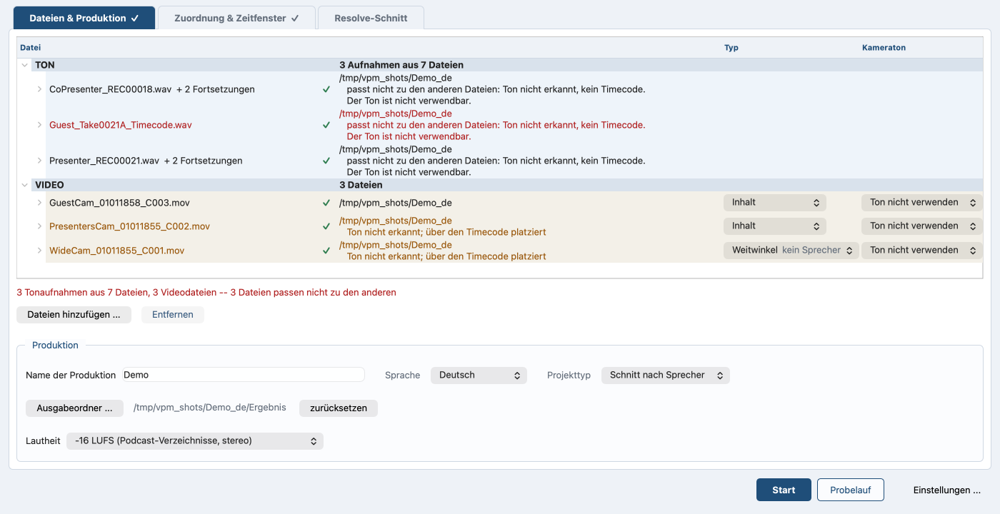
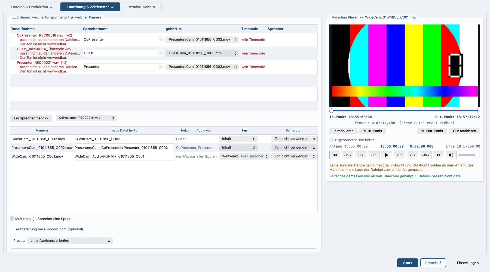

# Video Podcast Magic

*In English: [README.md](README.md)*



*Das Hauptfenster. Was gefunden wurde, was zusammengehört und was nicht
zusammenpasst — bevor irgendetwas geschrieben wird.*

*Am Programm arbeiten oder einen Pull Request stellen? [CONTRIBUTING.md](CONTRIBUTING.md) sagt wie: die Tests, der Gegenbeweis, den jede Prüfung schuldet, und was ein Pull Request tragen muss.*

**Version 2.30.0-beta.** Es macht die Arbeit, für die es geschrieben
wurde, jede Woche, an echtem Material. Beta heißt es, weil es nicht
fertig geprüft ist: das Format der Projektdatei kann sich noch ändern,
und eine ältere Datei wird mit einer klaren Meldung abgewiesen statt
halb gelesen.

`videopodcast-magic.py` — aufbereiteten Ton als erste Tonspur in
Videodateien legen und daraus alles bauen, was der Schnitt danach braucht:
die Kameras auf einer Zeitachse, einen ersten Schnitt nach Sprecher und ein
DaVinci-Resolve-Projekt.

Eine Python-Datei, rund 35 000 Zeilen. Kein Paket, kein Bauschritt.

## Warum es das gibt

Vor jeder Folge stand dieselbe Stunde Handarbeit. Der Rekorder trennt
eine Aufnahme bei zwei Gigabyte, aus einem Interview werden drei
Dateien. Ton und Bild fangen nicht zusammen an, und nach einer Stunde
sind die Lippen um eine Zehntelsekunde daneben, weil Kamera und
Rekorder jeweils ihren eigenen Quarz haben. Dann muss der gute Ton in
jede Kameradatei, jeder Sprecher muss von den anderen getrennt werden,
und jemand muss entscheiden, welche Kamera zu sehen ist, während wer
spricht.

Nichts davon ist Schnitt. Es ist die Arbeit vor dem Schnitt, es ist
jede Woche dieselbe, und eine Maschine kann sie messen, wo ein Mensch
sie schätzen müsste — also macht es die Maschine, und die Stunde geht
in den Schnitt.

Geschrieben wurde es für einen Podcast, und dort tut es diese Arbeit
jede Woche. Es entscheidet nicht: der Kameraschnitt ist ein Vorschlag,
der Schnitt bleibt deiner. Die Geschichte eines Laufs, von den Dateien
auf der Platte bis zum fertigen Resolve-Projekt, steht in
**[docs/overview.de.md](docs/overview.de.md)**.

## Installieren

Eine Datei. `videopodcast-magic.py` holen und starten — mehr ist nicht
zu installieren:

```
python3 -c "import urllib.request as u; u.urlretrieve('https://raw.githubusercontent.com/Bascht74/videopodcast-magic/main/videopodcast-magic.py', 'videopodcast-magic.py')"
python3 videopodcast-magic.py
```

Oder einfacher: die Adresse im Browser öffnen, die Datei speichern und
starten. Unter Windows `python` statt `python3` schreiben.

Python 3.10 oder neuer muss vorher da sein; das eine kann das Programm
nicht mitbringen. Alles andere holt es sich, wenn es gebraucht wird,
und sagt dabei, was es tut: `numpy` und `PySide6` beim ersten Start,
die Sprechertrennung samt Modell beim ersten Trennen.

**Zum Modell.** Die Trennung liest es aus einem Ordner neben dem
Programm — ohne Konto, ohne Zugangsschlüssel, und nach dem einen
Download ohne Netz. Das Programm holt es aus seinem eigenen
Repository, hält jede Datei gegen ihre Prüfsumme und legt es dorthin.
Es holt das Modell nur beim ersten Mal.

## Loslegen

```
python3 videopodcast-magic.py                          Oberfläche
python3 videopodcast-magic.py TON.wav VIDEO.mov
python3 videopodcast-magic.py TON.wav                  nur zusammensetzen
python3 videopodcast-magic.py TON.wav *.mov --out Fertig
python3 videopodcast-magic.py VIDEO.mov                nimmt den Kameraton
python3 videopodcast-magic.py --lang de|en             Sprache der Meldungen
python3 videopodcast-magic.py --help                   alle Schalter
```

Ohne Argumente öffnet sich die Oberfläche. Die Dateien werden an der Endung
erkannt, die Reihenfolge ist egal. `--lang de` oder `--lang en` legt die
Sprache fest; ohne den Schalter entscheidet die Systemsprache. Nur `--help`
bleibt englisch.



*Welche Aufnahme zu welcher Kamera gehört, und was aus jeder Kamera
wird.*

## Was gebraucht wird

Python 3.10 oder neuer, `ffmpeg` und `ffprobe` im Suchpfad und zwei Pakete
— `PySide6` für das Fenster, `numpy` für die Messungen. Das Programm
installiert Fehlendes beim Start über pip nach. Benutzt wird das Ganze
auf macOS und Windows; Linux läuft mit zwei Einschränkungen.

Die Einzelheiten, samt empfohlener Python-Version und den Unterschieden je
Plattform, stehen in
**[docs/requirements.de.md](docs/requirements.de.md)**.

## Das Handbuch

* **[Was gebraucht wird](docs/requirements.de.md)**: Python, ffmpeg, die
  beiden Pakete, und was sich je Plattform unterscheidet.
* **[Die Oberfläche](docs/interface.de.md)**: das Fenster, Reiter für
  Reiter — und was zu tun ist, wenn es keinen Timecode gibt.
* **[Vorflug](docs/preflight.de.md)**: was vor einem Lauf geprüft wird,
  und was jede Beanstandung bedeutet.
* **[Kanäle: eine Spur oder zwei?](docs/channels.de.md)**: wie ein
  Stereopaar von zwei einzelnen Mikrofonen unterschieden wird. Gemessen,
  nicht geraten.
* **[Der einfache Weg](docs/simple-path.de.md)**: eine Tondatei, eine
  Kamera — der kürzeste Weg hindurch.
* **[Aufbereitung über auphonic.com](docs/auphonic.de.md)**: Pegeln,
  Übersprechen, Transkription — und wo der Schlüssel liegt.
* **[Multitrack: mehrere Sprecher, mehrere Kameras](docs/multitrack.de.md)**:
  eine Spur je Sprecher, mehrere Kameras, eine Zeitachse.
* **[Spracherkennung und Sprechertrennung](docs/speech.de.md)**: was
  gesagt wird und wer es sagt, auf diesem Rechner ermittelt.
* **[Sprecherstatistik, Kameraschnitt, EDL](docs/camera-cut.de.md)**: wie
  der erste Schnitt vorgeschlagen wird, und die Zahlen, an denen er
  gemessen wird.
* **[DaVinci Resolve](docs/resolve.de.md)**: das Projekt, das herauskommt
  — Timelines, Spuren, Farbe, Ausgabe.
* **[Alle Schalter](docs/command-line.de.md)**: jeder Schalter der
  Kommandozeile, mit dem, was er tut.

Das ganze Verzeichnis: **[docs/README.de.md](docs/README.de.md)**.

## Weitere Informationen und technische Details

Neben dem Handbuch stehen die Dokumente für alle, die das Programm
ändern statt es zu benutzen. Sie sind alle englisch.

**[Inside the script](development/internals.md)** sagt, wie die
eine Datei aufgebaut ist und wie jeder Schritt arbeitet. **[What was
measured](development/measurements.md)** hält die Belege hinter den
Zahlen: Trefferquoten, Laufzeiten, Verteilungen, Vergleiche. **[Coding
guidelines](development/coding_guidelines.md)** sagt, wie der Code
geschrieben ist, und warum. Alle drei liegen in `development/`.

**[CHANGELOG.md](CHANGELOG.md)** sagt, was sich in jeder Version
geändert hat, von 0.1.0 an. **[THIRD-PARTY.md](THIRD-PARTY.md)** führt
auf, worauf sich das Programm zur Laufzeit stützt und unter welchen
Bedingungen, samt dem mitgelieferten Sprechermodell.
**[CLAUDE.md](CLAUDE.md)** hält die Projektregeln, darunter die, über
die nicht verhandelt wird; Claude Code liest die Datei zu Beginn einer
Sitzung von selbst.

## Was das Script nicht tut

Es schneidet nicht und entscheidet nichts. Der Kameraschnitt ist ein
Vorschlag. Das Script sorgt dafür, dass am Anfang der eigentlichen Arbeit
alles da ist, wo es hingehört — und sagt Bescheid, wenn etwas nicht
zusammenpasst, bevor man eine Stunde in den falschen Schnitt gesteckt hat.

## Lizenz

MIT — siehe `LICENSE`. Benutzen, ändern, weitergeben; der Urhebervermerk
bleibt dabei. Worauf sich das Programm stützt und unter welchen Bedingungen,
steht in `THIRD-PARTY.md`.
