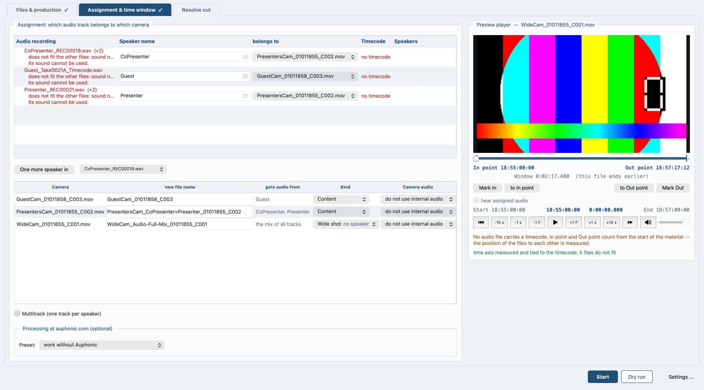

# Video Podcast Magic

*Auf Deutsch: [README.de.md](README.de.md)*


*The main window. What was found, what belongs together, and what does
not fit -- before anything is written.*

*Working on the program, or opening a pull request? [CONTRIBUTING.md](CONTRIBUTING.md) says how: the tests, the counter-proof every check owes, and what a pull request has to carry.*

**Version 2.24.0-beta.** It does the work it was written for, every
week, on real material. It is called beta because it is not finished
being tested: the format of the project file may still change, and an
older file is refused with a clear message rather than half read.

`videopodcast-magic.py` -- put processed audio into video files as the
first audio track, and build from it everything the edit needs afterwards:
the cameras on one time axis, a first cut by speaker, and a DaVinci Resolve
project.

One Python file, about 24000 lines. No package, no build step.

## Why this exists

Every episode began with the same hour of handwork. The recorder splits
a take at two gigabytes, so one interview arrives as three files. Sound
and picture do not start together, and by the end of the hour the lips
are off by a tenth of a second, because camera and recorder each run on
their own quartz. Then the good audio has to go into every camera file,
every speaker has to be told apart from the others, and somebody has to
decide which camera to be on while each of them talks.

None of that is editing. It is the work before the editing, it is the
same work every week, and a machine can measure it better than a person
can guess it -- so the machine does it, and the hour goes into the cut
instead.

It was written for one podcast and does that job every week. It does not
decide: the camera cut is a proposal, and the edit stays yours. The story
of one run, from the files on the disk to the finished Resolve project,
is in **[docs/overview.md](docs/overview.md)**.

## Getting it

One file. Fetch `videopodcast-magic.py` and run it -- nothing else has
to be installed:

```
python3 -c "import urllib.request as u; u.urlretrieve('https://raw.githubusercontent.com/Bascht74/videopodcast-magic/main/videopodcast-magic.py', 'videopodcast-magic.py')"
python3 videopodcast-magic.py
```

Or simpler: open that address in a browser, save the file, and run it.
On Windows write `python` instead of `python3`.

Python 3.10 or newer has to be there first; that is the one thing the
program cannot bring. Everything else it fetches when it needs it and
says so while it does: `numpy` and `PySide6` at the first start, the
speaker separation and its model the first time a separation is asked
for.

**About the model.** The separation reads it from a folder beside the
program -- no account, no token, and after the one download no network.
The program fetches it from its own repository, holds every file
against its checksum, and puts it there. It fetches the model only the
first time.

## Getting started

```
python3 videopodcast-magic.py                          interface
python3 videopodcast-magic.py AUDIO.wav VIDEO.mov
python3 videopodcast-magic.py AUDIO.wav                join only
python3 videopodcast-magic.py AUDIO.wav *.mov --out Done
python3 videopodcast-magic.py VIDEO.mov                takes the camera sound
python3 videopodcast-magic.py --lang de|en             language of the messages
python3 videopodcast-magic.py --help                   all switches
```

Without arguments the interface opens. Files are told apart by extension;
the order does not matter. `--lang de` or `--lang en` fixes the language;
without it the system locale decides. Only `--help` stays English.



*Which recording belongs to which camera, and what becomes of each
camera.*

## What it needs

Python 3.10 or newer, `ffmpeg` and `ffprobe` on the search path, and two
packages -- `PySide6` for the window, `numpy` for the measurements. The
program installs what is missing at start over pip. macOS and Windows are
what this is used on; Linux works with two limits.

The detail, including which Python is recommended and what differs per
platform, is in **[docs/requirements.md](docs/requirements.md)**.

## The manual

* **[What it needs](docs/requirements.md)**: Python, ffmpeg, the two
  packages, and what differs per platform.
* **[The interface](docs/interface.md)**: the window, tab by tab -- and
  what to do when there is no timecode.
* **[Preflight](docs/preflight.md)**: what is checked before a run
  starts, and what each complaint means.
* **[Channels: one track or two?](docs/channels.md)**: how a stereo pair
  is told apart from two separate microphones. Measured, not guessed.
* **[The simple path](docs/simple-path.md)**: one audio file, one camera
  -- the shortest way through.
* **[Processing at auphonic.com](docs/auphonic.md)**: levelling,
  de-bleed, transcription -- and where the key lives.
* **[Multitrack: several speakers, several cameras](docs/multitrack.md)**:
  one track per speaker, several cameras, one time axis.
* **[Speech recognition and speaker separation](docs/speech.md)**: what
  is said and who says it, worked out on this machine.
* **[Speaker statistics, camera cut, EDL](docs/camera-cut.md)**: how the
  first cut is proposed, and the numbers it is judged by.
* **[DaVinci Resolve](docs/resolve.md)**: the project that comes out --
  timelines, tracks, colour, render.
* **[All switches](docs/command-line.md)**: every command line switch,
  with what it does.

The whole contents: **[docs/README.md](docs/README.md)**.

## Further information and technical detail

Beside the manual stand the documents for whoever changes the program
rather than uses it. They are English only.

**[Inside the script](development/internals.md)** says how the one
file is put together and how each step works. **[What was
measured](development/measurements.md)** holds the evidence behind
the numbers: hit rates, run times, distributions, comparisons.
**[Coding guidelines](development/coding_guidelines.md)** says how
the code is written, and why. All three are in `development/`.

**[CHANGELOG.md](CHANGELOG.md)** says what changed in each version, from
0.1.0. **[THIRD-PARTY.md](THIRD-PARTY.md)** lists what the program leans
on at run time and under which terms, the speaker model included.
**[CLAUDE.md](CLAUDE.md)** holds the project rules, the ones that are
not negotiable among them; Claude Code reads it by itself at the start
of a session.

## What the script does not do

It does not cut and it decides nothing. The camera cut is a suggestion. The
script makes sure that at the start of the real work everything is where it
belongs -- and says so when something does not fit, before an hour has gone
into the wrong edit.

## Licence

MIT -- see `LICENSE`. Use it, change it, pass it on; keep the copyright
notice with it. What the program leans on and under which terms is listed
in `THIRD-PARTY.md`.
