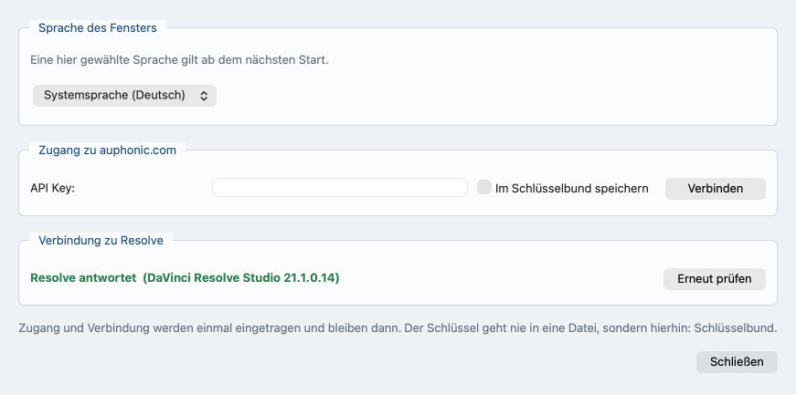

# Aufbereitung über auphonic.com

*In English: [auphonic.md](auphonic.md). Zurück zum
[Inhalt](README.de.md).*

## Der Schlüssel und das Preset

Der Dienst auphonic.com verarbeitet den zusammengesetzten Ton mit einem
gespeicherten Preset und schickt ihn als gewöhnliche Tondatei zurück.
Der Zugang wird einmal hinterlegt, das Preset gehört zur einzelnen
Produktion.

Den Schlüssel gibt es in den Auphonic-Kontoeinstellungen. Das Programm
bewahrt ihn an genau einer Stelle auf: im Schlüsselbund (macOS), in der
Registry (Windows) oder im Schlüsselbund des Desktops (Linux). Nie in
einer Datei, nie in der Projektdatei und auch nicht in einer
Umgebungsvariable.

1. Im Fußbereich **Einstellungen ...** öffnen; das Fenster selbst ist in
   [Die Oberfläche](interface.de.md) beschrieben.
2. Im Kasten **Zugang zu auphonic.com** das Feld **API Key:** füllen
   (wer von der Kommandozeile aus arbeitet, legt den Schlüssel einmal
   ab, wie unten unter *Den Schlüssel ohne Fenster ablegen* beschrieben).
3. Optional: das Häkchen **Im Schlüsselbund speichern** setzen (unter
   Windows heißt es **In der Registry speichern**, unter Linux
   **Gemerkt lassen**); der Schlüssel bleibt dann im Schlüsselbund, in
   der Registry oder im Schlüsselbund des Desktops. Auf dem Mac muss der Schlüsselbund dafür aufgesperrt sein;
   ist er es nicht, sagt das Fenster es.
4. **Verbinden** drücken. Der Knopf prüft den Schlüssel und holt die
   Presets.



*Das Fenster, das Einstellungen ... öffnet: oben der Kasten für den
Schlüssel, unten der für Resolve. Das Feld ist noch leer.*

Ein Schlüssel, den auphonic.com nicht annimmt, öffnet kein Fenster.
**Verbinden** wird nicht grün, und unter dem Feld sagt eine Zeile, was
auphonic.com geantwortet hat; daneben steht ein Knopf, der die
Einstellungen öffnet. Dieselbe Zeile steht im Einstellungsfenster und
im Kasten auf dem Reiter **Zuordnung & Zeitfenster**. Sie nennt auch
einen fehlenden Schlüssel.

**Die Zeile sagt, welcher Schlüssel abgelehnt wurde.** Beim Start hat
niemand etwas getippt, der Schlüssel kam also aus dem Schlüsselbund, der
Registry oder dem Schlüsselbund des Desktops, und genau das sagt die
Zeile -- **Der gemerkte Schlüssel wird nicht angenommen** --, damit dort
gesucht wird, wo er liegt. Nach **Verbinden** ist es der Schlüssel aus
dem Feld, und die Zeile sagt nur noch, was auphonic.com geantwortet hat.

* Auf dem Weg zu auphonic.com steht der Schlüssel nie in der
  Prozessliste und liegt nie in einer Datei: curl liest ihn von seiner
  Eingabe, als einzige Zeile seiner Konfiguration, und diese Eingabe
  sieht sonst niemand am Rechner. Der Schlüssel geht maskiert in diese
  Zeile, damit ein Anführungszeichen oder ein Zeilenumbruch darin keine
  eigenen Direktiven anfügen kann.

Das Ablegen im macOS-Schlüsselbund übergibt ihn dem Programm `security`
über dessen Eingabe, nicht als Argument; auch auf diesem Weg steht er
also nicht in der Prozessliste. Das Programm liest ihn zurück, um zu
sehen, dass er angekommen ist. Einen zweiten Weg gibt es nicht: als
Argument übergeben stünde er dort, wo jeder am Rechner ihn lesen kann.
Nimmt der Schlüsselbund ihn also nicht, wird nichts abgelegt, und die
Zeile unter dem Schlüsselfeld sagt, warum: **Der Schlüssel wurde nicht
gespeichert: …** -- gleich, ob das Häkchen von Hand gesetzt wurde oder
der Schlüssel mit **Verbinden** kam. Einen Kasten, der erst
weggeklickt werden müsste, gibt es dabei nicht. Das Häkchen geht
wieder heraus, damit es nicht gesetzt über einem Schlüssel steht, der
beim nächsten Start fort ist.
Unter Windows wird der Registry-Eintrag für alle außer diesem Benutzer
gesperrt, bevor der Schlüssel hineinkommt, und danach wird er
zurückgelesen. Lässt sich der Eintrag nicht sperren, wird der Schlüssel
gar nicht erst geschrieben.

Abgelegt wird der Schlüssel, der geprüft wurde, und nicht das, was im
Feld steht, wenn die Antwort eintrifft. Wer während der Prüfung einen
zweiten einfügte, bekam bisher diesen zweiten, ungeprüften, abgelegt --
unter einem Knopf, der gerade für den ersten grün geworden war.

Ob der Schlüsselbund zugesperrt ist, wird nachgesehen, bevor etwas
übergeben wird. Solange er zu ist, ist das Häkchen **Im Schlüsselbund
speichern** grau, und darunter steht in Warnfarbe **Der Schlüsselbund
ist zugesperrt. Sperr ihn auf, dann wacht dieser Knopf auf.** Daneben
steht **Schlüsselbundverwaltung öffnen**, und dieser Knopf öffnet das
Programm, das ihn aufsperrt. Ist er aufgesperrt, wacht das Häkchen
innerhalb einer halben Sekunde von selbst auf -- und dieses Aufwachen
ist das Zeichen, dass es geklappt hat, denn sonst meldet es niemand.
Das Nachsehen selbst fragt nichts und bringt nichts auf den Schirm.

Auf dem Reiter **Zuordnung & Zeitfenster** steht im Kasten
**Aufbereitung bei auphonic.com (optional)**, was dieser Lauf tut: das
Preset unter **Preset:** (auf der Kommandozeile `--auphonic-preset`).
Aus diesem Preset baut das Programm die Produktion neu.

Ist der Schlüssel geprüft, zeigt eine Zeile unter dem Preset das
restliche Guthaben bei auphonic.com und sagt es, wenn das Konto im
kostenlosen Tarif ist. Im Multitrack-Modus erinnert sie in der Farbe
einer Warnung daran, dass eine kostenlose Multitrack-Produktion höchstens
20 Minuten dauern darf. Der Kasten fragt das Konto zusammen mit den
Presets und sonst nie. Der Lauf fragt vor jedem Hochladen noch einmal,
und das Protokoll sagt, ob das Guthaben für diese Produktion reicht, und warnt, wenn eine kostenlose
Multitrack-Produktion länger als 20 Minuten ist. Es warnt nur: der Lauf
geht weiter, und das letzte Wort hat auphonic.com.

Das Häkchen **Multitrack (je Sprecher eine Spur)** steht nicht im
Auphonic-Kasten und braucht keinen Schlüssel. Es entscheidet hier, ob
jede Person eine eigene Spur behält: nur getrennte Spuren kann
auphonic.com einzeln aufbereiten und vom Übersprechen der anderen
befreien. Wo alle in einer Spur stehen, gibt es nichts, was der De-Bleed
auseinandernehmen könnte.

Über die Art der Produktion entscheidet die Zahl der Spuren. Eine
einzelne Spur geht als gewöhnliche Produktion hoch, zwei oder mehr als
Multitrack-Produktion, und das Preset muss dazu passen: ein gewöhnliches
für die eine, ein Multitrack-Preset für die anderen. Das Häkchen hat
dabei nicht mitzureden: Zwei Aufnahmen mit Bild, oder zwei ganz ohne,
gehen gemeinsam hoch, ob es gesetzt ist oder nicht, und die Liste der
Presets bietet die Art an, die der Lauf brauchen wird. Ein Preset der
falschen Art hält den Lauf an, bevor die Zeitachse gemessen wird.

### Den Schlüssel ohne Fenster ablegen

Wer nur auf der Kommandozeile arbeitet, legt den Schlüssel einmal so ab:

```text
$ videopodcast-magic --store-auphonic-key --lang de
Auphonic-API-Schlüssel (wird nicht angezeigt):
Der Schlüssel ist gespeichert, und das Zurücklesen ergab denselben Schlüssel.
```

Getippt wird er dort, wo das Terminal nichts anzeigt; dann kommt er in
den Schlüsselbund, die Registry oder den Schlüsselbund des Desktops,
genau wie mit dem Häkchen oben, und wird zurückgelesen. Jeder spätere
Lauf nimmt ihn von dort. Hat es nicht gehalten, lautet die Antwort **Der
Schlüssel ist nicht gespeichert:** mit dem Grund dahinter; wer nichts
tippt, legt nichts ab. Den Schlüssel selbst schreibt man nie hinter den
Schalter: Ein Wort dort wird abgewiesen, bevor überhaupt gefragt wird,
denn in der Befehlsgeschichte der Shell bliebe es stehen. Unter Linux
kommt er in den Schlüsselbund des Desktops (Secret Service, über
`secret-tool`; fehlt es, wird zuerst angeboten, es zu installieren);
antwortet keiner, wird nichts abgelegt, und die Antwort
sagt das -- siehe [Was gebraucht wird](requirements.de.md).

### Das Transkript entsteht hier

Am Text hat auphonic.com keinen Anteil. Das Programm hört den fertigen
Mix auf diesem Rechner ab und schreibt jedes Wort mit der Zeit mit, zu
der es gesagt wurde: eine json-Datei mit Zeiten, eine srt-Datei für
Untertitel und eine txt-Datei zum Lesen, in der Form, in der
auphonic.com seine eigenen liefert.

Das kostet Rechenzeit, kein Guthaben. Es braucht weder Schlüssel noch
Preset noch Upload, und ein Lauf ohne Auphonic schreibt dieselben drei
Dateien. `--no-transcript-file` lässt die Dateien weg -- gehört werden
die Wörter trotzdem, und der Schnitt holt sich seine Satzgrenzen weiter
aus ihnen.

Was in jeder der Dateien steht, sagt [Die drei Dateien des
Transkripts](speech.de.md#die-drei-dateien-des-transkripts); welchen Weg
die Erkennung auf welchem Rechner nimmt und was sie dort kostet, steht
im selben Kapitel.

### Ohne Auphonic arbeiten

Jeder Lauf kommt ohne den Dienst aus. Der erste Eintrag der Presetliste,
**ohne Auphonic arbeiten**, hält diesen Lauf hier (auf der
Kommandozeile `--without-auphonic`). Er ist kein Preset. Der Schlüssel
bleibt im Feld, gemerkt und geprüft, nur nicht weitergereicht. Ein
leeres Feld ist dieselbe Antwort: ein aus dem Fenster gestarteter Lauf
ohne Schlüssel darin läuft ohne den Dienst, auf dem einfachen Weg wie
auf dem Multitrack-Weg, und holt sich keinen gespeicherten Schlüssel
hinter dem Feld hervor.

Alles läuft dann hier: das Programm richtet die Spuren auf der
gemeinsamen Achse aus, mischt sie und verteilt sie auf die Kameras.
Kameraschnitt und Resolve-Projekt entstehen wie sonst. Es fehlt nur,
was der Dienst tut: De-Bleed, Leveler, Rauschentfernung. Das
Übersprechen bleibt im Ton.

Die Ziellautheit setzt `--lufs`; eine kleinere Zahl ist leiser, und
fehlt der Schalter, gilt −16, wie in einem neuen Projekt im Fenster. Auf
jede Spur kommt dieselbe Anhebung, so bleibt das Verhältnis der
Sprecher erhalten. Mit `--lufs source`, oder mit **Aus Quelldateien
übernehmen** im Fenster, wird gar nichts angepasst: der Ton bleibt, wie
er in den Quelldateien ist.

Die örtliche Sprechertrennung sagt, wer wann spricht ([Spracherkennung
und Sprechertrennung](speech.de.md)). Ohne sie misst das Programm es aus
den Spuren und rechnet das Übersprechen aus dieser Messung heraus, nicht
aus dem Ton. Die Messung und ihre untere Grenze stehen in
[Sprecherstatistik, Kameraschnitt, EDL](camera-cut.de.md).

Solange das Programm keinen Schlüssel geprüft hat, steht nur dieser
Eintrag in der Liste. Treffen die Presets ein, bleibt die Auswahl auf
ihm stehen: dass eine Liste eingetroffen ist, ist kein Grund, beim
nächsten **Start** Guthaben auszugeben. Die Presets stehen zur Wahl,
gewählt wird keines für einen.

Ein von Hand gewähltes Preset ist von da an die Antwort. Es übersteht
den Neuaufbau der Liste, und es steht auch dann in der Projektdatei,
wenn die Liste gar nicht aufgebaut werden kann -- abgelehnter
Schlüssel, keine Leitung. Aufgeschrieben wird dann das gewählte Preset
und nicht der Eintrag, auf den der Kasten zurückgefallen ist: ein ohne
Verbindung gespeichertes Projekt öffnet wieder mit dem Preset, das es
bekommen hat. Beim Wiederöffnen eines Projekts steht das gewählte
Preset wieder im Kasten, auch ein Multitrack-Preset: erst kommen die
Dateien und ihre Zuordnung zurück, dann wird die Liste für die Art von
Produktion aufgebaut, die sie ergeben. Ein Multitrack-Preset ist damit
wieder da, wo es gewählt werden kann.

Ist noch gar keine Liste geholt worden, holt das Öffnen des Projekts
eine, damit das Preset irgendwo stehen kann. Bis die Antwort da ist,
nennt der Kasten das Preset mit **wird geprüft** dahinter, grau und
nicht wählbar, und sein Wert bleibt **ohne Auphonic arbeiten**: ein
**Start** vor der Antwort gibt kein Guthaben aus.

### Was ein Lauf zeigt

Beide Wege beginnen im Protokoll mit einer Überschrift: `AUFBEREITUNG
BEI AUPHONIC.COM:` bei einer einzelnen Spur, `AUFBEREITUNG BEI
AUPHONIC.COM (MULTITRACK):` bei mehreren. Darunter stehen das Preset und
die Datei mit Größe und Kanälen, oder der Titel der Produktion, die
Spuren mit Namen und das, was hochzuladen ist. Dann folgt das Guthaben,
etwa `Guthaben bei auphonic.com: noch 1 Std. 20 Min., genug für die 12
Min., die diese Produktion braucht.`

Eine einzelne Spur geht dann diese Schritte:

1. `Hochladen <Datei>` mit einem Balken. Die Datei geht zusammen mit dem
   Preset hoch.
2. Bei einer Stereoaufnahme `Zwei Kanäle angefordert -- die Aufnahme ist
   Stereo`. Das Preset würde den Mix auf einen Kanal falten; so kommen
   zwei Kanäle zurück.
3. `Produktion läuft (…)` mit der Nummer der Produktion, und
   `Zeitgrenze: 2:00:00,000`.
4. Ein Balken mit der vergangenen Zeit und dem Stand, den auphonic.com
   meldet, etwa `Audio Processing`, bis dort `fertig` steht.
5. `Lade herunter <Name>`: eine Tondatei, die verlustfreie, wenn das
   Preset mehrere schreibt, und daneben nur, was Text ist -- Transkript,
   Untertitel, Kapitelmarken.
6. Hat auphonic.com etwas angefügt, `<Name>: auphonic.com hat am Ende
   6,4 s angefügt -- weggeschnitten`, und zuletzt `Ergebnis: <Name> (1
   MB) -- bleibt neben der Videodatei liegen`. Sie liegt im
   Ausgabeordner selbst, nicht in `auphonic-tracks/`.

Mehrere Spuren gehen diese:

1. `Fertigen Mixdown als Maßstab angefordert (wav-24bit)`: Der Mix, den
   auphonic.com herstellt, kommt mit zurück, als Maß dafür, wie laut der
   eigene Mix des Programms werden soll. Ist eine Spur Stereo, folgt
   `Zwei Kanäle, weil eine Spur Stereo ist`.
2. `Produktion läuft (…)`, dann `Hochladen 2 Spuren`: alle Spuren in
   einem Zug. Eine Spur, für die auphonic.com keine Datei angenommen
   hat, hält den Lauf an.
3. `Zeitgrenze:` und derselbe Balken.
4. `Lade herunter <Titel>.wav.zip`, die Einzelspuren in einem Archiv,
   danach jede weitere Ausgabe des Presets, darunter der fertige
   Mixdown `<Titel>_master.wav`. Alles landet in `auphonic-tracks/`.
5. `Im Archiv: Guest.wav, Presenter.wav`, und je Sprecher eine Zeile,
   die nennt, welche Datei zu seiner Spur geworden ist. Das Archiv wird
   gelöscht, sobald es entpackt ist.

An einer kurzen Probe von 20 Sekunden waren die Presets in weniger als
einer Sekunde da. Eine einzelne Spur brauchte vom Hochladen bis zum
Ergebnis etwa 15 s, davon etwa 10 s Warten; zwei Spuren brauchten etwa
27 s, davon etwa 20 s Warten. Längere Aufnahmen dauern länger; wie viel
länger, ist nicht gemessen. Der Balken kennt die Dauer nicht im Voraus:
An einer solchen Probe steht er bei wenigen Prozent und springt auf 100,
sobald auphonic.com fertig meldet.

### Wenn es die Produktion schon gibt

Gesucht wird nur nach einer Multitrack-Produktion. Eine einzelne Spur
geht bei jedem Lauf neu hoch, und jedes Hochladen kostet Guthaben.

Das Programm erkennt die Produktion am Namen und fragt, was mit ihr
geschehen soll:

1. vorhandenes Ergebnis übernehmen: nichts rechnen, nichts hochladen
2. mit dem gewählten Preset neu rechnen, Dateien bleiben stehen: kostet
   kein Guthaben
3. alles neu hochladen und neu rechnen: kostet Guthaben
4. abbrechen

Guthaben verbraucht allein das Hochladen. Punkt 2 rechnet mit dem neuen
Preset und lädt nichts hoch, also lässt sich ein Preset nach dem anderen
durchgehen. Das Programm lädt erst hoch, wenn es dazu aufgefordert wird.
Punkt 1 erscheint nur, wenn alles Nötige da ist. Bei anderen Spurnamen
dort fragt das Programm, ob es sie übernimmt.

Beim Neurechnen bringt das Programm auch die Spureinstellungen auf das
Preset. Weitere Spuren dort gehen in den Mix, eine Warnung nennt sie.

Eine Multitrack-Produktion wird ganz heruntergeladen, die Einzelspuren
und jede weitere Ausgabe, die das Preset selbst erzeugt: der fertige
Mixdown, Kapitelmarken, Auswertungen und ein eigenes Transkript, wo das
Preset eines herstellt. Bezahlt ist das alles ohnehin mit der
Produktion. Es landet in `auphonic-tracks/` neben den fertigen Videos,
später auch die `final_*.wav`. Eine einzelne Spur bringt ihre Tondatei
und das, was Text ist, zurück, wie oben beschrieben, und sonst nichts.
Ein Name, den
auphonic.com einer Datei gibt, wird auf den einfachen Dateinamen
gekürzt; bleibt keiner übrig, wird die Datei nicht geholt, und das
Protokoll nennt sie.

Was auphonic.com um eine zurückgegebene Datei herum legt -- beim
kostenlosen Tarif einen Jingle am Anfang, und hinter einer einzelnen
Spur noch einige Sekunden, an einer kurzen Probe etwa 6 s --, schneidet
das Programm weg.
Es sucht, wo der hochgeschickte Ton in der Rückgabe beginnt, und behält
genau die Länge, die hochgegangen ist; das Protokoll sagt, wie viele
Sekunden vorne und hinten weggefallen sind. Lässt sich der
hochgeschickte Ton in der Rückgabe nicht finden, bleibt die Datei, wie
sie kam, und auch das steht im Protokoll.

Einen nachträglich gesetzten In- oder Out-Punkt verrechnet das Programm
hier, nicht bei Auphonic. Es beschneidet die zurückgekommenen Spuren auf
das neue Fenster. Wenn die Länge weder zum Fenster noch zum ganzen
gemessenen Bereich passt, gehören die Dateien zu einem anderen Lauf, und
die Meldung sagt das.

### Wenn etwas klemmt

* **Verbinden wird nicht grün.** Die Zeile unter dem Feld sagt, was
  auphonic.com geantwortet hat, bei einem Schlüssel, den es nicht
  kennt, `auphonic.com nimmt den Schlüssel nicht an: Auphonic meldet
  403: Token doesn't exist`. Die Antwort kommt binnen einer Sekunde. Der
  Knopf daneben öffnet die Einstellungen; dort den Schlüssel
  berichtigen.
* **Die Zeitgrenze läuft ab.** Das Protokoll sagt `Zeitgrenze von
  2:00:00,000 erreicht, Produktion läuft noch:` und die Adresse der
  Produktion. Sie läuft bei auphonic.com weiter; mit `--auphonic-wait`
  wartet der Lauf länger. **Abbrechen** beendet ebenso nur das Warten, nicht
  die Produktion.
* **auphonic.com meldet einen Fehler.** Der Lauf endet mit
  `Aufbereitung fehlgeschlagen:` und dem, was auphonic.com gesagt hat.
* **In der Presetliste steht nur ihr erster Eintrag.** Es ist noch kein
  Schlüssel geprüft: **Verbinden** drücken.
* **Die zurückgekommenen Spuren passen weder zum Zeitfenster noch zum
  ganzen gemessenen Bereich.** Sie gehören zu einem anderen Lauf. Den
  Ordner dieses Laufs nehmen, oder den Ton noch einmal über
  auphonic.com schicken.
* **Der Lauf soll Guthaben kosten, das nicht gemeint war.** Nur Punkt 3
  lädt hoch, und nur das Hochladen kostet. Punkt 1 und Punkt 2 lassen
  die Dateien stehen, wo sie sind.

Der Ton ist jetzt aufbereitet und liegt in `auphonic-tracks/`. Wie die
Spuren über mehrere Sprecher und mehrere Kameras verteilt werden, steht
in [Multitrack: mehrere Sprecher, mehrere Kameras](multitrack.de.md).

### Weitere Optionen über die Kommandozeile

Im Fenster gibt es diese Optionen nicht.

* `--auphonic-preset` ohne Namen: das Programm fragt die vorhandenen
  Presets nummeriert ab, der Schlüssel ohne Dateien listet sie auf.
* `--auphonic-resume result|rerun|adopt|upload|abort` beantwortet die
  Frage nach einer schon vorhandenen Produktion im Voraus. Er erreicht
  nur einen Lauf, der mehrere Spuren hochlädt; bei einer einzelnen Spur
  gibt es keinen Upload je Spur, den man wieder aufnehmen könnte.
* `--auphonic-done ORDNER` holt nichts, sondern nimmt die dort
  liegenden Spuren, benannt nach den Sprechern. Liegt eine der
  Aufnahmen, die der Lauf bekommt, selbst in diesem Ordner, lehnt er sie
  ab: Er hält vor allem anderen an und nennt die Datei.
