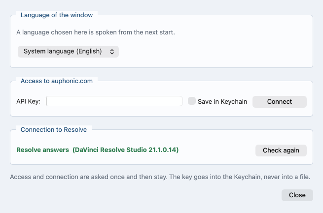

# Processing at auphonic.com

*Auf Deutsch: [auphonic.de.md](auphonic.de.md). Back to the
[contents](README.md).*

## The key and the preset

The service at auphonic.com processes the assembled audio with a stored
preset and sends it back as an ordinary audio file. The access goes in
once, the preset belongs to the single production.

The key is in the Auphonic account settings. The program keeps it in
one place: the Keychain (macOS), the Registry (Windows), or the
desktop's keyring (Linux). Never in a file, never in the project file,
and not in an environment variable.

1. Open **Settings ...** in the footer; the window itself is described
   in [The interface](interface.md).
2. In the box **Access to auphonic.com** fill in the field **API Key:**
   (for runs from the command line the key is stored once, as
   described under *Storing the key without the window* below).
3. Optional: tick **Save in Keychain** (on Windows **Save in
   Registry**, on Linux **Keep it saved**), which keeps the key in the
   Keychain, the Registry or the desktop's keyring. On a Mac the
   keychain has to be unlocked for that, and the window says so where
   it is not.
4. Press **Connect**. It checks the key and fetches the presets.



*The window that Settings ... opens: above the box for the key, below
the box for Resolve. The field is still empty.*

A key that auphonic.com does not accept opens no window. **Connect**
does not turn green, and under the field a line says what auphonic.com
replied, with a button beside it that opens the settings. That line
stands in the settings window and in the box on the **Assignment & time
window** tab alike. It names a missing key as well.

**The line says which key was refused.** Nobody typed anything at
start-up, so the key came out of the Keychain, the Registry or the
desktop's keyring, and the line says so -- **The stored key is not
accepted** -- so the answer is looked for where the key lies. After
**Connect** it is the key in the field, and the line says only what
auphonic.com replied.

* On its way to auphonic.com the key never appears in the process list
  and never lies in a file: curl reads it from its input, as the one
  line of its configuration, and nothing else on the machine sees that
  input. The key goes into that line escaped, so a quotation mark or a
  line break in it cannot add directives of its own.

Storing it in the macOS Keychain hands it to the `security` program over
that program's input, not as an argument, so the key does not stand in
the process list on that way either. The program reads it back to see
that it arrived. There is no second way round: handing it over as an
argument would put it where everybody on the machine can read it, so
where the Keychain does not take it, nothing is stored and the line
under the key field says why: **The key was not saved: …** -- whether the
tick was set by hand or the key came with **Connect**. No box has to be
clicked away first. The tick comes off again with it, so it never
stands there green over a key that is gone at the next start. On
Windows the Registry entry is shut to everybody but this user before
the key goes in, and the key is read back afterwards; where the entry
cannot be shut, the key is not written at all.

What is stored is the key that was checked, and not what stands in the
field when the answer comes back. Pasting a second key while the first
one is still being checked used to store the second, unchecked, under a
button that had just gone green for the first.

A locked keychain is looked at before anything is handed over. While it
is shut, the tick **Save in Keychain** is grey, and under it stands, in
the colour of a warning, **The keychain is locked. Unlock it and this
button wakes up.** Beside that line is **Open Keychain Access**, which
opens the program that unlocks it. Unlock it there and the tick comes
back by itself, within half a second -- and that waking is the sign the
unlock took, because nothing else reports it. The look itself asks
nothing and puts nothing on the screen.

On the **Assignment & time window** tab the box **Processing at
auphonic.com (optional)** holds what this run does: the preset under
**Preset:** (on the command line `--auphonic-preset`). The program
rebuilds the production from that preset.

Once the key is checked, a line under the preset shows the minutes of
credit left at auphonic.com and the plan, free or paying -- whether a
preset is chosen or not, and with **work without Auphonic** as well.
With a preset chosen, the line turns red where the credit is fewer than
the production needs -- as long as the longest track for Multitrack, all
tracks together otherwise, before the run lays them on one axis, which
can only make them longer. On the free plan a Multitrack production
longer than 21 minutes adds a second line, red as well: **On the free
plan auphonic.com takes a Multitrack production only up to about 21
min.** Without a preset the line is never red: there is no production to
hold the credit against. The box asks the account together with the
presets and at no other time.

The tick **Multitrack (one track per speaker)** is not in the Auphonic
box and needs no key. What it decides here is whether every person keeps
a track of their own: only separate tracks can auphonic.com work on one
by one and free of the bleed from the others. Where everybody stands in
one track there is nothing for the de-bleed to take apart.

The number of tracks decides the kind of production. A single track goes
up as an ordinary production, two or more as a multitrack production,
and the preset has to match: an ordinary preset for the one, a
multitrack preset for the others. The tick does not decide it: two
recordings with a picture, or two without any, go up together whether
it is set or not, and the preset list offers the kind the run will
need. A preset of the wrong kind stops the run before the time axis is
measured.

### Storing the key without the window

Whoever works only on the command line stores the key once with

```text
$ videopodcast-magic --store-auphonic-key
Auphonic API key (it is not shown):
The key is stored, and reading it back gave the same key.
```

The key is typed where the terminal does not show it, goes into the
Keychain, the Registry or the desktop's keyring just as the tick above
does, and is read back. Every later run takes it from there. Where it
did not hold, the answer is **The key is not stored:** and the reason,
and nothing typed stores nothing. The key itself is never written after
the switch: a word there is refused before anything is asked, because it
would stand in the shell's history. On Linux it goes into the desktop's
keyring (the Secret Service, through `secret-tool`; where that is
missing, installing it is offered first); where none answers,
nothing is stored and the answer says so -- see
[What it needs](requirements.md).

### The transcript is made here

None of the text comes from auphonic.com. The program listens to the
finished mix on this machine and writes down every word with the time it
was said: a json with times, an srt for subtitles and a txt to read, in
the shape auphonic.com delivers its own.

This costs the processor, not credit. It needs no key, no preset and no
upload, and a run without Auphonic writes the same three files.
`--no-transcript-file` leaves the files out -- the words are still heard,
and the cut still takes its sentence boundaries from them.

What stands in each file is in [The three transcript
files](speech.md#the-three-transcript-files); which way the recognition
takes on which machine and what it costs there is in the same
chapter.

### Working without Auphonic

Every run can do without the service. The first entry of the preset
list, **work without Auphonic**, keeps this run here (on the command
line `--without-auphonic`). It is not a preset. The key stays in the
field, remembered and checked, only not passed on. An empty field is
the same answer: a run started from the window with no key in it runs
without the service, on the plain path as on the multitrack one, and
does not go and fetch a stored key behind the field's back.

Everything then happens here: the program aligns the tracks on the
common axis, mixes them and distributes them over the cameras. Camera
cut and Resolve project come out as usual. Missing is only what the
service does: de-bleed, leveler, noise removal. The bleed stays in the
audio.

`--lufs` sets the target loudness; a lower number is quieter, and
without it the target is -16, as in a new project in the window. The
same gain goes on every track, which keeps the balance between the
speakers. With `--lufs source`, or **Take from source files** in the
window, nothing is adjusted at all: the sound stays as it is in the
source files.

The local speaker separation says who speaks when ([Speech recognition
and speaker separation](speech.md)). Without it, the program measures it
from the tracks and takes the bleed out of that measurement, not out of
the audio. The measurement and its lower limit stand in [Speaker
statistics, camera cut, EDL](camera-cut.md).

As long as the program has checked no key, the list holds this one
entry. When the presets arrive the entry keeps the selection: a list
that has just come in is no reason for the next **Start** to spend
credit, so the presets are offered and none of them is picked for you.

A preset picked by hand is the answer from then on. It survives a
rebuild of the list, and it goes into the project file even where the
list cannot be built at all -- a key auphonic.com refuses, no line out.
What is written down is then the preset that was picked and not the
entry the box fell back on, so a project saved on a machine with no
connection opens again with the preset it was given. Reopening a
project puts that preset back into the box, a multitrack preset
included: the files and their assignment come back first and the list
is built for the kind of production they make, so a multitrack preset
is there again to be found.

Where no list has been fetched yet, opening the project fetches one, so
that the preset has somewhere to stand. Until the answer arrives the
box names the preset with **being checked** behind it, greyed and not
pickable, and its value stays **work without Auphonic**: a **Start**
pressed before the answer spends no credit.

### What a run shows

Both paths open with a heading in the log: `PROCESSING AT
AUPHONIC.COM:` for a single track, `PROCESSING AT AUPHONIC.COM
(MULTITRACK):` for several. Under it stand the preset and the file with
its size and channels, or the production's title, the tracks by name and
what there is to upload. The run then asks the account once more -- the
preflight asked it first, see below -- and says what it answered: the plan, `Account at auphonic.com: free.`,
`paying.` or `not known.`, and the credit in minutes, for instance
`Credit at auphonic.com: 80 min left, enough for the 12 min this
production needs.` What a production needs is counted in whole minutes,
rounded up and never below `1 min`, since auphonic.com charges no less:
a 20-second sample needs `1 min`, not `0 min`.

Two things are said, and the run goes on either way:

* **Too little credit.** The credit line ends in `-- not enough.`, and a
  note beginning `Note:` says that the run tries anyway: auphonic.com
  decides whether the production starts.
* **A free account and a Multitrack production longer than 21
  minutes.** This one is a warning, in the warning colour: `Warning: this
  Multitrack production is 25 min long, and on the free plan auphonic.com
  takes one only up to about 21 min.` A note under it says why: a longer
  one is refused at the start and nothing is charged, and the run tries
  anyway. auphonic.com's own refusal speaks of 20 minutes; in a test on
  a free account 21 minutes still went through, and 22, 25, 30 and an
  hour were refused. Up to 21 minutes nothing is said.

The same lines stand first in the preflight, before anything is measured
at length: a run that sends to auphonic.com asks the account there, and
so does **Dry run**, which uploads nothing. Where the account cannot be
asked -- no key stored, no network -- the preflight says so in one line,
`Account at auphonic.com: not known -- it could not be asked. The run
goes on.`, and the run goes on. Nothing the account says stops a run.

Where auphonic.com refuses, it does so at the start, after the upload,
and charges nothing; the run ends with `Processing failed:` and
auphonic.com's own message, for instance `Non-paying users can try our
multitrack algorithms only for productions shorter than 20min!`

A single track then goes through these steps:

1. `Uploading <file>` with a bar. The file goes up together with the
   preset.
2. With a stereo recording, `Two channels requested -- the recording is
   stereo`. The preset would fold the mix to one channel; this way two
   channels come back.
3. `Production running (…)` with the production's number, and `Time
   limit: 2:00:00.000`.
4. A bar with the time gone by and the state auphonic.com reports, for
   instance `Audio Processing`, until it says `done`.
5. `Downloading <name>`: one audio file, the lossless one where the
   preset writes several, and beside it only what is text -- transcript,
   subtitles, chapter marks.
6. Where auphonic.com added something, `<name>: auphonic.com added 6.4 s
   at the end -- cut away`, and last `Result: <name> (1 MB) -- stays next
   to the video file`. It lies in the output folder itself, not in
   `auphonic-tracks/`.

Several tracks go through these:

1. `Finished mixdown requested as the yardstick (wav-24bit)`: the mix
   auphonic.com makes comes back too, as the measure for how loud the
   program's own mix should end up. Where one track is stereo, `Two
   channels, because one track is stereo` follows.
2. `Production created (…)`, then `Uploading 2 tracks`: all tracks in
   one upload. A track auphonic.com took no file for stops the run.
3. `Production running (…)` once the tracks are up and the production
   is started, then `Time limit:` and the same bar.
4. `Downloading <title>.wav.zip`, the single tracks in one archive, then
   every further output of the preset, the finished mixdown
   `<title>_master.wav` among them. All of it lands in
   `auphonic-tracks/`.
5. `In the archive: Guest.wav, Presenter.wav`, and one line per speaker
   naming the file that became their track. The archive is deleted once
   it is unpacked.

On a short sample of 20 seconds the presets arrived in under a second.
A single track took about 15 s from the upload to the result, about 10 s
of it waiting; two tracks took about 27 s, about 20 s of it waiting.
Longer recordings take longer, and how much longer was not measured. The
bar does not know the length in advance: on such a sample it stands at
a few per cent and jumps to 100 when auphonic.com reports it done.

### When the production already exists

Only a multitrack production is looked for. A single track goes up anew
on every run, and every upload costs credit.

The program finds the production by name and asks what should happen to
it:

1. take the existing result: nothing computed, nothing uploaded
2. recompute with the chosen preset, the files stay where they are:
   costs no credit
3. upload everything again and recompute: costs credit
4. cancel

The upload alone spends credit. Answer 2 recomputes with the new preset
and uploads nothing, so preset after preset can be tried. The program
uploads only when asked to. Answer 1 appears only if everything needed
is there. If the tracks are named differently there, the program asks
whether to adopt those names.

On a recompute the program brings the track settings to the preset as
well. Further tracks there go into the mix, and a warning names them.

A multitrack production is downloaded whole, the single tracks and every
further output the preset itself makes: the finished mixdown, chapter
marks, analyses, and a transcript of its own where the preset produces
one. All of that is paid for with the production either way. It lands in
`auphonic-tracks/` next to the finished videos, later the `final_*.wav`
too. A single track brings back its audio file and what is text, as
described above, and nothing else. A name auphonic.com
gives a file is cut to its plain file name; a file with none left is not
fetched, and the log names it.

What auphonic.com puts around a returned file -- on the free plan a
jingle in front, and behind a single track a few seconds more, on a
short sample about 6 s -- is cut away. The program finds where the sound it
sent begins in what comes back and keeps exactly the length that went
up, and the log says how many seconds went at the start and at the end.
Where the sent sound cannot be found in the return, the file is left as
it came, and the log says that too.

The program handles a later In point or Out point here, not at Auphonic.
It trims the returned tracks to the new window. If the length matches
neither the window nor the whole measured range, the files belong to
another run, and the message says so.

### When something goes wrong

* **Connect does not turn green.** The line under the field says what
  auphonic.com replied, for a key it does not know `auphonic.com does
  not accept the key: Auphonic reports 403: Token doesn't exist`. The
  answer comes within a second. The button beside it opens the
  settings; correct the key there.
* **The time limit runs out.** The log says `Time limit of 2:00:00.000
  reached, production still running:` and the address of the
  production. It goes on at auphonic.com; `--auphonic-wait` waits
  longer. **Stop** ends the waiting in the same way, not the
  production.
* **auphonic.com reports an error.** The run ends with `Processing
  failed:` and what auphonic.com said.
* **The preset list holds only its first entry.** No key has been
  checked yet: press **Connect**.
* **The returned tracks fit neither the time window nor the whole
  measured range.** They belong to another run. Use the folder that
  belongs to this run, or let the audio go through auphonic.com again.
* **A run is about to cost credit that was not meant.** Only answer 3
  uploads, and only the upload costs. Answers 1 and 2 leave the files
  where they are.

The audio is now processed and lies in `auphonic-tracks/`. How the
tracks are spread over several speakers and several cameras stands in
[Multitrack: several speakers, several cameras](multitrack.md).

### Further options on the command line

The window does not offer these.

* `--auphonic-preset` without a name: the program lists the existing
  presets with numbers and asks for one, and a key without files lists
  them too.
* `--auphonic-resume result|rerun|adopt|upload|abort` answers the
  question about a production that already exists in advance. It
  reaches only a run that uploads several tracks; a single track has no
  per-track upload to take up again.
* `--auphonic-done FOLDER` fetches nothing and takes the tracks lying
  there, named after the speakers. A recording handed to the run that
  lies in that folder itself is refused: the run stops before anything
  else and names the file.
