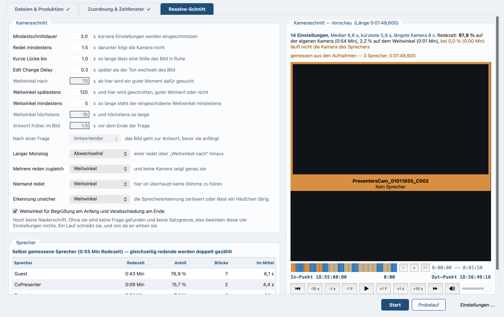

# Sprecherstatistik, Kameraschnitt, EDL

*In English: [camera-cut.md](camera-cut.md). Zurück zum
[Inhalt](README.de.md).*

## Wie der Schnitt entsteht

Der Schnitt braucht zwei Personen mit je einem Namen und einer Kamera.
Eine Person genügt auch, solange es eine zweite Kamera gibt, auf der
niemand ist. Zwei Personen liefern getrennte Aufnahmen, und ebenso die
Stimmen, die auf einer Aufnahme auseinandergehalten wurden, deren
**Sprechername** mit **mehrere Sprecher** beantwortet ist; das Häkchen
**Multitrack** gehört nicht dazu. Beide Wege stehen in [Spracherkennung
und Sprechertrennung](speech.de.md).
Damit weiß das Script, wann wer redet, und baut daraus den Schnitt:

* Ein Sprecher allein bekommt seine Kamera, mit Vorlauf.
* Ein kurzes „ja“ nicht: unter **Redet mindestens** bleibt das Bild, wo
  es ist.
* Bei Stille läuft der Weitwinkel: die Kamera, der kein Sprecher
  zugeordnet ist.
* Nach einer langen Einstellung kommt der Weitwinkel an einer
  Satzgrenze.

**Bei mehreren gleichzeitig** gewinnt eine Kamera, die genau diese
Sprecher zeigt, eine auf beide Moderatoren etwa. Passt keine genau, wird
die kleinste genommen, auf der alle Redenden vorkommen. Erst wenn keine
Kamera sie abdeckt, kommt der Weitwinkel. Die Zuordnung sagt, wer auf
welcher Kamera zu sehen ist: zwei Sprecher bei derselben Kamera heißt,
sie zeigt beide.

**Der Name richtet sich nach den Kameras.** Zwischen zwei Kameras
wechselt das Bild, auf einer Kamera nicht. Dort entsteht ein erster
Schnitt an jedem Sprecherwechsel. Der Lauf stellt `KAMERASCHNITT` über
seinen Abschnitt bei zwei Kameras und mehr, bei einer
`ERSTER SCHNITT NACH SPRECHERN`. Der Kasten im Fenster trägt diese
beiden Namen und einen dritten: bei einer benannten Person und zwei
Kameras oder mehr heißt er **Schnitt mit dem Weitwinkel**, weil ihre
Kamera steht und nur der Weitwinkel sie unterbricht. Bevor etwas
getrennt ist, heißt der Kasten **Kameraschnitt**.

Im Ausgabeordner landen `_speakers.csv`, `_speakers.edl`, `_cameracut.csv`
und `_cameracut.edl`, wie der Schnitt auch heißt. Die Köpfe sind
`Speaker,Start TC,End TC,Time from start,Duration s` und
`Shot,Camera,Speaker,Start TC,End TC,Duration s`, die EDL-Titel
`Speakers` und `Camera cut`.

### Die Stellschrauben einstellen

Die Oberfläche nimmt alle Werte entgegen: auf dem Reiter
**Resolve-Schnitt**, im Kasten **Kameraschnitt**. Je Wert ein Feld,
daneben die Einheit und eine kurze Zeile. Den Kasten gibt es, sobald der
Schnitt seine Personen hat — zwei davon, oder eine mit einer zweiten
Kamera, auf der niemand ist; vorher steht an seiner Stelle eine Zeile
und sagt, was fehlt.

*Reiter Resolve-Schnitt: links die Werte, rechts die Vorschau.*

Vier Felder formen den Schnitt selbst:

* **Mindestschnittdauer**: 3 s, so lange steht eine Einstellung
  mindestens (auf der Kommandozeile `--min-edit-duration`)
* **Redet mindestens**: 1,5 s, darunter folgt die Kamera nicht (auf
  der Kommandozeile `--min-speech-to-switch`)
* **Edit Change Delay**: 0,3 s, so viel später als der Ton wechselt
  das Bild; ein negativer Wert lässt das Bild vorlaufen (auf der
  Kommandozeile `--edit-change-delay`)
* **Reaktionsschnitt früher**: 1,5 s, so viel früher steht nach einer
  Frage die Antwort im Bild (auf der Kommandozeile `--reaction-lead`)

Vier weitere formen den Weitwinkel:

* **Weitwinkel nach**: 40 s, ab dieser Standzeit ein Blick in den
  Weitwinkel; 0 schaltet ihn ab (auf der Kommandozeile `--wide-after`)
* **Weitwinkel steht**: 5 s, so lange steht der eingeschobene
  Weitwinkel mindestens (auf der Kommandozeile `--wide-length`)
* **Weitwinkel höchstens**: 15 s, und so lange höchstens (auf der
  Kommandozeile `--wide-most`)
* **Weitwinkel spätestens**: 120 s, Obergrenze für eine Kamera am
  Stück (auf der Kommandozeile `--wide-latest`)

Darunter stehen vier Auswahlfelder. Sie sagen, was läuft, wenn die
Sprache nicht sagt, wer zu zeigen ist:

* **Langer Monolog**: **Abwechselnd** (auf der Kommandozeile
  `--on-monologue`)
* **Mehrere reden zugleich**: **Weitwinkel** (auf der Kommandozeile
  `--on-together`)
* **Erkennung unsicher**: **Weitwinkel** (auf der Kommandozeile
  `--on-uncertain`)
* **Frage**: **Antwortender** (auf der Kommandozeile `--on-question`)

Die ersten drei nehmen dieselben vier Werte: **Weitwinkel**,
**Zuhörer**, **Abwechselnd** und **Kein Kamerawechsel**. **Frage** nimmt
**nicht vorziehen**, **Antwortender** und **Zuhörer**; **nicht
vorziehen** heißt: kein vorgezogener Kamerawechsel, das Bild folgt dem
Ton hier wie überall sonst.

Unter den Feldern hält das Häkchen **Weitwinkel für Begrüßung am Anfang
und Verabschiedung am Ende** Anfang und Ende auf dem Weitwinkel (auf der
Kommandozeile schaltet `--no-wide-edges` es ab). Der Weitwinkel am Anfang
hält, bis das Wort wirklich übergeben wird, nicht bis zum ersten längeren
Block einer Nebenstimme.

**Redet mindestens** erledigt kurze Einwürfe („mhm“, „ja genau“). Eine
Einstellung, die trotzdem zu kurz ausfällt, geht in die folgende, nicht
in die vorherige.

### Wenn die Sprache nicht sagt, wer zu zeigen ist

Vier Fälle, und was jedes der vier Auswahlfelder entscheidet:

* **Langer Monolog**: einer hat über **Weitwinkel nach** hinaus das
  Wort. **Abwechselnd** merkt sich, was die letzte Unterbrechung zeigte.
* **Mehrere reden zugleich**: und keine Kamera zeigt genau sie.
* **Erkennung unsicher**: die Erkennung zerfasert über eine Passage,
  oder von einem Namen bleiben nur Schnipsel.
* **Frage**: das Bild geht zur Antwort, bevor sie anfängt. Nur nach
  einer Frage, die nicht vom Vielredner kommt, wenn sofort ein anderer
  übernimmt und das Wort behält.

**Zuhörer** heißt: wer als Nächstes spricht, und nur, wenn auf dieser
Kamera in den letzten 20 Sekunden jemand zu hören war; sonst der
Weitwinkel.

**Zuhörer** und **Abwechselnd** zeigen einen Menschen, von dem das
Programm nur weiß, dass er kurz vorher zu hören war. Es sieht das Bild
nicht. **Weitwinkel** einstellen, wo ein falsches Gesicht im Bild teurer
ist als ein ruhiges.

Zwei Sprecher auf einer Kamera zählen für diese Regeln als einer: ein
Sprecherwechsel zwischen ihnen ändert das Bild nicht.

### Was Vorschau und Sprecherkasten zeigen

Der Kasten **Kameraschnitt -- Vorschau** trägt die Länge im Titel und
darunter eine Zeile Zahlen:

* Einstellungen
* mittlere Standzeit
* kürzeste Einstellung
* längste Standzeit einer Kamera
* die Redezeit, geteilt in eigene Kamera, Weitwinkel und fremde Kamera

Die letzte Zahl steht in der Warnfarbe.

Der Kasten **Sprecher** zeigt je Sprecher:

* Redezeit und Anteil
* Zahl der Blöcke und deren mittlere Länge
* eine Zeile Stille

Die Überschrift nennt die Quelle: **Sprecher, nach Stimmen getrennt**
oder **Sprecher, selbst aus den Spuren gemessen**. Bei zwei gleichzeitig
Redenden zählt die Zeit doppelt, bei der Stille nicht. Deshalb ergeben
die Zeilen zusammen mehr als die Laufzeit.

Beides rechnet das Programm aus der Übergabedatei
`<Produktion>_resolve.json` des letzten Laufs, bei jeder Änderung neu
und immer für das gewählte Zeitfenster. Schreiben und Hochladen gehören
zum Lauf, nicht zur Vorschau.

Ohne bekannte Sprecher sagt der Kasten das und bietet den Knopf
**Sprecher jetzt messen**; wenn die Rechnung schiefgeht, steht an seiner
Stelle der Grund. Sprecher, die später auftauchen, starten die Vorschau
von selbst.

### Schnittband und Legende lesen

Im Kasten **Kameraschnitt -- Vorschau** sitzt das **Schnittband**, an
Stelle der Positionsleiste: der gerechnete Schnitt über die ganze Länge,
je Einstellung ein Balken in der Farbe seiner Kamera. Die Skala trägt
Minuten über das Ganze und Sekunden im Hineingezoomten. Zeigen nennt
Kamera, Von-bis und Dauer, Klicken setzt die Stelle für den Player.
Darunter die **Legende**: je Kamera im Schnitt ein Eintrag, ein Kästchen
in ihrer Farbe und dann wie oft, wer, Anteil und Zeit —
`129 × Kandidat  50 %  (29:48 Min)`.

**Ein Eintrag ist nach den Personen benannt, nicht nach der Datei.** Ein
Dateiname sagt nichts, was nicht schon bekannt wäre; die Zuordnung sagt
es. Also trägt ein Eintrag:

* den Sprecher dieser Kamera, mit Namen;
* alle Namen mit Pluszeichen verbunden, wenn mehrere auf derselben
  Kamera sind — `41 × Sprecher 1 + Sprecher 2  14 %  (9:37 Min)`;
  keiner fällt weg und keiner wird gekürzt;
* **Weitwinkel** für die Kamera, die als solcher dient;
* den Kurznamen der Kamera, wenn ihr niemand zugeordnet ist und sie
  nicht der Weitwinkel ist, denn sie Weitwinkel zu nennen wäre eine
  Behauptung und keine Ablesung;
* die Kamera neben dem Namen, wenn zwei denselben Namen ergeben — ein
  Sprecher zweimal gefilmt —, sonst wären die Balken nicht
  auseinanderzuhalten.

Die Legende bricht um. In einem schmalen Fenster steht sie auf zwei
Zeilen statt auf einer, und nichts wird gekürzt oder weggelassen, damit
es passt: Die Zeile bricht zwischen zwei Einträgen und an einem Plus,
nie mitten in einem Namen und nie mitten in einer Zahl.

Es sind die Farben der Clips in Resolve, mit einer Ausnahme: der
Weitwinkel wird in blassem Salbeiton angezeigt. In Resolve heißt der Clip
weiterhin Tan. Brown, Chocolate, Cocoa, Navy und Teal werden auf dunklem
Grund aufgehellt, Beige auf hellem abgedunkelt.

Das Band lässt sich zoomen. **+** zeigt halb so viel um die aktuelle
Stelle, **−** doppelt so viel, der dritte Knopf wieder die ganze Länge;
das Mausrad über dem Band tut dasselbe, ebenso die Tasten Plus, Minus
und 0. Hineinzoomen, um zu sehen und zu hören, ob ein Schnitt in einer
Pause oder mitten im Wort sitzt. Beim Abspielen folgt der Ausschnitt der
Position, damit er nicht aus dem Bild läuft.

### Wie die Vorschau-Player Datei und Ton wählen

Zwei Player zeigen das Material, und beide suchen sich ihre Datei
selbst.

Auf dem Reiter **Zuordnung & Zeitfenster** gilt diese Rangfolge:

1. eine Datei, die **In-Punkt und Out-Punkt enthält**, sonst laufen die
   Sprungknöpfe ins Leere
2. sonst eine mit wenigstens einer der Grenzen
3. unter gleich guten die Kamera ohne **zugeordneten Sprecher**
4. darunter die längste
5. nie eine Datei auf „Video ignorieren“, nie Vorspann oder Abspann

Die Projektdatei merkt sich, welche Datei zuletzt im Player stand, und
nimmt sie wieder, solange sie die Grenzen genauso gut abdeckt wie die
beste Alternative. Ohne Timecode oder gemessene Zeitachse behauptet das
Programm nichts über die Grenzen; sobald die Achse da ist, sieht der
Player noch einmal nach. **zu In-Punkt** und **zu Out-Punkt** holen sich
ihre Datei selbst; wenn es gar keine gibt, steht eine Zeile da, warum
nichts passiert ist.

Mit **zugeordneten Ton hören** läuft zum Bild der Ton, der zu dieser
Kamera gehört:

* die **aufbereitete Spur** von auphonic.com (`final_<Name>_<TC>.wav`),
  auf dem unter **Lautheit** gewählten Ziel, oder auf dem des Presets,
  wo nichts gewählt wurde, und mit BWF-Timecode
* sonst die **Rohaufnahme** des zugeordneten Sprechers
* beim Weitwinkel, der Kamera ohne zugeordneten Sprecher, der
  **Full-Mix**, sofern er vorliegt

Rohaufnahmen liegen 16 bis 36 dB unter dem aufbereiteten Ton, und lauter
machen kann die Oberfläche sie nicht. Der Kurzhinweis nennt, was läuft
und in welcher Fassung.

Auf dem Reiter **Resolve-Schnitt** zeigt der Player im Vorschau-Kasten
immer etwas: wenn ein Schnitt da ist, spielt er ihn und schaltet an jeder
Kante die Kamera um, sonst die Datei ohne zugeordneten Sprecher.

Der Ton kommt durchgehend aus einer Datei, am liebsten aus dem
**Full-Mix**, der auf Sendepegel liegt und auch in die Schnitt-Timeline
geht. Solange es ihn nicht gibt, nimmt das Programm die Kameradatei, die
den Mix als erste Tonspur trägt — dieselbe Wahl wie für Perspektive 1
des Multicam-Clips, und deutlich leiser.

`start_s` ist die Uhrzeit, zu der die Programmzeit null ist. Es ist der
früheste Tonanfang, der wirklich bekannt ist, eigener Timecode oder
gemessene Lage; sonst der früheste Kamera-Timecode; sonst nichts.
In-Punkt und Out-Punkt verschieben den Nullpunkt mit. Die Stelle in jeder
Kameradatei ist Programmzeit minus Versatz, derselbe Versatz, mit dem
auch die Schnitt-Timeline gebaut wird.

Das Programm setzt jede Stelle nach, bis sie sitzt;
[Inside the script](../development/internals.md) (englisch) nennt, wie
oft und wie lange.

### Sprecher ohne Auphonic messen

Ohne Auphonic bleibt der Lauf lokal, und das Script misst aus den Spuren,
wer wann redet. Der Weg dahin steht in [Aufbereitung über
auphonic.com](auphonic.de.md) (auf der Kommandozeile
`--without-auphonic`). Im Protokoll steht dieser Abschnitt unter der
Überschrift `SPRECHER -- HIER GEMESSEN`.

So liest das Script die Spuren:

* Es zerlegt jede Spur in Blöcke von 100 Millisekunden.
* Es misst jeden Block gegen den eigenen Grundpegel der Spur, das
  leiseste Fünftel ihrer Blöcke; 10 dB darüber gilt als Sprache.
* Pausen unter 0,35 Sekunden sind kein Sprecherwechsel.
* Passagen unter 0,4 Sekunden zählen nicht.

Davor rechnet das Script das **Übersprechen aus der Messung** heraus,
nicht aus dem Ton. Es sucht die Stellen, an denen genau eine Person
spricht: diese höchstens 10 dB unter ihrem eigenen Sprachpegel, die
anderen mindestens 6 dB unter ihrem. Dort misst es, wie laut diese
Stimme in den anderen Mikrofonen ankommt, und rechnet den eigenen Anteil
aus jeder Spur zurück.

Es geht auch bei Mikrofonen, die enger stehen, als die 3:1-Regel will.
Für ein Paar ohne mindestens drei solche Stellen zieht es nichts ab. Bei
Mikrofonen nebeneinander oder zu ähnlichen Spuren lässt es sich nicht
auflösen: die Pegel bleiben, wie gemessen, und das Protokoll sagt warum
und nennt das schlechteste Paar.

Bis 5 dB Trennung hinunter arbeitet die Erkennung exakt, deutlich unter
den 9,5 dB, die die 3:1-Regel verlangt; die Messreihe dahinter steht in
[What was measured](../development/measurements.md) (englisch).

Das Protokoll sagt, wie stark das Übersprechen war, und darunter je
Sprecher Redezeit und Zahl der Abschnitte. Wenn nichts zu hören war,
gibt es keinen Kameraschnitt.

Der Knopf **Sprecher jetzt messen** tut in der Oberfläche dasselbe, schon
vor dem ersten Lauf: gröber als die Trennung nach Stimmen, aber genug, um
den Schnitt einzustellen. Nach Stimmen getrennte Sprecher haben Vorrang,
sobald es sie gibt, und die Überschrift über der Tabelle sagt, was gilt.

### Schneiden, wenn eine Kamera alle zeigt

Bei mehreren Sprechern auf einer Kamera schneidet das Programm am
Sprecherwechsel: jede Einstellung kommt aus demselben Clip, zeigt also
denselben Bildausschnitt, und trägt den Namen dessen, der spricht.
Resolve bekommt eine Spur, die an den richtigen Stellen schon getrennt
ist, und dort lässt sich jedes Stück gruppieren, einfärben und
heranzoomen, so dass aus dem Weitwinkel der Sprecher wird.

Die Schnittliste sagt es mit: bei einer Kamera für alle trägt die EDL
den Sprechernamen an Stelle des Kameranamens. Die Spalte Sprecher in
`_cameracut.csv` steht in jedem Fall da.

**Eine einzige Stimme auf einer Kamera gibt keinen Schnitt.** Niemand
übergibt, also gibt es nichts zu schneiden, und weder Schnittliste noch
EDL entstehen. Die Passagen gehen in die Übergabedatei, und Resolve
setzt sie als Marker auf die Timeline, die es baut: die eine Kamera am
Stück mit dem Mix darunter.

**Mit einer zweiten Kamera gibt eine einzige Stimme sehr wohl einen
Schnitt.** Auf dieser Kamera ist niemand, also steht die Kamera des
Sprechers, und der Weitwinkel unterbricht sie; der Kasten heißt dann
**Schnitt mit dem Weitwinkel**. Fünf Minuten auf zwei Kameras ergaben
15 Einstellungen, davon 7 Weitwinkel, gegen 1 Einstellung auf einer
einzigen Kamera.

### Was die Projektdatei behält

`videopodcast-magic_<Produktion>.json` im Ausgabeordner enthält alles,
was man von Hand eingestellt hat und nicht wieder erraten kann. Das sind
die Dateiliste, Name und Ablageort der Produktion, das Zeitfenster, alle
Werte des Kameraschnitts, wer zu welcher Kamera gehört, das
Auphonic-Preset, die Stereo-Häkchen und die gemessene Lage jeder Datei;
der API Key steht **nicht** darin.

Beim Öffnen prüft das Programm das Format der Datei und weist eine Datei
in einem anderen Format ab. Ältere Projektdateien kann es nicht mehr
öffnen.

Sie entsteht schon, sobald das Programm die Zeitachse gemessen hat, dann
noch neben dem Material, weil es den Ausgabeordner noch nicht gibt. Wenn
er später gewählt oder die Produktion umbenannt wird, **wandert sie
mit**. Es gibt immer genau eine.

**Projekt öffnen ...** auf der Ablegefläche holt sie zurück, solange
keine Dateien in der Liste stehen; bei einem Fehlgriff sucht das Programm
im selben Ordner nach `videopodcast-magic*.json`. Daneben liegt die
Übergabedatei `<Produktion>_resolve.json`. Daraus rechnet die Vorschau,
und daraus baut der Resolve-Teil.

### Wie das Programm den Weitwinkel setzt

Ein Weitwinkel kommt nicht nach der Uhr. Er steigt an einer Satzgrenze
nahe der gewünschten Stelle ein, und den genauen Punkt liefert der Ton:
die Senke im Pegel um diese Satzgrenze. Beides ist gemessen, also gibt
dasselbe Material denselben Schnitt.

Er steht mindestens **Weitwinkel steht**, dann bis zum Satzende. Wenn
dieses Ende jenseits von **Weitwinkel höchstens** liegt, beendet ihn die
letzte Teilsatzgrenze davor.

`--wide-latest` ist die Reißleine: ohne Satzgrenze wird trotzdem
geschnitten. Ohne Transkript geht der Weitwinkel an die längste
Sprechpause in der Nähe und steht die eingestellte Mindestzeit.

### Was Kennzahlen und Farbvergleich messen

Am Ende jedes Laufs entsteht `<Produktion>_metrics.csv`; das Protokoll
wird beim nächsten Lauf überschrieben, diese Datei nicht. Über Monate
sieht man daran, was in einem einzelnen Lauf nicht auffällt: dass ein
Recorder langsamer wird, dass eine Kamera zunehmend anders aussieht als
die übrigen, dass das Übersprechen mit einem neuen Aufbau zugenommen hat.

Die Spalten sind `Area,Metric,Before,After,Unit`, durch Komma getrennt,
mit Punkt als Dezimalzeichen. `Area` und `Metric` bleiben in jeder
Sprache englisch, damit zwei Läufe vergleichbar bleiben. Vorher ist die
Spur, wie sie hereinkam, nachher, wie sie herausgeht, beides mit
demselben Verfahren gemessen.

Auf einem deutschen System kostet das Komma einen Schritt: Excel öffnet
eine CSV per Doppelklick mit dem Semikolon und legt die ganze Zeile in
eine Spalte. Der Weg hinein ist `Daten > Aus Text/CSV`; dort Trennzeichen
und die Sprache der Zahlen von Hand setzen. LibreOffice fragt beides von
selbst.

| Bereich | Was drinsteht |
|---|---|
| `Audio <Name>` | Lautheit, Spitze, Lautheitsumfang, Uhrengang in ppm, Versatz und Restfehler |
| `Audio` | Verstärkung auf jede Spur, Lautheitsziel |
| `Cut` | Zahl der Einstellungen, Median, kürzeste, längste, Anteil je Kamera |
| `Speech time` | Sekunden je Sprecher |
| `Colour <Name>` | Helligkeit je Kamera, Abstand zum Mittel, Farblage |

**Der Farbvergleich** misst an fünf Stellen jeder Kameradatei Helligkeit
und Farblage, verglichen gegen den Mittelwert aller Kameras statt gegen
eine Vorgabe. Ab etwa zwölf Stufen steht eine Warnung dabei. Beide
Messungen zusammen dauern bei langen Aufnahmen ein paar Minuten: die
Lautheitsmessung läuft je Spur zweimal durch.

### Wenn etwas klemmt

* **Der Kasten Sprecher sagt, dass keine Sprecher bekannt sind.**
  **Sprecher jetzt messen** drücken. Der Grund steht an Stelle der
  Tabelle, wenn die Rechnung schiefgeht.
* **Es kommt kein Schnitt heraus.** Auf den Spuren war nichts zu hören,
  oder die Trennung hat nur eine Stimme gefunden und es gibt nur eine
  Kamera. Das Protokoll sagt es unter `SPRECHER -- HIER GEMESSEN` oder
  `SPRECHER -- NACH STIMMEN GETRENNT`.
* **Auf dem Reiter Resolve-Schnitt fehlt der Kasten für den Schnitt.**
  Niemand trägt Namen und Kamera, oder eine Person tut es und es gibt
  keine zweite Kamera. Auf dem Reiter **Zuordnung & Zeitfenster** jeder
  Stimme einen Namen und eine Kamera geben.
* **Das Bild steht, obwohl der Sprecher wechselt.** Beide Sprecher
  sitzen auf einer Kamera, oder der Block ist kürzer als **Redet
  mindestens**.
* **Die Vorschau zeigt viel Zeit auf einer fremden Kamera.** Auf dem
  Reiter **Zuordnung & Zeitfenster** nachsehen, wer welcher Kamera
  zugeordnet ist.
* **Der Player ist sehr leise.** Den Full-Mix gibt es noch nicht, also
  trägt eine Kameradatei den Ton. Lauter machen kann die Oberfläche ihn
  nicht.
* **Der Schnitt ist unruhig.** **Mindestschnittdauer** oder **Redet
  mindestens** heraufsetzen.

Der Schnitt steht jetzt: eine Einstellungsliste, zwei EDLs und eine
Vorschau, in der er zu prüfen ist. Was Resolve daraus macht, steht in
[DaVinci Resolve](resolve.de.md).

### Weitere Optionen über die Kommandozeile

Im Fenster gibt es dafür keine Entsprechung.

* `--reaction-gap` wie schnell die Antwort auf die Frage folgen muss,
  damit der Reaktionsschnitt greift (3 s)
* `--reaction-hold` welchen Anteil der zehn Sekunden nach der Frage der
  Antwortende halten muss, zwischen 0 und 1 (0,7)
* `--no-metrics` lässt die Kennzahlendatei und den Farbvergleich weg
* `VPM_PLAYER_DEBUG=1` vor dem Aufruf stellt Uhr, Stand und Sollwert
  aller drei Player unter das Bild und jeden Versuch auf die Konsole
