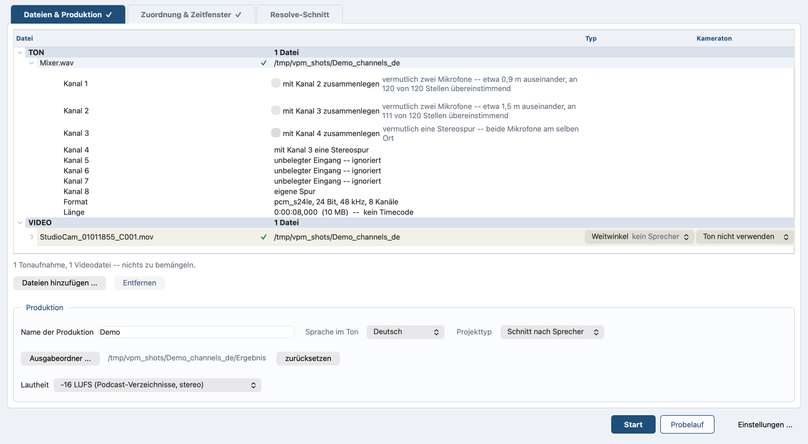

# Kanäle: eine Spur oder zwei?

*In English: [channels.md](channels.md). Zurück zum
[Inhalt](README.de.md).*

## Eine Spur oder zwei

Eine Datei mit zwei Kanälen kann zweierlei sein: ein Mikrofonpaar, oder
zwei Personen, die ein Recorder in eine Datei geschrieben hat. Wenn das
Programm sie als Paar liest, landen beide Sprecher in einer Spur.

In der Dateiliste auf dem Reiter **Dateien & Produktion** wird eine
Datei mit mehr als einem Kanal in eine Zeile je Kanal aufgeklappt:
**Kanal 1**, **Kanal 2** und so fort. Jede Zeile trägt ein Häkchen für
den Kanal danach: auf **Kanal 1** heißt es **mit Kanal 2
zusammenlegen**. Neben dem Häkchen steht, was gemessen wurde.

*Acht Kanäle: der Abstand bei Kanal 1 und 2, das Häkchen bei Kanal 3,
unbelegte Eingänge bei 5 bis 7 und eine eigene Spur bei 8.*

Für die Paare gelten drei Regeln:

* Das Programm fragt jeden Nachbarn, nicht jeden zweiten.
* Ein Kanal gehört nur zu einem Paar. Das Zusammenlegen von 2 und 3
  nimmt der Zeile von **Kanal 3** ihr eigenes Häkchen. Sie sagt **mit
  Kanal 2 eine Stereospur**.
* Wenn zwei Nachbarn beide nach einem Paar aussehen, gewinnt der linke,
  bis jemand etwas anderes sagt.

Damit zwei Kanäle eine Stereospur werden: das Häkchen in der Zeile des
ersten der beiden setzen. Es wegzunehmen nimmt das Paar wieder
auseinander. Die Messung schlägt vor, das Häkchen berichtigt:

* Ein Paar auseinanderzunehmen nimmt genau dieses auseinander und legt
  nichts anderes zusammen.
* Eines zusammenzulegen macht seine beiden Nachbarn frei.
* Nur eine Zeile, die etwas anderes sagt als die Messung, steht als
  **manuell gesetzt -- übersteuert die Messung** da.
* Bis die Messung da ist, sagt die Zeile das, statt zu raten.
* Bei einer Datei, deren Kanalzahl sich gar nicht lesen lässt, sagt der
  Lauf das, statt die Zeile warten zu lassen.

Das Programm benennt die Spuren nach ihren Kanälen: `Channel 1`,
`Channel 2+3`. Die Dateien, in die es sie schneidet, tragen denselben
Namen, zusammengeschrieben und mit einem kurzen Fingerabdruck des
Quellordners dazwischen: `Mixer_3f9a1c02_Channel1+2.wav`. Das Wort
„Channel“ bleibt in jeder Sprache englisch.

Es entscheidet, *wann* die beiden Kanäle dasselbe hören, nicht wie
ähnlich sie sind. Ein Mikrofonpaar hört alles praktisch gleichzeitig;
zwei Ansteckmikrofone auf zwei Personen hören einander verspätet, und
zwar genau um ihren Abstand. Der genannte Abstand stimmt auf einen
Zehntelmeter, und es trägt auch dann noch, wenn das Übersprechen 26 dB
unter dem Sprecher liegt. Die Messreihe zur Kanalpaarung liegt in [What
was measured](../development/measurements.md) (englisch).

Zwei Grenzen, beide in der Zeile benannt. Das Programm liest ein Paar
mit mehr als etwa 30 cm Abstand als zwei Mikrofone. Und eine Datei,
deren beide Kanäle vor dem Zusammenlegen auf eine gemeinsame Zeitachse
gebracht wurden, sieht aus wie ein Paar. Die Zeile behauptet nichts und
schlägt die Trennung vor, wenn die beiden Kanäle zu wenig gemeinsamen
Ton haben. Dieser Abstand ist fest eingebaut; kein Schalter setzt ihn.
Liegt die Messung daneben, übersteuert das Häkchen in der Zeile sie.

Jede Spur, die dabei herauskommt, ist eine Spur wie jede andere: eine
Zeile in der Zuordnung, ein Name, eine Kamera. Sie ist einzeln anhörbar.
Stumme Kanäle werden keine Spur. Das Häkchen übersteuert die Messung
jederzeit, und eine Übersteuerung steht im Projekt.

### Welche Kanäle überhaupt eine Spur werden

Zwei Regeln entscheiden, ob ein Kanal als belegt gilt, und eine genügt:

* Relativ: 45 dB unter dem lautesten Kanal ist ein Eingang, in den
  niemand etwas gesteckt hat.
* Absolut: unter −70 dBFS liegt nur noch der Rauschteppich des
  Wandlers.

Beide Zahlen sind fest eingebaut; kein Schalter setzt sie. Ein Kanal
über beiden Marken wird eine Spur, ein Kanal unter einer der beiden
bleibt draußen.

Die absolute Regel greift nur, wenn wenigstens ein Kanal darüber liegt.
Eine durchweg leise Aufnahme wird weiter nach der relativen Regel
beurteilt. Der Lauf beurteilt die ganze Aufnahme, nicht ihren ersten
Block. Ein Kanal gilt als belegt, wenn er in irgendeinem Block etwas
trägt, und der Lauf beurteilt jedes Paar in dem Block, in dem es am
lautesten ist.

### Stereo bleibt Stereo

Eine Spur behält die Kanäle ihrer Quelle. Ein Paar bleibt den ganzen Weg
zweikanalig, ob die Messung es als eines gelesen hat oder das Häkchen es
gesetzt hat. Es geht auf die Zeitachse, durch die Lautheitsmessung, als
eigene Tonspur in die Kameradatei und in den Mix. Eine zweikanalige
Datei, die gar nicht getrennt wurde, verhält sich genauso.

Wo mehr als eine Spur da ist, ist der Mix ohnehin zweikanalig, eine
Stereospur geht also unverändert hinein. Eine einzelne Aufnahme ist die
Ausnahme: es gibt nichts zu mischen, eine einzelne Monoaufnahme ergibt
also einen einkanaligen Mix, während eine Stereoquelle ihn von allein
auf zwei Kanäle hebt. Der [Vorflug](preflight.de.md) sagt, was eine
Stereospur für die Lautheitsmessung heißt. Wo der Mix zwei Kanäle hat,
kopiert das Programm Monospuren vor der Summe auf beide Seiten, nicht
danach.

Das Programm fordert den fertigen Mixdown bei auphonic.com zweikanalig
an, sobald eine Spur Stereo ist. Bei einer Produktion aus einer
einzelnen Spur schaltet es die Mono-Faltung bei jeder Ausgabe ab, die
das Preset verlangt.

Was auphonic.com mit einer Stereospur innerhalb einer
Multitrack-Produktion macht, wurde am echten Dienst nicht gemessen. Wenn
eine Spur als Stereo hochging und einkanalig zurückkommt, sagt der Lauf
das und macht weiter. Der Mix bleibt zweikanalig, weg ist der
Unterschied zwischen den beiden Mikrofonen dieser einen Spur.

### Wenn etwas klemmt

* **Zwei Personen sind in einer Spur gelandet.** Das Häkchen in der
  Zeile des ersten der beiden Kanäle wegnehmen.
* **Aus einem Mikrofonpaar sind zwei Spuren geworden.** Das Häkchen in
  der Zeile des ersten der beiden setzen.
* **Ein Kanal fehlt in der Zuordnung.** Das Programm hat ihn als
  unbelegt gemessen, und seine Zeile sagt das. Nachsehen, was in diesem
  Eingang steckte.
* **Die Zeile sagt, die Messung läuft noch.** Sie füllt sich selbst,
  sobald die Messung da ist.
* **Eine Stereospur kommt von auphonic.com einkanalig zurück.** Der Lauf
  sagt das und macht weiter. Der Mix bleibt zweikanalig.

Jeder Kanal hat jetzt seinen Platz: eine eigene Spur, eine Hälfte einer
Stereospur, oder er bleibt draußen. Was aus diesen Spuren wird, steht in
[Der einfache Weg](simple-path.de.md) für eine Aufnahme und in
[Multitrack](multitrack.de.md) für mehrere.
