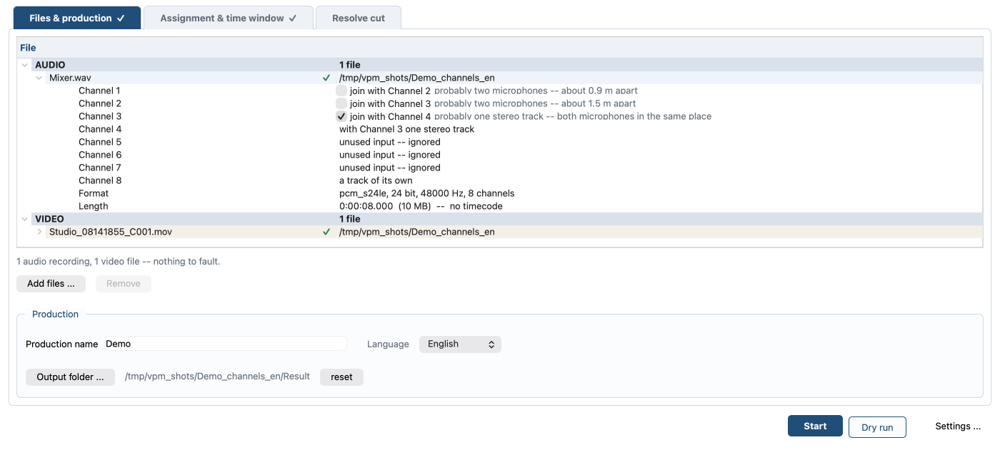

# Channels: one track or two?

*Auf Deutsch: [channels.de.md](channels.de.md). Back to the
[contents](README.md).*

## One track or two

A file with two channels can be two things: one pair of microphones, or
two people that a recorder wrote into one file. If the program reads
them as a pair, both speakers land in one track.

In the file list on the **Files & production** tab a file with more than
one channel opens into one row per channel: **Channel 1**, **Channel 2**
and so on. Each row carries a tick for the channel after it: on
**Channel 1** it reads **join with Channel 2**. What was measured stands
beside the tick.

*Eight channels: the distance on Channels 1 and 2, the tick on Channel
3, unused inputs on 5 to 7 and a track of its own on 8.*

Three rules hold for the pairs:

* The program asks every neighbour, not every second one.
* A channel belongs to one pair only. Joining 2 and 3 leaves the row of
  **Channel 3** without a tick of its own. It says **with Channel 2 one
  stereo track**.
* If two neighbours both look like a pair, the left one wins until
  somebody says otherwise.

To make two channels one stereo track, set the tick on the row of the
first of the two. Clearing it takes the pair apart again. The
measurement proposes, the tick corrects:

* Taking a pair apart takes exactly that pair apart and joins nothing
  else.
* Putting one together frees both its neighbours.
* Only a row that says something other than the measurement reads **set
  by hand -- overrides the measurement**.
* Until the measurement is in, the row says so instead of guessing.
* For a file whose channel count cannot be read at all, the run says
  that rather than leaving the row waiting.

The program names the tracks after their channels: `Channel 1`,
`Channel 2+3`. The files it cuts them into carry the same name, closed
up and with a short fingerprint of the source folder in between:
`Mixer_3f9a1c02_Channel1+2.wav`. The word "Channel" stays English in
every language.

What decides is *when* the two channels hear the same thing, not how
alike they are. One pair of microphones hears everything at practically
the same moment; two clip-ons on two people hear each other late, and by
exactly their distance. The distance it reports is right to a tenth of a
metre, and it still holds even when the bleed is 26 dB below the
speaker. The measurements behind the channel pairing are in [What was
measured](../development/measurements.md).

Two limits, both named on the row. The program reads a pair spaced wider
than about 30 cm as two microphones. And a file whose two channels were
laid on a common time axis before being joined looks like a pair. If the
two channels share too little sound to tell, the row claims nothing and
proposes the split.

Every track that comes out of this is a track like any other: a row in
the assignment, a name, a camera. It can be listened to on its own.
Silent channels do not become tracks. The tick overrules the measurement
at any time, and an override stands in the project.

### Which channels become tracks at all

Two rules decide whether a channel counts as used, and one of them is
enough:

* Relative: 45 dB below the loudest channel is an input nobody plugged
  anything into.
* Absolute: below −70 dBFS only the noise floor of the converter
  remains.

The absolute rule only applies if at least one channel is above it. A
recording that is quiet throughout is still judged by the relative rule.
The run judges the whole recording, not its first block. A channel counts
as used when it carries something in any block, and the run judges each
pair in the block where it is loudest.

### Stereo stays stereo

A track keeps the channels its source has. A pair stays two channels the
whole way, whether the measurement read it as one or the tick set it. It
goes onto the time axis, through the loudness measurement, into its own
audio track on the camera file, and into the mix. A two channel file that
was never split behaves exactly the same way.

The mix has two channels anyway, so a stereo track goes into it as it
is. [Preflight](preflight.md) says what a stereo track means for the
loudness measurement. The program copies mono tracks to both sides
before the sum, not after.

The program asks auphonic.com for the finished mixdown in two channels
as soon as one track is stereo. On the simple path it switches the mono
fold off for every output the preset asks for.

What auphonic.com does with a stereo track inside a multitrack
production has not been measured against the real service. If a track
goes up in stereo and comes back in one channel, the run says so and
carries on. The mix keeps its two channels, and what is gone is the
difference between the two microphones of that one track.

### When something goes wrong

* **Two people landed in one track.** Clear the tick on the row of the
  first of the two channels.
* **One pair of microphones became two tracks.** Set the tick on the row
  of the first of the two.
* **A channel is missing from the assignment.** The program measured it
  as unused, and its row says so. Check what was plugged into that
  input.
* **The row says the measurement is still running.** It fills itself in
  as soon as the measurement is in.
* **A stereo track came back from auphonic.com in one channel.** The run
  says so and carries on. The mix keeps its two channels.

Every channel now has its place: a track of its own, one half of a
stereo pair, or out of the run. What becomes of those tracks is in [The
simple path](simple-path.md) for one recording and in
[Multitrack](multitrack.md) for several.
