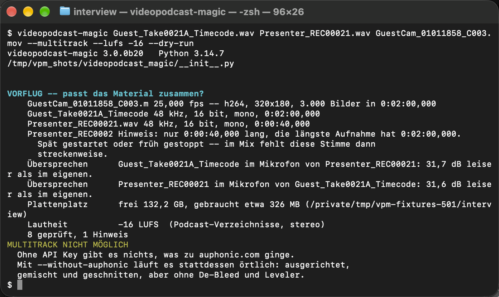

# Alle Schalter

*In English: [command-line.md](command-line.md). Zurück zum
[Inhalt](README.de.md).*

`--help` gibt diese Liste auch aus, immer auf Englisch. Vorgaben in Klammern.
Ein Schalter, der nur auf einem Weg wirkt, trägt in den Tabellen hier
`[multitrack only]` oder `[simple path only]`; in `--help` sind drei von
ihnen ebenso gekennzeichnet, und die Marke bleibt englisch, in welcher
Sprache der Lauf auch läuft.

*`--multitrack --lufs -16 --dry-run` am Ende des Aufrufs, darunter die
Version und das Python, dann der Vorflug mit acht Prüfungen und einem
Hinweis. Ohne Schlüssel hält der Multitrack-Lauf dort an.*

## Grundlagen

| Schalter | Wirkung |
|---|---|
| `--lang KÜRZEL` | Sprache der Meldungen: `de`, `en`, `es`, `fr`, `hi`, `ja`, `pt`, `ru`, `zh` (Systemsprache) |
| `--out ORDNER` | wohin die Ergebnisse kommen (neben jedes Video) |
| `--suffix TEXT` | wird an den Dateinamen gehängt (`_audio`) |
| `--name-camera TEXT` | Name der Kameraspur (`Camera Original`) |
| `--parallel ANZAHL` | so viele Videodateien gleichzeitig; 0 entscheidet selbst, 1 nacheinander (0)  `[multitrack only]` |
| `--dry-run` | nur messen und berichten, nichts schreiben |
| `--version` | Nummer der Version, und auf welchem Python das läuft |
| `--update` | `pip3 install -U` auf die Adresse ausführen, aus der das Programm kam, mit der neuesten Fassung hintendran, in dem Python, in dem es läuft, und schreiben, was pip sagt. Jeder andere Lauf sagt nur, dass eine neuere Version draußen ist |

## Was mit Ton und Bild geschieht

| Schalter | Wirkung |
|---|---|
| `--no-camera-audio` | den Kameraton wegwerfen statt behalten |
| `--no-follow-ups` | nicht nach nummerierten Fortsetzungsdateien suchen (es sucht danach) |
| `--together DATEI ...` | diese Dateien sind eine Aufnahme, in dieser Reihenfolge; wiederholbar. Der Lauf sortiert sonst nach Namen, die Gruppe nicht: ein Block beim ersten ihrer Namen |
| `--apart DATEI` | dieser Block steht für sich, was immer sein Name sagt: er wird an keine Aufnahme angehängt und bleibt im Plan eine eigene Spur, auch wenn er denselben Namen bekommt wie ein anderer Block desselben Aufnahmegeräts; wiederholbar |
| `--no-single-tracks` | nur den Mix ins Video, nicht die Aufnahmen daneben  `[simple path only]` |
| `--no-drift` | Uhrendrift messen und melden, aber nicht herausrechnen |
| `--tc HH:MM:SS:FF` | Starttimecode des Bildes, wenn die Kamera keinen oder einen falschen geschrieben hat (aus der Videodatei) |
| `--fps ZAHL` | anzunehmende Bildrate, wenn ffprobe eine falsche meldet (aus der Videodatei) |
| `--lufs ZAHL` | Lautheitsziel in LUFS für die Summe der Sprecherspuren; tiefer ist leiser, die üblichen Ziele liegen zwischen -23 und -14. Ohne ihn wird nichts angepasst: der Ton wird aus den Quelldateien übernommen, wie er ist (keine) |
| `--speech-language CODE` | Sprachkennung der Tonspuren, ISO 639-2/B: `ger`, `eng`. Vorsicht, `deu` wirft ffmpeg stillschweigend weg (keine) |
| `--speech-language-camera CODE` | dasselbe für die Kameraspur (keine: nur so unterscheidet der QuickTime-Player die beiden Einträge im Tonmenü) |
| `--speakers-local DATEI` | diese Aufnahme auf diesem Rechner nach Stimmen trennen und danach schneiden (die Aufnahme, die der Lauf selbst wählt) |
| `--speakers-from DATEI` | eine fertige Trennung aus einer Projekt- oder Zuordnungsdatei übernehmen, statt zu rechnen (keine) |
| `--speakers-count ZAHL` | wie viele Personen `--speakers-local` suchen soll (selbst herausfinden) |
| `--no-speakers-local` | in diesem Lauf nie eine Aufnahme nach Stimmen trennen (aus) |
| `--no-speech-recognition` | nicht mitschreiben, was gesprochen wird; der Schnitt hat dann keine Satzgrenzen (aus)  `[multitrack only]` |
| `--no-transcript-file` | kein Transkript neben das Ergebnis schreiben; sonst kommen die gehörten Wörter als json, srt und txt in den Ausgabeordner (aus)  `[multitrack only]` |

## Bei auphonic.com aufbereiten

| Schalter | Wirkung |
|---|---|
| `--auphonic-api-key SCHLÜSSEL` | Schlüssel aus den Kontoeinstellungen, schaltet die Aufbereitung ein. Ohne Dateien listet er nur die Presets |
| `--auphonic-preset NAME` | Name oder Kennung des Presets (das Programm fragt) |
| `--auphonic-wait SEKUNDEN` | wie lange gewartet wird (7200) |
| `--auphonic-resume WAS` | Produktion ist schon da: `result`, `rerun`, `adopt`, `upload`, `abort` (das Programm fragt)  `[multitrack only]` |
| `--auphonic-done ORDNER` | schon aufbereitete Spuren, nach den Sprechern benannt. Der Lauf nimmt sie von dort, statt sie hochzuladen, und das Guthaben bleibt unangetastet  `[multitrack only]` |
| `--multitrack` | jede Tondatei als eigene Spur, damit auphonic.com das Übersprechen herausnehmen kann. Braucht ein Multitrack-Preset |
| `--assign DATEI` | JSON, welcher Ton zu welcher Kamera gehört; die Oberfläche schreibt es  `[multitrack only]` |
| `--without-auphonic` | auf diesem Rechner ausrichten, mischen und schreiben, Kameraschnitt aus eigener Spracherkennung |

## Das Zeitfenster setzen

| Schalter | Wirkung |
|---|---|
| `--in-point ZEIT` | Anfang: `17:20:14` absolut, `+12:30` oder `90` ab Fensterbeginn (aus den Videodateien) |
| `--out-point ZEIT` | Ende, gleiche Schreibweise; `-30` zählt vom Ende zurück (aus den Videodateien) |

## Den Kameraschnitt steuern

| Schalter | Wirkung |
|---|---|
| `--min-edit-duration SEKUNDEN` | wie kurz eine Einstellung stehen darf; kürzere gehen in die folgende auf, 0 aus (3) |
| `--min-speech-to-switch SEKUNDEN` | wie lange jemand reden muss, bevor die Kamera ihm folgt, 0 aus (1,5) |
| `--silence-hold SEKUNDEN` | wie lange eine Stille noch als Atempause zählt und nicht als Ende; nur wo `--on-silence` eine kurze Lücke halten soll (1,0) |
| `--edit-change-delay SEKUNDEN` | wie viel später als der Ton das Bild schneidet; negativ lässt es vorlaufen (0,3) |
| `--reaction-lead SEKUNDEN` | wie viel früher das Bild nach einer Frage zur Antwort geht (1,5) |
| `--reaction-gap SEKUNDEN` | wie schnell die Antwort auf die Frage folgen muss, damit der Reaktionsschnitt greift (3) |
| `--reaction-hold ANTEIL` | wie viel der zehn Sekunden nach der Frage der Antwortende halten muss, zwischen 0 und 1 (0,7) |
| `--on-monologue WERT` | einer redet allein, länger als `--wide-after`: `wide`, `listener`, `alternate`, `hold` (alternate) |
| `--on-together WERT` | mehrere reden zugleich, und keine Kamera zeigt genau sie: `wide`, `listener`, `alternate`, `hold` (wide) |
| `--on-silence WERT` | es redet überhaupt niemand: `wide`, `hold-brief`, `hold` (wide) |
| `--on-uncertain WERT` | die Erkennung ist unsicher, und es redet jemand: `wide`, `listener`, `alternate`, `hold` (wide) |
| `--on-question WERT` | nach einer Frage: `off`, `answer`, `listener` (answer) |
| `--wide-shot DATEI` | diese Videodatei ist ein Weitwinkel: eine Kamera, vor der niemand sitzt, sie nimmt keinen Sprecher; wiederholbar. Ohne ihn sind es die Kameras ohne zugeordneten Sprecher |
| `--wide-after SEKUNDEN` | ab dieser Standzeit bricht das Programm die Einstellung an einer Satzgrenze auf, nicht nach der Uhr, 0 aus (70) |
| `--wide-length SEKUNDEN` | wie lange die eingeschobene Einstellung mindestens steht; danach läuft sie bis zum Satzende (5) |
| `--wide-most SEKUNDEN` | wie lange sie höchstens steht; wenn das Satzende darüber liegt, beendet die letzte Teilsatzgrenze davor die Einstellung (15) |
| `--wide-latest SEKUNDEN` | wie lange eine Kamera höchstens ohne Schnitt stehen darf (120) |
| `--no-wide-edges` | den Weitwinkel nicht über Begrüßung und Verabschiedung halten |

## Vorflug und Kennzahlen steuern

| Schalter | Wirkung |
|---|---|
| `--no-preflight` | die Prüfung vor dem ersten langen Schritt überspringen |
| `--preflight-again` | neu messen statt die gespeicherte Messung zu nehmen |
| `--anyway` | auch laufen, wenn der Vorflug einen Grund zum Anhalten gefunden hat |
| `--no-metrics` | am Ende keine Kennzahlen und keinen Farbvergleich  `[multitrack only]` |

## Vorspann und Abspann hinzufügen

| Schalter | Wirkung |
|---|---|
| `--intro DATEI` | über den Anfang gelegt, auf der zweiten Bild- und Tonspur. Wird weder ausgerichtet noch aufbereitet |
| `--outro DATEI` | dasselbe für das Ende; beginnt, wo das letzte Wort endet |

## Mit DaVinci Resolve arbeiten

| Schalter | Wirkung |
|---|---|
| `--resolve` | danach Projekt und Timelines bauen. Resolve muss laufen |
| `--resolve-json DATEI` | nur den Resolve-Teil, aus einer schon vorhandenen `..._resolve.json` |
| `--resolve-project WAS` | Projekt ist schon da: `update`, `keep`, `new`, `abort` (das Programm fragt) |
| `--resolve-audio-tracks` | nur die Tonzuordnung des offenen Projekts ausgeben; das Programm liest es und lässt es, wie es ist |
| `--hdr-check DATEI` | nur nachsehen, ob eine fertige Datei alles trägt, was sie als HDR ausweist |

Das sind alle Schalter. Das Kapitel, zu dem ein Schalter gehört, nennt
auch das Feld im Fenster, das ihn setzt; der [Inhalt](README.de.md)
führt die Kapitel auf.

## Wenn etwas klemmt

* **Ein Schalter, den das Programm nicht kennt.** Der Lauf hält an,
  bevor etwas geschieht, und gibt die ganze Liste der Schalter aus. Die
  Schreibweise mit den Tabellen oben vergleichen.
* **Der Lauf hält sofort an und nennt eine ffmpeg-Fassung.** Dieses
  ffmpeg ist älter als 9.0.1, oder es fehlt ganz. Mit Schaltern
  gestartet, sagt das Programm es in dem Terminal, aus dem es gestartet
  wurde, und zwar bevor etwas geschieht, und bietet dort an, eines zu
  holen; `--help`, `--version` und `--update` antworten weiterhin. [Was
  gebraucht wird](requirements.de.md#woher-ffmpeg-kommt) sagt, warum
  diese Fassung und woher man sie bekommt.
* **Eine Zeile sagt, diesem ffmpeg fehle soxr.** Das wird gesagt, nicht
  gefragt, und nichts hält an: Der Uhrengang zwischen den Kameras wird
  dann in hundertmal gröberen Stufen ausgeglichen. Gesagt wird es nur
  dort, wo sich auf diesem Rechner etwas daran ändern ließe.
* **Ein Wert mit einem Leerzeichen darin.** In Anführungszeichen
  setzen: `--auphonic-preset "<Name des Presets>"`. Ohne sie kommt das
  zweite Wort als Dateiname an.
* **`--multitrack` ohne Schlüssel.** Der Lauf hält nach dem Vorflug an.
  Dem Programm einen Schlüssel geben, oder `--without-auphonic` auf
  diesem Rechner ausrichten, mischen und schneiden lassen.
* **Die Liste ist auch in einem deutschen Lauf englisch.** `--help` und
  die Namen der Schalter folgen `--lang` nicht; der Schalter setzt die
  Sprache der Meldungen.
