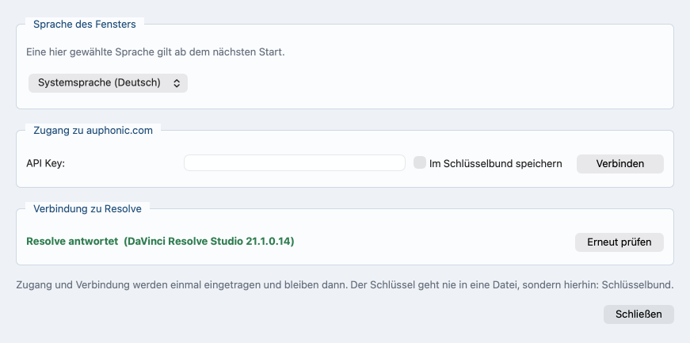

# Die Oberfläche

*In English: [interface.md](interface.md). Zurück zum
[Inhalt](README.de.md).*

## Die vier Reiter

Vier Reiter, in der Reihenfolge, in der man sie braucht.

- **Dateien & Produktion**: oben die Dateiliste, darunter ein schmaler
  Streifen mit Produktionsname, gesprochener Sprache und Ausgabeordner.
  Dateien oder ganze Ordner hineinziehen, hinzufügen oder ein früheres
  Projekt öffnen. Solange die Liste leer ist, steht dort eine
  Ablegefläche, die den Ablauf erklärt.

  Das Programm nennt den Blick auf das Material vor einem Lauf den
  Vorflug. Jede Datei bekommt daraus schon beim Hinzufügen ein
  Prüfzeichen: ✓ nichts zu bemängeln, ! ein Hinweis, ✕ so geht es nicht.
  Unter der Liste steht das Ergebnis in einem Satz;
  [Vorflug](preflight.de.md) sagt, was jedes Prüfzeichen bedeutet.

  **Projekt öffnen ...** steht auf der Ablegefläche und unter **Datei**.
  Ein geöffnetes Projekt nimmt jederzeit neue Dateien auf, und sein Name
  steht in der Titelzeile — ein Fenster mit geöffnetem Projekt und eines
  ohne sind so nicht dasselbe Bild.

  Liegt beim Material eine Projektdatei, bietet das Programm sie an,
  während die Dateien hereinkommen, und bevor eine davon vermessen wird:
  findet es eine, fragt es einmal und nennt sie mit dem Tag, an dem sie
  geschrieben wurde; findet es mehrere, zeigt es sie zur Auswahl; findet
  es keine, geschieht nichts. Teilweise wird nie geladen — das Projekt
  kommt ganz zurück, mit den Namen, jeder Trennung, die darin steht, wer
  vor welcher Kamera sitzt, den Typen und dem Zeitfenster, oder es wird
  gar nicht geöffnet.

  Ein **Nein** lässt die hereingekommenen Dateien genau dort, wo sie
  sind. Die Liste entsteht aus ihnen und wird vermessen wie sonst auch,
  einmal, und dieselbe Projektdatei wird kein zweites Mal angeboten. Ein
  **Ja** setzt die Dateien des Projekts an ihre Stelle, und weil die
  Frage zuerst kam, wurde nichts vermessen, was die Antwort gleich
  darauf wegwirft. Material aus einem anderen Ordner bietet das Projekt
  dieses Ordners an; weiteres Material aus einem Ordner, nach dem schon
  gefragt wurde, fragt nicht noch einmal. Ist ein Projekt offen, wird
  nichts mehr angeboten.

  Der Ausgabeordner wird nicht geraten. Solange keiner gewählt ist und
  kein Projekt sagt, wohin es geht, steht an seiner Stelle **neben der
  jeweiligen Videodatei**, und genau dorthin geht das Ergebnis. Steht
  dort ein Ordner, erscheint daneben **zurücksetzen** und legt das
  Ergebnis wieder neben die jeweilige Videodatei. Der Produktionsname
  wird aus dem Ordner vorgeschlagen, in dem das Material liegt, und
  lässt sich überschreiben.

  Jede Videodatei trägt in der Liste das Feld **Kameraton**. Es steht
  auf **Ton nicht verwenden**, bis jemand es auf **Ton verwenden**
  stellt. Dann geht dieser Ton denselben Weg wie eine eingelesene
  Aufnahme: Kanäle gemessen, eine Spur oder zwei entschieden, leere
  Kanäle bleiben draußen, in Spuren zerlegt. Zum Synchronisieren wird
  dieser Ton ohnehin genommen; darüber entscheidet das Feld nicht.

  Wo nichts zu entscheiden ist, setzt sich das Feld selbst, ist
  ausgegraut und trägt den Grund daneben:

  - die Datei hat keine Tonspur,
  - die Datei bleibt ganz draußen,
  - die Datei ist ein Intro oder ein Outro,
  - eine einzige Videodatei trägt Ton, und keine Tonaufnahme steht
    daneben. Dieser Ton ist dann der einzige, den es gibt, und das Feld
    steht auf **Ton verwenden**. Kommt eine Tonaufnahme dazu, ist die
    Wahl wieder frei.

  Dasselbe Feld steht auf **Zuordnung & Zeitfenster** bei der Kamera,
  auf demselben Wert: ändert man eines, folgt das andere sofort.

  Jede Videodatei trägt in der Liste außerdem das Feld **Typ**:
  **Inhalt**, **Weitwinkel**, **Vorspann**, **Abspann** oder
  **Video ignorieren**. Wer auf dem Feld stehen bleibt, erfährt, was die
  Einträge bedeuten. Das Feld selbst wird nie im Ganzen ausgegraut —
  Grau über dem ganzen Kasten hieße „hier ist nichts zu machen“, und zu
  machen ist immer etwas.

  Gesperrt wird ein Eintrag der Liste: er steht grau da und lässt sich
  nicht wählen, und der Grund steht an ihm — wer darauf stehen bleibt,
  liest ihn. Zwei Einträge können zugleich gesperrt sein, jeder mit
  seinem eigenen Satz.

  - Eine Kamera, der niemand zugeordnet ist, zeigt **Weitwinkel**,
    obwohl niemand sie so gekennzeichnet hat. Gesperrt ist dann
    **Inhalt**, weil ihr kein Sprecher zugeordnet ist. Gibt man dieser
    Kamera einen Sprecher oder setzt den **Typ** selbst, ist der Eintrag
    wieder frei.
  - Eine Datei, für die die Messung keinen Platz gefunden hat, ist
    weder Inhalt noch Weitwinkel; für sie sind beide Einträge gesperrt.
    Inhalt wird in die Folge hineingeschnitten, und für diese Datei
    gibt es dort keine Stelle. Der Weitwinkel ist die Kamera, die
    durchläuft und einspringt, wo keine andere passt, also muss er auf
    der Zeitachse liegen. An jedem Eintrag steht sein eigener Grund,
    und das Programm setzt eine solche Datei von sich aus auf
    **Vorspann**.

    Für diese beiden Sperren muss zweierlei zugleich zutreffen, keines
    davon allein. Der Ton der Datei muss schlecht zum Rest passen **und**
    kein Timecode darf sie zwischen die anderen einordnen, wozu ein
    Timecode auf der Datei gehört und einer auf etwas anderem im
    Material; eine einmal abgelesene Uhr sagt nichts. Ein Jingle ist
    beides auf einmal: kein Timecode, und im Ton nichts, was der Raum
    auch hat — er steht rot in der Liste. Eine Kamera, deren Mikrofon vom
    Raum nichts gehört hat, ist nur das erste, und ihr eigener Timecode
    setzt sie weiterhin framegenau — sie behält also die Wahl, und die
    Liste schreibt das neben sie, statt sie rot zu färben.

  **Vorspann**, **Abspann** und **Video ignorieren** werden nie
  gesperrt. Das sind Antworten über die Datei selbst und haben nichts
  damit zu tun, wer vor welcher Kamera sitzt. Eine Datei, die zu nichts
  passt, gehört genau in einen dieser drei Einträge.

  Die beiden Sperren an einer Datei, die nirgends hinpasst, sind keine
  Empfehlung, sondern eine Feststellung über das Material. Sie gelten
  darum auch gegen einen **Typ**, den jemand selbst gewählt hat, und
  gegen einen, den eine Projektdatei mitgebracht hat: steht dort Inhalt
  oder Weitwinkel, wird die Datei auf **Vorspann** gesetzt. Bei der
  Kamera, der niemand zugeordnet ist, ist es umgekehrt — wer den **Typ**
  selbst setzt, beendet die Sperre.

  Jede Sperre geht von selbst wieder weg, sobald ihr Grund weg ist.
  Eine Kamera, die einen Sprecher bekommt, bekommt **Inhalt** zurück,
  und eine Datei, die eine spätere Messung einordnen kann, bekommt
  beide Einträge zurück. Wohin die Datei inzwischen gesetzt wurde,
  bleibt stehen, bis jemand es selbst ändert.

  Eine Datei mit mehr als einem Kanal sagt darunter, was aus ihr wird: je
  Kanal eine Zeile, mit einem Häkchen, das in der ersten Zeile
  **mit Channel 2 zusammenlegen** anbietet, und daneben, was gemessen
  wurde. Das Programm benennt Kanäle, in denen nichts steht, und lässt
  sie aus allem Weiteren heraus.
  [Kanäle: eine Spur oder zwei?](channels.de.md) sagt, wie das Programm
  die beiden unterscheidet.

  Eine einzelne Fortsetzungsdatei lässt sich für sich entfernen. Sie
  bleibt dann draußen, obwohl sie im Ordner liegt, und später wieder
  hinzugefügt ist sie eine eigene Aufnahme. Erst wenn die ganze Aufnahme
  entfernt und wieder hinzugefügt wird, gehören die Blöcke wieder
  zusammen.

  **Mit der Datei gehen die Antworten über sie**: der Sprechername, die
  Kamera, der **Typ**, das Ausgemachte über ihre Kanäle. Die
  Projektdatei wird aus demselben Vorrat geschrieben, also ist das, was
  die Liste verlassen hat, auch aus ihr heraus, und eine wieder
  hinzugefügte Datei kommt blank zurück und wird neu gefragt. Bisher
  blieb das Entfernte in der gespeicherten Projektdatei stehen, und wer
  eine Datei später wieder hinzunahm, bekam wortlos die alte Antwort --
  eine Aufnahme mit leerem Namen, eine Kamera auf **Vorspann**.

  

  *Die Liste nach dem Öffnen eines Projekts, mit den Prüfzeichen aus
  dem Vorflug und dem Streifen darunter.*
- **Zuordnung & Zeitfenster**: links die Tabellen, rechts der Player.
  Erscheint mit den Dateien.

  Die Aufnahmen sind ein Baum. Seine zweite Spalte ist der
  **Sprechername**. Sie startet leer, mit dem Namen, den der Dateiname
  nahelegt, grau darin: ein eingetippter Name sagt, dass die Aufnahme
  diese eine Person ist, und der Eintrag **mehrere Sprecher**, den man
  stattdessen wählen kann, setzt das Programm daran, auf diesem Rechner
  zu ermitteln, wer wann in genau dieser Aufnahme spricht. Erst diese
  Antwort zeigt die Stimmen. Eine Trennung, die niemand beantwortet
  hat, lässt das Feld leer und die Zeilen verborgen, und eine spätere
  Antwort holt sie sofort hoch, mit den Namen und Kameras, die sie
  schon hatten. Die fünfte Spalte, **Sprecher**, sagt, wie es darum
  steht -- **Sprecher werden getrennt ...** und **Abbrechen**, solange
  es läuft, in dieser Zeile und in keiner anderen, danach **Getrennt: 4
  Sprecher**, und einen Grund, wo die Trennung nicht laufen konnte. Sie
  ist eine Auskunft und sonst nichts: dort startet keine Trennung, und
  wer es sich anders überlegt, geht zurück ins Feld.

  Jede Aufnahme hält ihre eigene Trennung, und mehrere stehen
  nebeneinander: jede Zeile zählt die Stimmen ihrer eigenen Aufnahme,
  und wird eine zweite aufgetrennt, bleiben Zeilen, Namen und Kameras
  der ersten unangetastet. Nur **Abbrechen** steht immer in einer
  einzigen Zeile, denn aufgetrennt wird eine Aufnahme nach der anderen.

  Ein Name ist eine Person, und eine Person steht einmal auf dem Blatt.
  Ein Name, den es schon gibt, färbt sein Feld schon beim Tippen rot --
  auf beiden Ebenen und über die Trennungen hinweg. Was das heißt, ist
  auf den beiden Ebenen verschieden. Zwei Aufnahmen unter einem Namen
  sind eine Rückfrage und keine Weigerung: sie sollen zu einer einzigen
  Spur werden, und die Zeile unter der Tabelle sagt das;
  [Multitrack](multitrack.de.md) hat diese Seite ganz. Eine **Stimme**
  unter einem Namen, den schon jemand anderes trägt, ist dagegen eine
  Weigerung -- der Hinweis am Feld bittet um einen eigenen, **Start**
  bleibt gesperrt, und die Zeile unter den Knöpfen nennt die Person.

  Zu welcher Kamera eine Aufnahme gehört, ergibt sich aus diesem Namen,
  solange niemand selbst eine wählt; ein später getippter oder
  verbesserter Name zieht die Kamera also mit. Eine von Hand gewählte
  Kamera ist eine Antwort und bleibt, wo sie hingesetzt wurde.

  Bei mehr als einer Tonaufnahme läuft nichts von selbst; die Antwort in
  der Zeile startet es. Unter den Aufnahmen steht **Auf diesem Rechner
  nicht**: das schaltet die Trennung für das ganze Projekt ab.

  Die Stimmen sind die Zeilen unter der Aufnahme, in der sie gehört
  wurden ([Spracherkennung und Sprechertrennung](speech.de.md)),
  eingerückt und zunächst aufgeklappt. Jede sagt in der ersten Spalte
  **Stimme**, damit die Stufe zu sehen ist, und trägt den Namen und die
  zugehörige Kamera. Eine Aufnahme mit Stimmen darunter trägt selbst
  keine Kamera -- die tragen die Zeilen darunter, damit die Zuordnung
  nie auf zwei Ebenen zugleich steht --, und ihre eigene Zelle unter
  **gehört zu** sagt genau das, grau: **die Stimmen darunter tragen die
  Kameras**. Klappt man die Stimmen zu, nennt dieselbe Zelle statt
  dessen sie -- die Kameras: **auf 2 Kameras**, oder **auf 1 Kamera, 1
  ohne**, wenn eine Stimme noch keine hat. Ein Klick auf eine Stimme holt den
  Player an die Stelle, wo diese Stimme am längsten redet, und spielt
  sie ab. Aufnahmen, die keine Stimmen zeigen, sind eine flache Liste,
  ohne Dreiecke.

  Vergibt das Programm den Namen einer Stimme selbst, nimmt es die erste
  Nummer, die niemand hat -- gezählt über alle Trennungen und über die
  Aufnahmen darüber. So beginnt eine zweite Aufnahme nicht mit einem
  zweiten **Sprecher 1**: wo **Sprecher 1** steht, heißt der nächste
  **Sprecher 2**. Ein von Hand gegebener Name wird nie umnummeriert, und
  eine Nummer, die wieder frei wird, wird wieder benutzt.

  Die Kameratabelle darunter trägt noch einmal **Kameraton**, bei jeder
  Kamera, auf dem Wert aus der Dateiliste, und daneben den **Typ**, auf
  demselben Wert und mit denselben gesperrten Einträgen: dass ein Clip
  in Wahrheit ein Abspann ist, merkt man beim Ansehen, und der Player
  steht hier. Eine Kamera auf **Ton verwenden** bekommt eine Zeile in
  der Zuordnungstabelle darüber, wie eine eigene Aufnahme.

  

  *Oben, welche Aufnahme zu welcher Kamera gehört, unten, was aus
  jeder Kamera wird.*
- **Resolve-Schnitt**: eine Zeile, die sagt, ob Resolve antwortet, mit
  dem Weg zu den Einstellungen daneben. Dann das Zeitfenster, der Kasten
  mit den Werten für den Schnitt und der Kasten **Sprecher**, dessen
  Überschrift die Quelle der Sprecher nennt. Zuletzt der Kasten
  **Kameraschnitt -- Vorschau** mit Schnittband und abspielbarer
  Vorschau. Das Bild sagt unter sich, auf einer Fläche in der Farbe der
  laufenden Einstellung, wer spricht und welche Kamera läuft; hat eine
  Einstellung kein Bild, füllt die Farbe die ganze Fläche, und die
  beiden Zeilen stehen darauf. [Der Kameraschnitt](camera-cut.de.md)
  liest sie aus.

  Das Band teilt sich seine Zeile mit drei Zoom-Knöpfen und, ganz am
  Ende der Zeile, der gezeigten Zeitspanne in Schreibmaschinenziffern:
  `0:00:00 -- 0:42:13`. **−** zeigt doppelt so viel, **+** halb so viel
  um die aktuelle Stelle, der dritte wieder die ganze Länge. Die Anzeige
  steht vom ersten Augenblick an da, bevor jemand gezoomt hat:
  ungezoomt ist es das ganze Material, und solange nichts im Band steht,
  liest sie `0:00:00 -- 0:00:00`. Ihre Breite liegt fest, damit die drei
  Knöpfe unter dem Zeiger stehen bleiben, während die Zahlen wechseln.
  [Der Kameraschnitt](camera-cut.de.md) sagt, wie das Band selbst zu
  lesen ist und was die Überschrift des Kastens **Sprecher** besagt.

  Im Kasten **Kameraschnitt -- Vorschau** steht unter der Vorschau eine
  Zeile, die sagt, worauf dieser Schnitt beruht; ihre Farbe bewertet die
  Auskunft. Sie bleibt stehen, solange es Zahlen gibt.

  - **gemessen aus den Aufnahmen -- 3 Sprecher, 1:09:23**, in der
    Warnfarbe. Es ist noch nichts gelaufen; die Sprecher sind aus den
    Aufnahmen herausgehört, wie sie daliegen, und der Schnitt davor ist
    ein vorläufiger.
  - **aus dem fertigen Lauf -- 3 Sprecher, 1:09:23**, in der guten
    Farbe. Ein Lauf ist durch, und die Vorschau steht auf dessen
    Ergebnis: alle Spuren auf einer Achse, die Sprecher so, wie der Lauf
    sie gefunden hat.
  - **aus den bearbeiteten Auphonic Spuren -- 3 Sprecher, 1:09:23**,
    ebenfalls in der guten Farbe. Dasselbe, und die Spuren sind von
    auphonic.com zurückgekommen, das Übersprechen der Nachbarn heraus.

  Damit ist die eine Frage beantwortet, die man an eine Vorschau hat:
  ob man ihr trauen kann. Ist ein Lauf durch, stehen Vorschau und Lauf
  auf demselben Boden -- dieselben Sprecher, dieselbe Achse. Verstellt
  man danach die Regler, folgt die Vorschau ihnen sofort; drückt man
  **Resolve-Projekt anlegen**, wird der Schnitt für Resolve neu
  gerechnet, aus den Werten, die jetzt dort stehen, und ebendiesem
  Ergebnis. Kein zweiter Lauf, und kein Rückfall auf eine vorläufige
  Lesart. Solange die Zeile in der Warnfarbe steht, kann sich jede Zahl
  daneben noch verschieben.

  Die Vorschau rechnet den Uhrengang jedes Recorders mit, so wie der
  Lauf es tut. Keine zwei Recorder laufen exakt gleich schnell; über
  eine Stunde macht das ungefähr eine Zehntelsekunde aus. Früher hat die
  Vorschau ihn gemessen und wieder weggeworfen, und ihre Schnittpunkte
  liefen dann über eine Stunde um rund 143 Millisekunden gegen den Lauf
  davon, also drei bis vier Bilder. Jetzt bleiben sie unter einem Bild.
  Auf welche Kamera geschnitten wird, war davon nie berührt: dafür war
  der Abstand viel zu klein.

  Vorschau und Lauf behalten auch dieselben Kameras. Beide stellen an
  eine Datei die eine Frage, an der es hängt -- hat sie überhaupt einen
  Platz --, und darum steht eine Kamera, deren Ton nicht erkannt wurde,
  die ihre Uhr aber zwischen die anderen setzt, im Band ebenso wie im
  fertigen Projekt. Früher ließ das Band eine Kamera weg, die der Lauf
  behielt, und die Legende darunter zählte dann eine Kamera weniger, als
  aus Resolve herauskam.

  In derselben Zeile steht der Knopf **Sprecher jetzt messen** -- immer
  dann, wenn eine Spur weder von einer Trennung abgedeckt noch gemessen
  ist, also auch neben einer Trennung, die schon steht. Dann steht dort,
  wer fehlt, anstelle dessen, worauf der Schnitt beruht. Diese Leute
  sind im Schnitt; nur diese Vorschau kann sie erst nach dem Messen
  zeigen. Scheitert eine Messung, steht der Grund an derselben Stelle.
  Nach einem Lauf ist der Knopf fort, und nur die Zeile bleibt: der Lauf
  hat jede Spur gemessen, die er hatte, und sein Ergebnis ist feiner als
  das dieses Knopfes.

  Der Kasten mit den Werten heißt **Kameraschnitt**, wenn die Sprecher
  auf zwei oder mehr Kameras sitzen. Bei einer Kamera für alle heißt er
  **Erster Schnitt nach Sprechern**. Dort wird nichts gewechselt: der
  Schnitt fällt bei jedem Sprecherwechsel, und Resolve bekommt je Person
  einen Clip. Bei einer Person und einer zweiten Kamera, auf der niemand
  ist, heißt er **Schnitt mit dem Weitwinkel**: die Kamera dieser Person
  steht, und der Weitwinkel bricht sie auf. Mit gesetztem **Multitrack**
  bleibt der Name **Kameraschnitt**.

  Der Kasten erscheint, sobald **Multitrack** gesetzt ist oder zwei
  Personen einen Namen und eine Kamera tragen. Woher die beiden kommen,
  macht keinen Unterschied, und beide Herkünfte zählen zusammen: eine
  Stimme unter einer getrennten Aufnahme und eine Aufnahme mit eigenem
  Namen sind zwei Personen, ebenso zwei Stimmen oder zwei Aufnahmen. Eine
  Person genügt, wo es zwei oder mehr Kameras gibt. Eine Person auf einer
  einzigen Kamera bekommt keinen Kasten, und das ist richtig: es gibt
  nichts, wohin geschnitten werden könnte. Bis dahin steht an der
  Stelle von Kasten und Vorschau eine Zeile, die sagt, was fehlt. Ein
  Resolve-Projekt entsteht trotzdem, mit jeder Kamera am gemessenen
  Platz.

  Beide hinteren Reiter stehen mit und ohne getrennte Spuren da, und die
  Zuordnung ebenso: **gehört zu** wird mit dem Häkchen gefragt und ohne
  es, denn zu welcher Kamera eine Aufnahme gehört, ist ohnehin
  dieselbe Frage, und der Lauf macht dieselbe Antwort daraus. Das
  Häkchen anzuklicken kostet deshalb nichts — von Hand gewählte Kameras
  bleiben stehen.
- **Ausgabe**: erscheint, sobald etwas läuft, in denselben Farben wie
  das Terminal, mit den Knöpfen **Ergebnis-Ordner öffnen** und
  **Resolve-Projekt anlegen**. Der Reiter kommt außerdem beim Öffnen
  eines Projekts hoch, wenn im Ausgabeordner schon fertige Dateien
  liegen -- die Knöpfe gehören zu diesen Dateien, und so sagt das Blatt,
  wie die Dinge stehen, statt wie ein misslungener Lauf auszusehen.

**Multitrack (je Sprecher eine Spur)** hat eine eigene Zeile unter der
Zuordnungstabelle, über dem Auphonic-Kasten. Es geht mit auphonic.com
und ohne; nach dem API Key fragt das Programm erst auf dem Weg über
auphonic.com. Der Kameraschnitt braucht das Häkchen nicht.

Multitrack braucht zwei Eingangsspuren. Eine Eingangsspur ist eine
eigene Aufnahme, ein Kanal eines mehrkanaligen Aufnahmegeräts oder der
Ton einer Videodatei, die auf **Ton verwenden** steht. Mehrere Blöcke
derselben Aufnahme zählen als eine Spur, eine beiseitegelegte Spur gar
nicht.

Das Häkchen bleibt anklickbar, was auch immer im Projekt liegt. Bei nur
einer Spur sagt das eine graue Zeile daneben, und sie nennt den Weg zur
zweiten: **Kameraton** bei einer Kamera, gestellt auf
**Ton verwenden**. Wenn jede Kamera ihren Ton schon hergibt, sagt diese
Zeile, dass keiner mehr übrig ist.

Unter dem Auphonic-Kasten erscheint ein zweiter Balken, solange das
Material vermessen wird, mit einer Zeile je Datei und dem Stand jeder
einzelnen. Eine Zeile verschwindet, sobald ihre Datei fertig ist, der
Balken selbst kurz nach der letzten. Er zeigt die Vorarbeit -- Ton
lesen und Hüllkurven rechnen --, also dieselbe Arbeit, die der Balken
neben **Start** mitträgt, hier Datei für Datei.

**Sprache** neben dem Produktionsnamen ist die in der Aufnahme
gesprochene Sprache, vorbelegt aus der Systemsprache. Sie tut zweierlei:
Sie wird zur Kennzeichnung der geschriebenen Tonspur, und die Erkennung
auf diesem Rechner wird auf diese Sprache eingestellt. „nicht gesetzt“
lässt die Spur ungekennzeichnet und überlässt der Erkennung die Sprache.
Zur Auswahl stehen nur Sprachen, die die Erkennung hier auch versteht.
[Das Transkript entsteht hier](auphonic.de.md#das-transkript-entsteht-hier)
sagt, was die Erkennung schreibt, und [Spracherkennung und
Sprechertrennung](speech.de.md), welchen Weg sie auf welchem Rechner
nimmt.

**Lautheit** in der Gruppe **Produktion** auf der ersten Seite legt fest,
wie laut die fertige Folge gemacht wird; derselbe Gewinn geht auf jede
Spur, so bleibt das Verhältnis der Sprecher erhalten. Fünf Einträge:

- **-16 LUFS (Podcast-Verzeichnisse, stereo)**
- **-19 LUFS (Podcast-Verzeichnisse, mono)**
- **-14 LUFS (YouTube -- regelt nur herunter, nie herauf)**
- **-23 LUFS (EBU R128, Rundfunk)**
- **Aus Quelldateien übernehmen**

Ein neues Projekt beginnt bei −16 LUFS. Das Fenster merkt sich den zuletzt
gewählten Eintrag, und eine geladene Projektdatei sticht diese Erinnerung.
**Aus Quelldateien übernehmen** passt gar nichts an: auphonic.com macht
weiter, was in seinem Preset steht, und ohne auphonic.com bleibt der Ton
wie in den Quelldateien -- die Datei kommt Byte für Byte gleich heraus.

[Welches Lautheitsziel gilt](preflight.de.md#welches-lautheitsziel-gilt)
sagt, was sonst noch am Ziel hängt: die Normalisierung der Spuren, die
Anzeige im Resolve-Projekt und was im Protokoll steht.

**Probelauf** ist der Lauf, der misst und berichtet, aber nichts schreibt.
Er und **Start** bleiben gesperrt, solange etwas offen ist, und
**unter den Knöpfen steht, was**, mitsamt dem Reiter, auf dem es steht:

- keine Dateien,
- kein Ton in Verwendung: keine Tonaufnahme, und keine Videodatei auf
  **Ton verwenden**,
- kein Produktionsname,
- weniger als zwei Spuren in der Zuordnungstabelle für Multitrack,
- bei Multitrack eine Aufnahme ganz ohne Namen: keiner getippt, und
  keiner, den der Dateiname nahelegt -- der graue Vorschlag gilt als
  Name, wo nichts darüber getippt wird,
- bei Multitrack alle Aufnahmen unter demselben Namen,
- eine **Stimme** unter einem Namen, den schon jemand anderes trägt: der
  Schnitt setzt eine Person auf eine Kamera, und ein Name auf zwei
  Stimmen wäre diese Person an zwei Stellen,
- zwei Kameras mit derselben Ausgabedatei.

Das Feld oder die Zeile, die gemeint ist, wird rot. Ein Häkchen hinter
einem Reiter heißt: dort ist nichts mehr offen. Kein Fenster geht dafür
auf.

Was ein Probelauf von den Sprechern zeigt, hängt davon ab, was auf
diesem Rechner schon liegt. Eine früher gerechnete Trennung wird
zurückgelesen, und die Stimmen werden mit ihrer Redezeit aufgezählt --
der wirkliche Schnitt, ohne dass dafür etwas gerechnet wird. Nur wo
eine Trennung erst gemessen werden müsste, bleibt sie liegen, und das
Protokoll sagt es. [Spracherkennung und
Sprechertrennung](speech.de.md) zeigt den Block und was darin steht.

Dann eine Zusammenfassung: wie viele Kameras und Tonspuren, wie
lang, welches Preset, wie viele Dateien entstehen, wieviel Platz sie
brauchen und wieviel frei ist. Wenn der Lauf bestehende Dateien
überschreiben würde, zeigt ein Fenster erst, welche.

Der Player hat Abspielen und Pause, sekunden- und frameweise vor und
zurück, Lautstärke und Tempo; links der Timecode, rechts die Position, ab
dem In-Punkt gezählt.

- Ein Klick auf eine Zeile der Zuordnungs- oder der Kameratabelle holt
  die Datei an dieselbe Stelle im Geschehen, so lassen sich zwei Kameras
  vergleichen. Ein Klick auf eine Stimme unter einer Aufnahme öffnet
  diese Aufnahme dort, wo die Stimme am längsten redet, und spielt
  sofort. Das Häkchen **zugeordneten Ton hören** spielt die dieser
  Kamera zugeordnete Aufnahme; ohne das Häkchen ist der Kameraton zu
  hören.
- In-Punkt und Out-Punkt nehmen die Stelle aus dem Bild, ein blauer
  Streifen zeigt das Fenster, und beim Ziehen laufen nur die Zahlen mit.
  Solange die Zeitachse fehlt, sind sie gesperrt.
- Formate, die der Rechner nicht abspielen kann (MXF, R3D, manche
  ProRes-Spielarten), bekommen einen Knopf für `ffplay`.

Die Ausgabe landet zusätzlich in `videopodcast-magic.log` neben dem
Script. Die erste Zeile nennt Version, Zeit, Betriebssystem und Python,
die Zeile darunter den Pfad, aus dem das Programm gestartet wurde --
mehrere Kopien des Programms teilen sich ein Protokoll, und ohne diese
Zeile ist später nicht zu sagen, welche davon was geschrieben hat. Jeder
Start des Programms beginnt die Datei neu und hebt die vorige als
`videopodcast-magic_1.log` auf; eine Datei hält also eine ganze Sitzung
mit allen Läufen darin. Auch was Qt und ffmpeg an Python vorbei
ausgeben, steht darin.

Neben **Start** läuft **ein Balken für alles Ausstehende**, mit einer
Zeile daneben, woran gerade gearbeitet wird; er läuft immer nur vorwärts.
Er deckt beide Hälften ab: das Messen nach jeder Änderung an der
Dateiliste und den Lauf selbst. Zu diesem Messen gehören Hüllkurven,
Kameraton, Kanäle und die Prüfung, und eine Hüllkurve ist die Lautheit
über die Länge einer Spur.

Ein Abschnitt, der echte Prozente meldet, nimmt den Balken mit. Bei einem
Abschnitt, der nichts meldet, kriecht er langsam weiter und bleibt vor
dem Ende stehen.

Für den Lauf selbst nennt die Zeile den Abschnitt, auf beiden Wegen mit
denselben Namen, mit Multitrack und ohne:

- **Plan wird gelesen**
- **Ton aus den Kameras**: nur mit Multitrack. Ohne richtet der Lauf sich
  an den Kameras aus und lässt sie in Ruhe.
- **Gemeinsame Zeitachse**
- **Aufbereitung bei auphonic.com**, ohne Schlüssel **Lautheit und Pegel**
- **Wer wann spricht**
- **Kameradateien werden geschrieben**
- **Übergabe und Ergebnis**

Ein Abschnitt, der gar nicht vorkommt, steht auch nicht in der Liste; der
Balken hält also keinen Anteil für ihn zurück. Bleibt ein Lauf stehen,
sagt die Zeile, in welchem Abschnitt.

### Was hinter Einstellungen ... steht

Der Knopf **Einstellungen ...** sitzt im Fußbereich, neben **Start**.
Dahinter steht, was man einmal einrichtet und dann nicht mehr anfasst:
der Schlüssel für auphonic.com samt Häkchen, das ihn ablegt, und ob
Resolve antwortet. Das Preset gehört zur Produktion und steht dort, wo
über die Spuren entschieden wird: unter der Zuordnungstabelle.

Das Fenster hinter dem Knopf hat zwei Kästen.

- **Zugang zu auphonic.com**: das Feld für den API Key und das Häkchen,
  das ihn behält (**Im Schlüsselbund speichern** auf dem Mac, **In der
  Registry speichern** unter Windows). **Verbinden** prüft den Schlüssel
  und holt die Presets. Ist der Schlüsselbund auf dem Mac zugesperrt, ist
  das Häkchen grau, eine Zeile darunter sagt es, und
  **Schlüsselbundverwaltung öffnen** daneben öffnet das Programm, das ihn
  aufsperrt; danach wacht das Häkchen von selbst wieder auf. Nimmt die
  Ablage den Schlüssel nicht an, nimmt **Verbinden** das Häkchen wieder
  heraus und schreibt **Der Schlüssel wurde nicht gespeichert** samt
  Grund dazu — es steht nie gesetzt über einem Schlüssel, der beim
  nächsten Start fort ist.
- **Verbindung zu Resolve**: ob Resolve antwortet, mit Version, wenn ja,
  und den Gründen, wenn nein. **Erneut prüfen** fragt noch einmal, das
  Öffnen des Fensters ebenso.
  [DaVinci Resolve](resolve.de.md) sagt, was ein Nein bedeutet.

*Hinter Einstellungen ...: der Schlüssel für auphonic.com, und ob
Resolve antwortet.*

## Alles über Menü oder Taste erreichen

Die Menüleiste trägt vier Menüs: **Datei**, **Ansicht**, **Wiedergabe**
und **Hilfe**.

**Datei** steht in der Reihenfolge, in der die Arbeit geht. Zuerst das
Projekt — **Projekt öffnen ...**, **Projekt speichern**, **Projekt
schließen** —, dann das Material, dann der Lauf. **Projekt schließen**
räumt das Fenster leer, bis es aussieht wie nach dem Start, und lässt
die Datei unberührt, aus der es kam; das ist der Weg zu einer zweiten
Produktion, ohne das Programm zu beenden. **Projekt speichern**
schreibt die Projektdatei dorthin, wohin der Ausgabeordner zeigt, ohne
etwas laufen zu lassen, und sagt danach, wohin sie gegangen ist.

Ist noch kein Ausgabeordner gewählt, kommt der Satz vor dem Fenster:
die Projektdatei kommt in den Ausgabeordner, und der ist noch nicht
gewählt, bitte einen wählen. Erst danach geht die Ordnerauswahl auf.
Bricht man sie ab, geschieht nichts weiter. Eine Ordnerauswahl, die von
selbst aufgeht, sagt nämlich nicht, warum sie da ist.

**Projekt schließen** ruft außerdem zurück, was am alten Material noch
lief. Hüllkurven und Kameraton werden nicht weiter herausgeholt, die
Kanalmessung und die Prüfung hören auf, die gemeinsame Zeitachse wird
nicht weiter gemessen, die Sprechertrennung hört auf, und der Balken
neben **Start** verschwindet im selben Augenblick. Ein Stück Arbeit, das
im Hintergrund schon läuft, läuft womöglich noch zu Ende, aber seine
Antwort wird weggeworfen: sie setzt sich nicht wieder auf den Balken,
und sie wirft keine Dateien in die geleerte Liste. Ein leeres Fenster
ist ein untätiges.

**Ansicht** nennt die Reiter beim Namen, statt sie zu nummerieren.
**Hilfe** enthält den Weg in dieses Handbuch, **Was sich in dieser
Version geändert hat**, **Nach Update suchen ...** und **Über Video
Podcast Magic**.

Auf dem Mac sitzt die Menüleiste oben am Bildschirmrand, sonst oben im
Fenster. **Einstellungen ...** wandert dort ins Programmmenü und steht
sonst überall unter **Datei**.

Alles, was in den Menüs steht, hat eine Taste, und in den Menüs steht
der ganze Lauf: das Projekt, das Material, der Start, der Player.
Knöpfe, die für sich auf einem Reiter stehen, haben keinen Menüeintrag
und keine eigene Taste -- **Verbinden** und **Erneut prüfen** hinter
**Einstellungen ...** und die beiden unter **Ausgabe**. Die Tasten ohne
Zusatztaste gehören dem Player oder dem Schnittband und wirken nur,
solange dieses den Fokus hat.

Die drei Knöpfe, die das Schnittband zoomen, haben sehr wohl Tasten, und
das Band beantwortet sie selbst: `+` zeigt halb so viel um die aktuelle
Stelle, `-` doppelt so viel, `0` und `Pos1` wieder die ganze Länge. Das
Rad über dem Band tut dasselbe wie `+` und `-`.

| Taste | Der Eintrag, den sie drückt |
|---|---|
| `Cmd+P` | **Projekt öffnen ...** |
| `Cmd+S` | **Projekt speichern** |
| `Cmd+W` | **Projekt schließen** |
| `Cmd+O` | **Dateien hinzufügen ...** |
| `Cmd+Rückschritt` | **Entfernen** -- das in der Liste Ausgewählte |
| `Cmd+Umschalt+O` | **Ausgabeordner ...** |
| `Cmd+R` | **Start** |
| `Cmd+Umschalt+R` | **Probelauf** |
| `Cmd+1` bis `Cmd+4` | Auf diesen Reiter, in ihrer Reihenfolge |
| `Cmd+,` | **Einstellungen ...** |

Im Player:

| Taste | Der Eintrag, den sie drückt |
|---|---|
| `Leertaste` | **Abspielen und anhalten** |
| `L` | **Vorwärts abspielen, jeder Druck schneller** |
| `K` | **Anhalten** |
| `Links` `Rechts` | **Ein Bild zurück**, **Ein Bild vor** |
| `Umschalt+Links` `Umschalt+Rechts` | **Eine Sekunde zurück**, **Eine Sekunde vor** |
| `Alt+Links` `Alt+Rechts` | **Zehn Sekunden zurück**, **Zehn Sekunden vor** |
| `I` `O` | **In markieren**, **Out markieren** |
| `Umschalt+I` `Umschalt+O` | **zu In-Punkt**, **zu Out-Punkt** |

`L` verdoppelt bis 8×, und das Tempo steht am Vorlauf-Knopf. Der Player
hat kein `J`: Qt spielt hier nichts rückwärts, gemessen.

Unter Windows und Linux steht `Strg` statt `Cmd`. Es ist die Belegung,
die die Schnittprogramme gemeinsam haben.

## Sich selbst aktuell halten

Kurz nachdem das Fenster steht, fragt das Programm github.com, ob es eine
neuere Version gibt. Es sieht nur dann nach, nicht während eines Laufs.
Das ist eine Frage nach einer Nummer.

Wenn es eine gibt, nennt ein Fenster sie und die Version, die hier läuft.
Es zeigt, was sich in der neuen Version geändert hat, in ihren eigenen
Worten, und darunter die Adresse. Zwei Knöpfe:

- **Später** lässt die laufende Version an ihrem Platz.
- **Aktualisieren** holt die neue Version, setzt sie an die Stelle der
  Datei und startet das Programm neu.

Das Programm liest, was herunterkommt, bevor es das benutzt: es muss
lesbarer Text sein, es muss wie dieses Programm aussehen, und es muss
sich übersetzen lassen. Wenn eine der drei Prüfungen fehlschlägt, bleibt
die Datei liegen, die funktioniert, und das Fenster sagt, was nicht
stimmte.

Die Version, die lief, bleibt als `videopodcast-magic.py.old` neben der
neuen liegen. **Hilfe > Zurück auf 2.26.1-beta** setzt sie wieder ein;
der Eintrag nennt die Nummer aus dieser Datei und steht nur im Menü,
solange die Datei da ist.

Es wird vorher gefragt, und die aufbewahrte Datei muss dieselben drei
Prüfungen bestehen wie das, was herunterkommt. Danach startet das
Programm neu. Die Datei ist damit aufgebraucht, und vorwärts geht es
wieder über das Update aus dem Netz.

Das Häkchen **Diese Version überspringen** legt eine Fassung beiseite.
Bei der nächsten fragt das Fenster wieder, und über **Hilfe > Nach
Update suchen ...** jederzeit.

## Wie die Zeitachse ohne Timecode entsteht

Wenn eine Datei keinen Timecode trägt, misst die Oberfläche im
Hintergrund, wo sie liegt, mit dem Verfahren des Laufs selbst. Danach
springt der Player zwischen den Dateien auf dieselbe Stelle im Geschehen,
und In-Punkt und Out-Punkt gelten für alle gleich.

Ein einziger Timecode genügt, um die Achse daran zu hängen; ohne jeden zählt
sie ab dem Anfang des Materials und wird als virtueller Timecode angezeigt.

Die Achse steht in der Projektdatei, mit Größe und Änderungszeit jeder
Datei, und der nächste Start übernimmt sie. Neben dem Platz jeder Datei
steht dort auch, wie schnell ihr Recorder gelaufen ist, damit der zweite
Start dieselben Minuten nicht noch einmal messen muss. Dateien, die
nicht dazu passen, erscheinen rot. Eine Projektdatei aus der Zeit, bevor
dieser Gang mitgeschrieben wurde, lässt sich weiterhin öffnen: dann gilt
jeder Recorder als gleichmäßig laufend, wovon das Programm vorher
ohnehin ausgegangen ist. Mehr über die Projektdatei steht in
[camera-cut.de.md](camera-cut.de.md).

**Wer eine Datei hineinzieht, während gemessen wird, bekommt sie
mitgemessen.** Die laufende Messung wurde über die Liste angestoßen,
wie sie damals war, und weiß von der neuen Datei nichts. Also wartet
die Anfrage: sobald die Antwort da ist, wird die ganze Liste noch
einmal gemessen, die neue Datei mit. Von Hand ist dafür nichts zu tun
und nichts zu wiederholen. Der Balken neben **Start** sagt, dass die
Zeitachse gemessen wird, und über den zweiten Durchgang sagt er es
wieder.

Die Messung unterscheidet drei Urteile, und die Zeile sagt, welches es
ist. **Zu einem Platz führen zwei Wege, der Ton und die Uhr, und einer
davon genügt** -- daran entscheidet sich, was dort steht. Der Vermerk
steht in eigenen Zeilen unter dem, was die Zeile sonst sagt, und nicht
mehr dahinter: in einer Zeile geschrieben schob ihn der Ordnername
davor aus der Spalte, und gerade die Hälfte, auf die es ankam, war fort.

Eine Datei, deren Ton nicht erkannt wurde, die ihr Timecode aber zwischen
die anderen setzt, trägt den Vermerk **Ton nicht erkannt; über den
Timecode platziert**. Sie liegt framegenau auf der Achse; es fehlt allein
die Gegenprobe, und gesperrt ist für sie nichts.

Eine Datei, die überhaupt keinen Platz hat, trägt den Vermerk **passt
nicht zu den anderen Dateien: Ton nicht erkannt, kein Timecode. Der Ton
ist nicht verwendbar.** und steht in Rot. Ihr Ton hat mit dem übrigen
Material nichts gemeinsam, und kein Timecode ordnet sie zwischen die
anderen ein; deshalb lässt sie sich nicht in die Folge hineinschneiden:
In der Spalte **Typ** sind **Inhalt** und **Weitwinkel** für sie
gesperrt, sie wird auf **Vorspann** gesetzt, und das Protokoll sagt,
warum. Das ist kein Vorschlag, sondern eine Feststellung über das
Material, und sie gilt, wie der **Typ** auch dorthin gekommen ist.

War an einer solchen Datei überhaupt nichts zu messen, wird ihr
stattdessen **Video ignorieren** vorgeschlagen. Das ist ein Vorschlag
wie die für die Stimmen: Er füllt nur einen **Typ**, in dem noch die
eigene Antwort des Programms steht, nie einen, den jemand gewählt hat,
und eine Datei, die eine spätere Messung wieder einordnen kann, bekommt
ihren alten Eintrag zurück. [Vorflug](preflight.de.md) sagt, woran ein
Jingle von einer Kamera unterschieden wird, die nichts gehört hat.

## Wenn etwas klemmt

- **Start** bleibt gesperrt: die Zeile unter den Knöpfen nennt, was
  fehlt, und das gemeinte Feld oder die gemeinte Zeile wird rot. Ist
  das nachgetragen, gibt der Knopf sich frei.
- **Der Player zeigt kein Bild**: an seine Stelle tritt ein Knopf, der
  die Datei an `ffplay` übergibt; das öffnet ein eigenes Fenster.
- **In-Punkt und Out-Punkt sind gesperrt**: das Programm misst die
  Zeitachse noch. Der Balken neben **Start** sagt, was gerade läuft.
  Dateien, die währenddessen dazukommen, werden danach gemessen, in
  einem eigenen zweiten Durchgang.
- **Eine Datei steht plötzlich auf „Vorspann“ oder „Video ignorieren“**:
  die Messung hat keinen Platz für sie gefunden. Ihr einen Timecode
  geben, der zum übrigen Material passt -- der muss mit einem anderen
  Programm gesetzt werden --, dann sind die Einträge wieder da. Bis
  dahin stehen **Vorspann**, **Abspann** und **Video ignorieren** zur
  Wahl; **Inhalt** und **Weitwinkel** sind gesperrt, und daran ändert
  auch keine Hand etwas.
- **Das Update ging nicht durch**: die Datei, die funktioniert, bleibt
  liegen, und das Fenster sagt, was nicht stimmte. **Hilfe > Nach Update
  suchen ...** versucht es noch einmal.
- **Beim Nachfragen mitschicken**: die Version aus `--version`, das
  Betriebssystem, `videopodcast-magic.log` und was man vorhatte, vor
  den Einzelheiten des Fehlers.

Das ist das ganze Fenster. Im nächsten Kapitel, [Vorflug](preflight.de.md),
geht es um die Prüfungen vor einem Lauf und um die Bedeutung jedes
Prüfzeichens in der Dateiliste.

### Weitere Optionen über die Kommandozeile

Im Fenster gibt es diese Optionen nicht.

`--update` holt die neuere Fassung und legt die laufende als
`videopodcast-magic.py.old` daneben. Ein Lauf von der Kommandozeile sagt
nur, daß eine neuere da ist -- aus einem Script gestartet darf er an
keiner Frage stehen bleiben, und ungefragt holt er nichts.

`VPM_NO_UPDATE_CHECK` in der Umgebung schaltet das Ganze ab, den
Menüeintrag mit. Der Eintrag sagt das dann, statt nachzusehen. Diese
Variable setzt, wer die Maschine betreibt.
