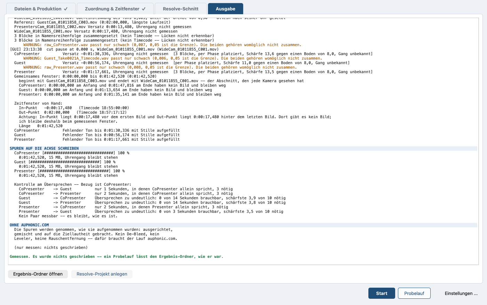

# Die Oberfläche

*In English: [interface.md](interface.md). Zurück zum
[Inhalt](README.de.md).*

## Die vier Reiter

Vier Reiter, in der Reihenfolge, in der man sie braucht.

- **Dateien & Produktion**: oben die Dateiliste, darunter ein schmaler
  Streifen mit Produktionsname, gesprochener Sprache, Projekttyp und
  Ausgabeordner. Dateien oder ganze Ordner hineinziehen, hinzufügen
  oder ein früheres Projekt öffnen. Solange die Liste leer ist, steht
  dort eine Ablegefläche, die den Ablauf erklärt.

  Das Programm nennt den Blick auf das Material vor einem Lauf den
  Vorflug. Jede Datei bekommt daraus schon beim Hinzufügen ein
  Prüfzeichen: ✓ nichts zu bemängeln, ! ein Hinweis, ✕ so geht es nicht.
  Unter der Liste steht das Ergebnis in einem Satz;
  [Vorflug](preflight.de.md) sagt, was jedes Prüfzeichen bedeutet.

  **Projekt öffnen ...** steht auf der Ablegefläche und unter **Datei**.
  Ein geöffnetes Projekt nimmt jederzeit neue Dateien auf, und sein Name
  steht in der Titelzeile — ein Fenster mit geöffnetem Projekt und eines
  ohne sind so nicht dasselbe Bild. Die Projektdatei heißt nach der
  Produktion und zieht mit um, wenn die Produktion einen neuen Namen
  bekommt; die Titelzeile nennt sie dann unter dem neuen.

  Liegt beim Material eine Projektdatei, bietet das Programm sie an,
  während die Dateien hereinkommen, und bevor eine davon vermessen wird:
  findet es eine, fragt es einmal und nennt sie mit dem Tag, an dem sie
  geschrieben wurde; findet es mehrere, zeigt es sie zur Auswahl; findet
  es keine, geschieht nichts. Teilweise wird nie geladen — das Projekt
  kommt ganz zurück, mit den Namen, jeder Trennung, die darin steht, wer
  vor welcher Kamera sitzt, den Typen und dem Zeitfenster, oder es wird
  gar nicht geöffnet.

  Ein **Nein** lässt die hereingekommenen Dateien genau dort, wo sie
  sind. Die Liste entsteht aus ihnen und wird vermessen wie sonst auch,
  einmal, und dieselbe Projektdatei wird kein zweites Mal angeboten. Ein
  **Ja** setzt die Dateien des Projekts an ihre Stelle, und weil die
  Frage zuerst kam, wurde nichts vermessen, was die Antwort gleich
  darauf wegwirft. Material aus einem anderen Ordner bietet das Projekt
  dieses Ordners an; weiteres Material aus einem Ordner, nach dem schon
  gefragt wurde, fragt nicht noch einmal. Ist ein Projekt offen, wird
  nichts mehr angeboten.

  Der Ausgabeordner wird nicht geraten. Solange keiner gewählt ist und
  kein Projekt sagt, wohin es geht, steht an seiner Stelle **neben der
  jeweiligen Videodatei**, und genau dorthin geht das Ergebnis. Ist ein
  Ordner zu lang für die Zeile, wird er in der Mitte gekürzt; wer mit
  der Maus darauf stehen bleibt, sieht ihn ganz. Steht
  dort ein Ordner, erscheint daneben **zurücksetzen** und legt das
  Ergebnis wieder neben die jeweilige Videodatei. Ein Original wird
  dabei nie getroffen: jede Kameradatei, die der Lauf schreibt, trägt
  am Ende ihres Namens `_audio`. Der Produktionsname
  wird aus dem Ordner vorgeschlagen, in dem das Material liegt, und
  lässt sich überschreiben.

  **Eine Datei, die überschrieben wird, wird vorher benannt.** Die
  Endung `_audio` hält den Lauf von dem Material fern, das man ihm
  gegeben hat; von allem übrigen im Ausgabeordner hält sie ihn nicht ab
  -- von einem Export, den jemand von Hand gebaut hat, von der
  Lieferung eines früheren Laufs, vom Ergebnis einer anderen Produktion
  unter demselben Namen. Der Lauf weigert sich deswegen nicht, und er
  denkt sich auch keinen Namen daneben aus: beides machte aus jedem
  zweiten Durchgang ein `_audio_2`. Er sagt es stattdessen -- im
  Protokoll und unter **Ausgabe**, bevor die erste Kameradatei
  geschrieben wird, solange Abbrechen noch nichts kostet.

  Zwei Sätze, und sie sind nicht gleich laut. Eine Datei, die diese
  Produktion hier schon einmal angelegt hat, bekommt eine ruhige Zeile
  mit ihrem Namen: *stammt aus einem früheren Lauf dieser Produktion
  und wird ersetzt*. Alles andere steht rot da und mit ganzem Pfad:
  *ist schon da und wird überschrieben -- in dieser Produktion ist
  nicht vermerkt, dass sie die Datei angelegt hat*. Woran das
  auseinandergehalten wird, ist einzig der Vermerk, den ein früherer
  Lauf dieser Produktion in jenem Ordner hinterlassen hat -- nicht der
  Name und nicht das Datum. Ist der Vermerk verlorengegangen, wurde die
  Produktion umbenannt oder zeigt der Ausgabeordner inzwischen
  woandershin, dann steht der laute Satz auch über der eigenen
  Lieferung. Der Lauf ist lieber einmal zu laut, und er behauptet dabei
  nur, was er weiß: dass hier nichts darüber vermerkt ist -- und nicht,
  dass es niemand war.

  Jede Videodatei trägt in der Liste das Feld **Kameraton**. Es steht
  auf **Ton nicht verwenden**, bis jemand es auf **Ton verwenden**
  stellt. Dann geht dieser Ton denselben Weg wie eine eingelesene
  Aufnahme: Kanäle gemessen, eine Spur oder zwei entschieden, leere
  Kanäle bleiben draußen, in Spuren zerlegt. Zum Synchronisieren wird
  dieser Ton ohnehin genommen; darüber entscheidet das Feld nicht.

  Wo nichts zu entscheiden ist, setzt sich das Feld selbst und ist
  ausgegraut, und an Stelle seines Werts steht grau darin, warum -- im
  Feld selbst, wo man ohnehin hinsieht, nicht in einem Tooltip und nicht
  in einer anderen Spalte. Vier Gründe gibt es:

  - **keine Tonspur**: die Datei hat keine;
  - **bleibt draußen**: die Datei steht auf **Video ignorieren**;
  - **fertiger Clip**: die Datei ist ein Vorspann oder ein Abspann;
  - **einziger Ton**: eine einzige Videodatei trägt Ton, und keine
    Tonaufnahme steht daneben. Dieser Ton ist dann der einzige, den es
    gibt, und das Feld verwendet ihn. Kommt eine Tonaufnahme dazu, ist
    die Wahl wieder frei.

  Dasselbe Feld steht auf **Zuordnung & Zeitfenster** bei der Kamera,
  auf demselben Wert: ändert man eines, folgt das andere sofort.

  Jede Videodatei trägt in der Liste außerdem das Feld **Typ**:
  **Inhalt**, **Weitwinkel**, **Vorspann**, **Abspann** oder
  **Video ignorieren**. Wer auf dem Feld stehen bleibt, erfährt, was die
  Einträge bedeuten. Das Feld selbst wird nie im Ganzen ausgegraut —
  Grau über dem ganzen Kasten hieße „hier ist nichts zu machen“, und zu
  machen ist immer etwas. Bei einer Kamera auf **Weitwinkel** steht
  grau hinter dem Wert **kein Sprecher** -- gleich, ob jemand sie so
  gekennzeichnet oder das Programm es ermittelt hat: Auf dieser Kamera
  spricht niemand.

  Gesperrt wird ein Eintrag der Liste: er steht grau da und lässt sich
  nicht wählen, und der Grund steht an ihm. Solange die Liste offen ist,
  steht er hinter dem Namen des Eintrags, bei langem Satz gekürzt; wer
  auf dem Eintrag stehen bleibt, liest ihn ganz. Zwei Einträge können
  zugleich gesperrt sein, jeder mit seinem eigenen Satz.

  - Eine Kamera, der niemand zugeordnet ist, zeigt **Weitwinkel**,
    obwohl niemand sie so gekennzeichnet hat. Gesperrt ist dann
    **Inhalt**, weil ihr kein Sprecher zugeordnet ist. Gibt man dieser
    Kamera einen Sprecher oder setzt den **Typ** selbst, ist der Eintrag
    wieder frei. Bei **Nur synchronisieren** fragt niemand, wer spricht,
    und so wird dort auch keine Kamera zum Weitwinkel erklärt: Weitwinkel
    ist nur eine Kamera, die jemand auf **Weitwinkel** stellt.
  - Eine Datei, für die die Messung keinen Platz gefunden hat, ist
    weder Inhalt noch Weitwinkel; für sie sind beide Einträge gesperrt.
    Inhalt wird in die Folge hineingeschnitten, und für diese Datei
    gibt es dort keine Stelle. Der Weitwinkel ist die Kamera, die
    durchläuft und einspringt, wo keine andere passt, also muss er auf
    der Zeitachse liegen. An jedem Eintrag steht sein eigener Grund,
    und das Programm setzt eine solche Datei von sich aus auf
    **Vorspann** — auf **Video ignorieren**, wenn eine andere Datei den
    Vorspann schon hält, denn in einer Folge gibt es einen.

    Für diese beiden Sperren muss zweierlei zugleich zutreffen, keines
    davon allein. Der Ton der Datei muss schlecht zum Rest passen
    **und** kein Timecode darf sie zwischen die anderen einordnen. Damit
    ein Timecode eine Kamera einordnet, die der Ton nicht einordnen
    kann, braucht es zwei: einen auf ihr selbst und einen auf einer
    Kamera, die der Ton sehr wohl eingeordnet hat; an dieser wird der
    eigene gemessen — an der längsten Kamera, wenn sie einen trägt,
    sonst an der nächsten eingeordneten, die einen hat. Die Uhr einer
    Tonaufnahme ordnet keine Kamera ein, und eine einmal abgelesene Uhr
    sagt nichts. Gibt es keine solche Kamera, bleibt die Kamera draußen,
    und Dateiliste wie Protokoll sagen, warum. Ein Jingle ist beides auf
    einmal: kein Timecode, und im Ton nichts, was der Raum auch hat — er
    steht rot in der Liste. Eine Kamera, deren Mikrofon vom Raum nichts
    gehört hat, ist nur das erste, solange ihr Timecode eine solche
    Kamera hat, an der er sich messen lässt: Dann setzt er sie weiterhin
    framegenau — sie behält also die Wahl, und die Liste schreibt das
    neben sie, statt sie rot zu färben.

  **Video ignorieren** wird nie gesperrt, **Vorspann** und **Abspann**
  nur so lange, wie eine andere Datei die Marke hält — der Eintrag nennt
  dann jene Datei, und wer die Marke dort wegnimmt, gibt ihn wieder
  frei. Alle drei sind Antworten über die Datei selbst und haben nichts
  damit zu tun, wer vor welcher Kamera sitzt. Eine Datei, die zu nichts
  passt, gehört genau in einen von ihnen.

  Die beiden Sperren an einer Datei, die nirgends hinpasst, sind keine
  Empfehlung, sondern eine Feststellung über das Material. Sie gelten
  darum auch gegen einen **Typ**, den jemand selbst gewählt hat, und
  gegen einen, den eine Projektdatei mitgebracht hat: steht dort Inhalt
  oder Weitwinkel, wird die Datei auf **Vorspann** gesetzt, und auf
  **Video ignorieren**, wenn der Vorspann schon vergeben ist. Bei der
  Kamera, der niemand zugeordnet ist, ist es umgekehrt — wer den **Typ**
  selbst setzt, beendet die Sperre.

  Jede Sperre geht von selbst wieder weg, sobald ihr Grund weg ist.
  Eine Kamera, die einen Sprecher bekommt, bekommt **Inhalt** zurück,
  und eine Datei, die eine spätere Messung einordnen kann, bekommt
  beide Einträge zurück. Wohin die Datei inzwischen gesetzt wurde,
  bleibt stehen, bis jemand es selbst ändert.

  Eine Datei mit mehr als einem Kanal sagt darunter, was aus ihr wird: je
  Kanal eine Zeile, mit einem Häkchen, das in der ersten Zeile
  **mit Channel 2 zusammenlegen** anbietet, und daneben, was gemessen
  wurde. Das Programm benennt Kanäle, in denen nichts steht, und lässt
  sie aus allem Weiteren heraus.
  [Kanäle: eine Spur oder zwei?](channels.de.md) sagt, wie das Programm
  die beiden unterscheidet.

  Eine einzelne Fortsetzungsdatei lässt sich für sich entfernen. Sie
  bleibt dann draußen, obwohl sie im Ordner liegt, und später wieder
  hinzugefügt ist sie eine eigene Aufnahme. Erst wenn die ganze Aufnahme
  entfernt und wieder hinzugefügt wird, gehören die Blöcke wieder
  zusammen.

  **Mit der Datei gehen die Antworten über sie**: der Sprechername, die
  Kamera, der **Typ**, das Ausgemachte über ihre Kanäle. Die
  Projektdatei wird aus demselben Vorrat geschrieben, also ist das, was
  die Liste verlassen hat, auch aus ihr heraus, und eine wieder
  hinzugefügte Datei kommt blank zurück und wird neu gefragt. Bisher
  blieb das Entfernte in der gespeicherten Projektdatei stehen, und wer
  eine Datei später wieder hinzunahm, bekam wortlos die alte Antwort --
  eine Aufnahme mit leerem Namen, eine Kamera auf **Vorspann**.

  

  *Die Liste nach dem Öffnen eines Projekts, mit den Prüfzeichen aus
  dem Vorflug und dem Streifen darunter.*
- **Zuordnung & Zeitfenster**: links die Tabellen, rechts der Player;
  ist das Fenster für beide nebeneinander zu schmal, rückt der Player
  unter die Tabellen. Erscheint mit den Dateien.

  Die Aufnahmen sind ein Baum. Seine zweite Spalte ist der
  **Sprechername**. Sie startet leer, mit dem Namen, den der Dateiname
  nahelegt, grau darin: ein eingetippter Name sagt, dass die Aufnahme
  diese eine Person ist, und der Eintrag **mehrere Sprecher**, den man
  stattdessen wählen kann, setzt das Programm daran, auf diesem Rechner
  zu ermitteln, wer wann in genau dieser Aufnahme spricht. Erst diese
  Antwort zeigt die Stimmen. Eine Trennung, die niemand beantwortet
  hat, lässt das Feld leer und die Zeilen verborgen, und eine spätere
  Antwort holt sie sofort hoch, mit den Namen und Kameras, die sie
  schon hatten. Die fünfte Spalte, **Sprecher**, sagt, wie es darum
  steht -- **Trennen ...** und **Abbrechen**, solange es läuft, in
  dieser Zeile und in keiner anderen, danach **Getrennt: 4
  Sprecher**, und wo sie nicht laufen konnte, einen kurzen Satz, der
  aufs Protokoll verweist -- dort steht der Grund selbst. Sie
  ist eine Auskunft und sonst nichts: dort startet keine Trennung, und
  wer es sich anders überlegt, geht zurück ins Feld.

  Jede Aufnahme hält ihre eigene Trennung, und mehrere stehen
  nebeneinander: jede Zeile zählt die Stimmen ihrer eigenen Aufnahme,
  und wird eine zweite aufgetrennt, bleiben Zeilen, Namen und Kameras
  der ersten unangetastet. Nur **Abbrechen** steht immer in einer
  einzigen Zeile, denn aufgetrennt wird eine Aufnahme nach der anderen.

  Ein Name ist eine Person, und eine Person steht einmal auf dem Blatt.
  Ein Name, den es schon gibt, färbt sein Feld schon beim Tippen rot --
  auf beiden Ebenen und über die Trennungen hinweg. Was das heißt, ist
  auf den beiden Ebenen verschieden. Zwei Aufnahmen unter einem Namen
  sind eine Rückfrage und keine Weigerung: sie sollen zu einer einzigen
  Spur werden, und die Zeile unter der Tabelle sagt das;
  [Multitrack](multitrack.de.md) hat diese Seite ganz. Eine **Stimme**
  unter einem Namen, den schon jemand anderes trägt, ist dagegen eine
  Weigerung -- der Hinweis am Feld bittet um einen eigenen, **Start**
  bleibt gesperrt, und die Zeile unter den Knöpfen nennt die Person.

  Zu welcher Kamera eine Aufnahme gehört, ergibt sich aus diesem Namen,
  solange niemand selbst eine wählt; ein später getippter oder
  verbesserter Name zieht die Kamera also mit. Der graue Vorschlag gilt
  dabei als dieser Name: auch eine Aufnahme, in die niemand etwas
  getippt hat, landet auf der Kamera, die nach ihr heißt. Eine von Hand
  gewählte Kamera ist eine Antwort und bleibt, wo sie hingesetzt wurde.

  Steht eine Aufnahme oder eine Stimme unter **gehört zu** auf **nicht
  verwenden**, ist sie aus der Mischung und aus dem Transkript heraus,
  und ein Name bewirkt für sie nichts. Ihr Namensfeld wird grau, und
  darin steht, ebenfalls grau, **ungenutzt**. Was dort getippt
  war, bleibt im Feld stehen und gilt mit jeder anderen Antwort wieder.

  Bei mehr als einer Tonaufnahme läuft nichts von selbst; die Antwort in
  der Zeile startet es. Unter den Aufnahmen steht **Auf diesem Rechner
  nicht**: das schaltet die Trennung für das ganze Projekt ab.

  Die Stimmen sind die Zeilen unter der Aufnahme, in der sie gehört
  wurden ([Spracherkennung und Sprechertrennung](speech.de.md)),
  eingerückt und zunächst aufgeklappt. Jede sagt in der ersten Spalte
  **Stimme**, damit die Stufe zu sehen ist, und trägt den Namen und die
  zugehörige Kamera. Eine Aufnahme mit Stimmen darunter trägt selbst
  keine Kamera -- die tragen die Zeilen darunter, damit die Zuordnung
  nie auf zwei Ebenen zugleich steht --, und ihre eigene Zelle unter
  **gehört zu** sagt genau das, grau: **die Stimmen darunter tragen die
  Kameras**. Klappt man die Stimmen zu, nennt dieselbe Zelle statt
  dessen sie -- die Kameras: **auf 2 Kameras**, oder **auf 1 Kamera, 1
  ohne**, wenn eine Stimme noch keine hat. Ein Klick auf eine Stimme holt den
  Player an die Stelle, wo diese Stimme am längsten redet, und spielt
  sie ab. Aufnahmen, die keine Stimmen zeigen, sind eine flache Liste,
  ohne Dreiecke.

  Vergibt das Programm den Namen einer Stimme selbst, nimmt es die erste
  Nummer, die niemand hat -- gezählt über alle Trennungen und über die
  Aufnahmen darüber. So beginnt eine zweite Aufnahme nicht mit einem
  zweiten **Sprecher 1**: wo **Sprecher 1** steht, heißt der nächste
  **Sprecher 2**. Ein von Hand gegebener Name wird nie umnummeriert, und
  eine Nummer, die wieder frei wird, wird wieder benutzt.

  Die Kameratabelle darunter trägt noch einmal **Kameraton**, bei jeder
  Kamera, auf dem Wert aus der Dateiliste, und daneben den **Typ**, auf
  demselben Wert und mit denselben gesperrten Einträgen: dass ein Clip
  in Wahrheit ein Abspann ist, merkt man beim Ansehen, und der Player
  steht hier. Eine Kamera auf **Ton verwenden** bekommt eine Zeile in
  der Zuordnungstabelle darüber, wie eine eigene Aufnahme.

  Mit dem Projekttyp **Nur synchronisieren** ist dieser Reiter kürzer.
  Die Spalten **Sprechername** und **Sprecher** fehlen, und mit ihnen
  der Eintrag **mehrere Sprecher**, die Stimmzeilen, der Knopf **Ein
  Sprecher mehr in ...** und die Zeile **Auf diesem Rechner nicht**:
  wer spricht, fragt niemand, weil nichts geschnitten wird. Auch die
  Zeile **Multitrack (je Sprecher eine Spur)** fehlt, und das Häkchen
  ist aus. Auch **gehört zu** fehlt, und in der Kameratabelle
  **bekommt Audio von**: ohne Sprecher gibt es nichts zuzuordnen, die
  eine Aufnahme kommt in jede Kameradatei. Geblieben sind die Zeile der
  Aufnahme mit ihrem Timecode, die Kameratabelle mit **Kamera**, **neue
  Datei heißt**, **Typ** und **Kameraton**, der Player und der Kasten
  für auphonic.com -- die eine Aufnahme kann dort weiterhin aufbereitet
  werden. Unter **neue Datei heißt** schlägt das Programm hier den
  eigenen Dateinamen der Kamera vor, nie einen aus Sprechernamen
  gebauten, und das Feld gilt auch hier, wie auf jedem Weg: unter
  diesem Namen schreibt der Lauf die Kameradatei, und die Spur der
  Kamera in Resolve trägt ihn ebenfalls ([Multitrack](multitrack.de.md),
  „Die Zuordnung setzen“).

  

  *Oben, welche Aufnahme zu welcher Kamera gehört, unten, was aus
  jeder Kamera wird.*
- **Resolve-Schnitt**: eine Zeile über Resolve nur dort, wo Resolve
  nicht antwortet -- **Resolve antwortet nicht -- siehe Einstellungen**,
  mit dem Weg zu den Einstellungen daneben. Antwortet Resolve, steht
  dort gar nichts: an Resolve ist nichts einzustellen, und der Weg zu den
  Einstellungen ist für den da, der etwas zu richten hat. Dann das
  Zeitfenster, der Kasten mit den Werten für den Schnitt und der Kasten
  **Sprecher**, dessen Überschrift die Quelle der Sprecher nennt, in
  Klammern die gemessene Redezeit und dahinter, dass gleichzeitig
  Redende doppelt zählen. Das alles bildet die linke Spalte. Rechts
  daneben steht der Kasten **Kameraschnitt -- Vorschau** mit
  Schnittband und abspielbarer Vorschau; ist das Fenster für zwei
  Spalten zu schmal, steht er unter den Einstellungen. Das Bild sagt
  unter sich, auf einer Fläche in der Farbe der laufenden Einstellung,
  wer spricht und welche Kamera läuft; hat eine
  Einstellung kein Bild, füllt die Farbe die ganze Fläche, und die
  beiden Zeilen stehen darauf. [Der Kameraschnitt](camera-cut.de.md)
  liest sie aus.

  Das Band teilt sich seine Zeile mit drei Zoom-Knöpfen und, ganz am
  Ende der Zeile, der gezeigten Zeitspanne in Schreibmaschinenziffern:
  `0:00:00 -- 0:42:13`. **−** zeigt doppelt so viel, **+** halb so viel
  um die aktuelle Stelle, der dritte wieder die ganze Länge. Die Anzeige
  steht vom ersten Augenblick an da, bevor jemand gezoomt hat:
  ungezoomt ist es das ganze Material, und solange nichts im Band steht,
  liest sie `0:00:00 -- 0:00:00`. Ihre Breite liegt fest, damit die drei
  Knöpfe unter dem Zeiger stehen bleiben, während die Zahlen wechseln.
  [Der Kameraschnitt](camera-cut.de.md) sagt, wie das Band selbst zu
  lesen ist und was die Überschrift des Kastens **Sprecher** besagt.

  Im Kasten **Kameraschnitt -- Vorschau** steht unter der Vorschau eine
  Zeile, die sagt, worauf dieser Schnitt beruht; ihre Farbe bewertet die
  Auskunft. Sie bleibt stehen, solange es Zahlen gibt.

  - **gemessen aus den Aufnahmen -- 3 Sprecher, 1:09:23**, in der
    Warnfarbe. Es ist noch nichts gelaufen; die Sprecher sind aus den
    Aufnahmen herausgehört, wie sie daliegen, und der Schnitt davor ist
    ein vorläufiger.
  - **aus dem fertigen Lauf -- 3 Sprecher, 1:09:23**, in der guten
    Farbe. Ein Lauf ist durch, und die Vorschau steht auf dessen
    Ergebnis: alle Spuren auf einer Achse, die Sprecher so, wie der Lauf
    sie gefunden hat. Nach einem Lauf über auphonic.com steht dort
    dasselbe: Von dort kommt der Klang zurück, und die Sprecher werden
    so oder so an den Aufnahmen ermittelt.

  Damit ist die eine Frage beantwortet, die man an eine Vorschau hat:
  ob man ihr trauen kann. Ist ein Lauf durch, stehen Vorschau und Lauf
  auf demselben Boden -- dieselben Sprecher, dieselbe Achse. Verstellt
  man danach die Regler, folgt die Vorschau ihnen sofort; drückt man
  **Resolve-Projekt anlegen**, wird der Schnitt für Resolve neu
  gerechnet, aus den Werten, die jetzt dort stehen, und ebendiesem
  Ergebnis. Kein zweiter Lauf, und kein Rückfall auf eine vorläufige
  Lesart. Solange die Zeile in der Warnfarbe steht, kann sich jede Zahl
  daneben noch verschieben.

  Die Vorschau rechnet den Uhrengang jedes Recorders mit, so wie der
  Lauf es tut. Keine zwei Recorder laufen exakt gleich schnell; über
  eine Stunde macht das ungefähr eine Zehntelsekunde aus. Früher hat die
  Vorschau ihn gemessen und wieder weggeworfen, und ihre Schnittpunkte
  liefen dann über eine Stunde um rund 143 Millisekunden gegen den Lauf
  davon, also drei bis vier Bilder. Jetzt bleiben sie unter einem Bild.
  Auf welche Kamera geschnitten wird, war davon nie berührt: dafür war
  der Abstand viel zu klein.

  Vorschau und Lauf behalten auch dieselben Kameras. Beide stellen an
  eine Datei die eine Frage, an der es hängt: hat sie überhaupt einen
  Platz. Eine Kamera, deren Ton nicht erkannt wurde, steht an der
  Stelle, die ihr Timecode angibt, im Band ebenso wie im fertigen
  Projekt -- sofern auch eine Kamera, die der Ton eingeordnet hat,
  einen Timecode trägt. Was der Ton aus ihr gemacht hat, ist eine Schätzung,
  die nicht gereicht hat, und der Timecode ist keine; bisher landete sie
  an dieser Schätzung. Früher ließ das Band eine Kamera weg, die der
  Lauf behielt, und die Legende darunter zählte dann eine Kamera
  weniger, als aus Resolve herauskam.

  Eine Kamera ganz ohne Tonspur geht denselben Weg und fällt nicht mehr
  wortlos von der Zeitachse: sie wird genannt, steht dort, wohin ihr
  Timecode sie setzt, und hat sie keinen, wird ihr **Video ignorieren**
  vorgeschlagen.

  Für die Sprecher ist nichts zu drücken. Sie werden aus den Spuren
  geholt, sobald dieser Reiter aufgeht -- einmal und kein zweites Mal:
  nicht, während eine Messung läuft, nicht, nachdem eine gescheitert
  ist, und nicht dort, wo ein fertiger Lauf sie schon kennt. Solange
  nichts bekannt ist, sagt die Vorschau genau das und nennt den Weg für
  den Fall, dass alle auf einer Aufnahme sitzen: **mehrere Sprecher** im
  Feld **Sprechername**.

  Die Zeile unter der Vorschau bleibt und trägt beide Auskünfte. Ist
  eine Spur weder von einer Trennung abgedeckt noch gemessen, steht
  dort, wer fehlt, anstelle dessen, worauf der Schnitt beruht -- auch
  neben einer Trennung, die schon steht. Diese Leute sind im Schnitt;
  nur diese Vorschau kann sie erst nach dem Messen zeigen. Scheitert
  eine Messung, steht der Grund an derselben Stelle. Nach einem Lauf
  steht dort nur noch, worauf der Schnitt beruht: der Lauf hat jede Spur
  gemessen, die er hatte, und sein Ergebnis ist feiner als alles, was
  sich aus den rohen Aufnahmen heraushören lässt.

  Der Kasten mit den Werten heißt **Kameraschnitt**, wenn die Sprecher
  auf zwei oder mehr Kameras sitzen. Bei einer Kamera für alle heißt er
  **Erster Schnitt nach Sprechern**. Dort wird nichts gewechselt: der
  Schnitt fällt bei jedem Sprecherwechsel, und Resolve bekommt je Person
  einen Clip. Bei einer Person und einer zweiten Kamera, auf der niemand
  ist, heißt er **Schnitt mit dem Weitwinkel**: die Kamera dieser Person
  steht, und der Weitwinkel bricht sie auf. Mit gesetztem **Multitrack**
  bleibt der Name **Kameraschnitt**.

  Der Kasten erscheint, sobald **Multitrack** gesetzt ist oder zwei
  Personen einen Namen und eine Kamera tragen. Woher die beiden kommen,
  macht keinen Unterschied, und beide Herkünfte zählen zusammen: eine
  Stimme unter einer getrennten Aufnahme und eine Aufnahme mit eigenem
  Namen sind zwei Personen, ebenso zwei Stimmen oder zwei Aufnahmen. Eine
  Person genügt, wo es zwei oder mehr Kameras gibt. Eine Person auf einer
  einzigen Kamera bekommt keinen Kasten, und das ist richtig: es gibt
  nichts, wohin geschnitten werden könnte. Bis dahin steht an der
  Stelle von Kasten und Vorschau eine Zeile, die sagt, was fehlt. Ein
  Resolve-Projekt entsteht trotzdem, mit jeder Kamera am gemessenen
  Platz.

  Beide hinteren Reiter stehen mit und ohne getrennte Spuren da, und die
  Zuordnung ebenso: **gehört zu** wird mit dem Häkchen gefragt und ohne
  es, denn zu welcher Kamera eine Aufnahme gehört, ist ohnehin
  dieselbe Frage, und der Lauf macht dieselbe Antwort daraus. Das
  Häkchen anzuklicken kostet deshalb nichts — von Hand gewählte Kameras
  bleiben stehen.

  Mit **Nur synchronisieren** bleibt der Reiter, und ein Satz ganz oben
  sagt, was er nicht ist: **Nur synchronisieren: kein Schnitt. Die
  Übergabe trägt allein die Multicam-Zeitleiste; das Resolve-Projekt
  wird im Reiter „Ausgabe“ angelegt.** Der Kasten mit den Werten für
  den Schnitt, der Kasten **Sprecher** und die Vorschau stehen
  ausgegraut darunter, gemessen wird darin nichts, und beim Öffnen des
  Reiters werden keine Sprecher geholt. Die Zeile oben in der Vorschau
  und die unter den Einstellungen zum Weitwinkel bleiben leer: Auch
  ausgegraut redeten sie noch von Sprechern und einem Weitwinkel, und
  beides gibt es bei diesem Typ nicht. Auf **Ausgabe** sagt der
  Hinweis am Knopf **Resolve-Projekt anlegen**, was der Knopf bei
  diesem Typ baut. Die Zeile über Resolve tut, was sie
  immer tut: ob Resolve antwortet, wird beim ersten Blick auf diesen
  Reiter gefragt, bei beiden Typen.
- **Ausgabe**: erscheint, sobald etwas läuft, in denselben Farben wie
  das Terminal, mit den Knöpfen **Ergebnis-Ordner öffnen** und
  **Resolve-Projekt anlegen**. Der Reiter kommt außerdem beim Öffnen
  eines Projekts hoch, wenn im Ausgabeordner schon fertige Dateien
  liegen -- die Knöpfe gehören zu diesen Dateien, und so sagt das Blatt,
  wie die Dinge stehen, statt wie ein misslungener Lauf auszusehen.
  **Dieser Reiter ist die Konsole des Programms**, nicht nur die eines
  Laufs: Hier landet, was pip schreibt, während es eine neuere Fassung
  holt, und ebenso jede Zeile einer ffmpeg-Installation — was die
  Paketverwaltung von sich gibt oder wie weit der Download ist, Minute
  für Minute. Aus einem Terminal startet das Programm niemand mehr,
  also ist dies das Terminal.

  

  **Resolve-Projekt anlegen** richtet sich nach der Dateiliste. Nimmt
  man eine Kamera heraus, wird der Knopf grau, sobald die Übergabe des
  letzten Laufs nicht mehr genau die Kameras nennt, die dort stehen, und
  wer auf ihm stehen bleibt, liest, dass die Übergabedatei aus einem
  Lauf fehlt. Legt man die Kamera wieder hinein, lässt er sich wieder
  drücken -- auch nach einem Lauf, der eine Kamera draußen gelassen hat:
  Das Fenster nimmt die Übergabe zurück, die der Knopf zu dieser Liste
  hatte. Weil die Übergabe auch die Kameras nennt, die ihr Lauf
  ausgelassen hat, steht der Knopf auch dann wieder bereit, wenn das
  Projekt inzwischen geschlossen und neu geöffnet wurde; eine Kamera,
  die erst nach diesem Lauf dazukam, lässt ihn grau. Wer einen anderen
  Ausgabeordner wählt oder zu **neben der jeweiligen Videodatei**
  zurückkehrt, lässt das Programm sofort am
  neuen Ort nach einer Übergabe suchen ([Resolve](resolve.de.md) sagt,
  wo es sucht).

**Multitrack (je Sprecher eine Spur)** hat eine eigene Zeile unter der
Zuordnungstabelle, über dem Auphonic-Kasten. Es geht mit auphonic.com
und ohne; nach dem API Key fragt das Programm erst auf dem Weg über
auphonic.com. Der Kameraschnitt braucht das Häkchen nicht. Beim
Projekttyp **Nur synchronisieren** fehlt die Zeile, und das Häkchen ist
aus: je Sprecher eine Spur ist eine Frage für den Schnitt nach Sprecher.

Multitrack braucht zwei Eingangsspuren. Eine Eingangsspur ist eine
eigene Aufnahme, ein Kanal eines mehrkanaligen Aufnahmegeräts oder der
Ton einer Videodatei, die auf **Ton verwenden** steht. Mehrere Blöcke
derselben Aufnahme zählen als eine Spur, eine beiseitegelegte Spur gar
nicht.

Das Häkchen bleibt anklickbar, was auch immer im Projekt liegt. Bei nur
einer Spur sagt das eine graue Zeile daneben, und sie nennt den Weg zur
zweiten: **Kameraton** bei einer Kamera, gestellt auf
**Ton verwenden**. Wenn jede Kamera ihren Ton schon hergibt, sagt diese
Zeile, dass keiner mehr übrig ist.

Unter dem Auphonic-Kasten erscheint ein zweiter Balken, solange das
Material vermessen wird, mit einer Zeile je Datei und dem Stand jeder
einzelnen. Eine Zeile verschwindet, sobald ihre Datei fertig ist, der
Balken selbst kurz nach der letzten. Er zeigt die Vorarbeit -- Ton
lesen und Hüllkurven rechnen --, also dieselbe Arbeit, die der Balken
neben **Start** mitträgt, hier Datei für Datei.

**Name der Produktion**, **Sprache im Ton** und **Projekttyp** stehen
in einer Zeile. Ist das Fenster für alle drei zu schmal, bricht die
Zeile in eine zweite um, statt den Reiter **Dateien & Produktion** über
den Fensterrand hinauszuschieben; eine Beschriftung bleibt dabei immer
bei ihrem Feld.

**Sprache im Ton** neben dem Produktionsnamen ist die in der Aufnahme
gesprochene Sprache, vorbelegt aus der Systemsprache. Sie tut zweierlei:
Sie wird zur Kennzeichnung der geschriebenen Tonspur, und die Erkennung
auf diesem Rechner wird auf diese Sprache eingestellt. „nicht gesetzt“
lässt die Spur ungekennzeichnet und überlässt der Erkennung die Sprache.
Zur Auswahl stehen nur Sprachen, die die Erkennung hier auch versteht.
[Das Transkript entsteht hier](auphonic.de.md#das-transkript-entsteht-hier)
sagt, was die Erkennung schreibt, und [Spracherkennung und
Sprechertrennung](speech.de.md), welchen Weg sie auf welchem Rechner
nimmt.

**Projekttyp** daneben sagt, was aus der Produktion werden soll; das
Feld beginnt auf **nicht gesetzt**. Zwei Einträge:

- **Schnitt nach Sprecher**: die Kameras auf einer Zeitachse und ein
  Schnitt danach, wer gerade spricht -- alles, was der Rest dieses
  Handbuchs beschreibt.
- **Nur synchronisieren**: die Kameras auf einer Zeitachse, mehr
  nicht. Keine Sprecher, kein Transkript, kein Schnitt; die Übergabe
  trägt allein die Multicam-Timeline, und Resolve bekommt diese eine
  Timeline. Hinein geht nur eine Tonaufnahme ([Vorflug](preflight.de.md)
  sagt, was eine zweite bekommt), und wo der Typ den hinteren Reitern
  etwas nimmt, steht es oben bei den Reitern.

Wer auf dem Feld stehen bleibt, liest dasselbe. Dateien dürfen vor der
Antwort hereinkommen, und vermessen werden sie so oder so; nur
**Start** und **Probelauf** warten, und die Zeile unter den Knöpfen sagt
**Noch kein Projekttyp gewählt.** Wer ohne Antwort auf den Reiter
**Zuordnung & Zeitfenster** wechselt, wird einmal je Produktion
gefragt, in einem Kasten **Projekttyp** -- **Was soll aus dieser
Produktion werden?** -- mit den beiden Einträgen und **Abbrechen**.
**Abbrechen** wählt nichts, und gefragt wird nicht noch einmal; das
Feld im Streifen nimmt die Antwort weiterhin an. Ein geöffnetes Projekt
fragt nie: der Typ steht in der Projektdatei, und eine Projektdatei aus
der Zeit vor dem Typ öffnet sich als **Schnitt nach Sprecher**. Auf der
Kommandozeile heißt es `--project-type cut` oder `sync`, und `cut`, wo
nichts gesagt wird.

**Lautheit** in der Gruppe **Produktion** auf der ersten Seite legt fest,
wie laut die fertige Folge gemacht wird; derselbe Gewinn geht auf jede
Spur, so bleibt das Verhältnis der Sprecher erhalten. Fünf Einträge:

- **-16 LUFS (Podcast-Verzeichnisse, stereo)**
- **-19 LUFS (Podcast-Verzeichnisse, mono)**
- **-14 LUFS (YouTube -- regelt nur herunter, nie herauf)**
- **-23 LUFS (EBU R128, Rundfunk)**
- **Aus Quelldateien übernehmen**

Ein neues Projekt beginnt bei −16 LUFS. Das Fenster merkt sich den zuletzt
gewählten Eintrag, und eine geladene Projektdatei sticht diese Erinnerung.
**Aus Quelldateien übernehmen** passt gar nichts an: auphonic.com macht
weiter, was in seinem Preset steht, und ohne auphonic.com bleibt der Ton
wie in den Quelldateien -- die Datei kommt Byte für Byte gleich heraus.

[Welches Lautheitsziel gilt](preflight.de.md#welches-lautheitsziel-gilt)
sagt, was sonst noch am Ziel hängt: die Normalisierung der Spuren, die
Anzeige im Resolve-Projekt und was im Protokoll steht.

**Probelauf** ist der Lauf, der misst und berichtet und keinen Schnitt
erzeugt. Eines schreibt er doch: Hören die Mikrofone einander zu gut,
um auseinandergehalten zu werden, misst er ihren Abstand und bewahrt
die zusammengelegte Aufnahme auf, die die Trennung braucht -- der
richtige Lauf muss sie dann nicht ein zweites Mal bauen.
Er und **Start** bleiben gesperrt, solange etwas offen ist, und
**unter den Knöpfen steht, was**, mitsamt dem Reiter, auf dem es steht:

- keine Dateien,
- kein Ton in Verwendung: keine Tonaufnahme, und keine Videodatei auf
  **Ton verwenden**,
- kein Produktionsname,
- kein Projekttyp gewählt,
- weniger als zwei Spuren in der Zuordnungstabelle für Multitrack,
- bei Multitrack eine Aufnahme ganz ohne Namen: keiner getippt, und
  keiner, den der Dateiname nahelegt -- der graue Vorschlag gilt als
  Name, wo nichts darüber getippt wird,
- bei Multitrack alle Aufnahmen unter demselben Namen,
- eine **Stimme** unter einem Namen, den schon jemand anderes trägt: der
  Schnitt setzt eine Person auf eine Kamera, und ein Name auf zwei
  Stimmen wäre diese Person an zwei Stellen,
- zwei Kameras mit derselben Ausgabedatei.

Das Feld oder die Zeile, die gemeint ist, wird rot. Ein Häkchen hinter
einem Reiter heißt: dort ist nichts mehr offen. Kein Fenster geht dafür
auf.

Was ein Probelauf von den Sprechern zeigt, hängt davon ab, was auf
diesem Rechner schon liegt. Eine früher gerechnete Trennung wird
zurückgelesen, und die Stimmen werden mit ihrer Redezeit aufgezählt --
der wirkliche Schnitt, ohne dass dafür etwas gerechnet wird. Nur wo
eine Trennung erst gemessen werden müsste, bleibt sie liegen, und das
Protokoll sagt es. [Spracherkennung und
Sprechertrennung](speech.de.md) zeigt den Block und was darin steht.

Dann eine Zusammenfassung: wie viele Kameras und Tonspuren, wie
lang, welches Preset, wie viele Dateien entstehen, wieviel Platz sie
brauchen und wieviel frei ist. Wenn der Lauf bestehende Dateien
überschreiben würde, zeigt ein Fenster erst, welche.

Der Player hat Abspielen und Pause, sekunden- und frameweise vor und
zurück, Lautstärke und Tempo; links der Timecode, rechts die Position, ab
dem In-Punkt gezählt. Der Timecode links ist die gemessene Lage, wo es
eine gibt -- dieselbe Zeitrechnung, in der die ganze Achse steht --, und
nur wo nichts gemessen wurde, die eigene Uhr der Datei.

- Ein Klick auf eine Zeile der Zuordnungs- oder der Kameratabelle holt
  die Datei an dieselbe Stelle im Geschehen, so lassen sich zwei Kameras
  vergleichen. Diese Stelle kommt aus der Messung; wo für eine der
  beiden Dateien nichts gemessen wurde, antworten die Uhren. Lief das
  Bild gerade, läuft es in der neuen Datei weiter -- man kann die Kamera
  wechseln, ohne das Zusehen zu unterbrechen. Ein Klick auf eine Stimme
  unter einer Aufnahme öffnet diese Aufnahme dort, wo die
  Stimme am längsten redet, und spielt sofort. Das Häkchen
  **zugeordneten Ton hören** spielt die dieser Kamera zugeordnete
  Aufnahme; ohne das Häkchen ist der Kameraton zu hören. Auch diese
  Aufnahme wird über die Messung ans Bild gelegt, damit beide zusammen
  laufen, selbst wenn die Uhren der zwei Geräte auseinandergehen.
  Solange die Messung aussteht, setzen die Uhren sie ans Bild, und die Zeile
  unter dem Bild sagt das an Stelle der Zeit: **nach der Uhr platziert
  -- Messung steht aus**. Diese Zeile folgt dem Häkchen, sobald es
  angeklickt wird, bei Pause ebenso wie beim Abspielen. Eine
  Aufnahme aus mehreren Blöcken läuft dabei durch: es klingt der Block,
  der diesen Augenblick enthält, der Wechsel an der Grenze geschieht von
  selbst, und wo die Aufnahme unter dem Bild auf dem Schirm gar nicht
  dran ist, bleibt sie still, statt ihren Anfang an der falschen Stelle
  zu spielen. Beide Enden dieser Rechnung kommen aus derselben
  Zeitrechnung: gemischt lief der Ton um genau den Unterschied der
  beiden Uhren gegen das Bild.
- In-Punkt und Out-Punkt nehmen die Stelle aus dem Bild, ein blauer
  Streifen zeigt das Fenster, und beim Ziehen laufen nur die Zahlen mit.
  Solange die Zeitachse fehlt, sind sie gesperrt.
- Formate, die der Rechner nicht abspielen kann (MXF, R3D, manche
  ProRes-Spielarten), bekommen einen Knopf für `ffplay`, **Externe
  Vorschau -- Format kennt die App nicht** -- auch dann, wenn das System
  keinen Fehler nennt und die Datei bloß als nicht zu öffnen meldet.

Die Ausgabe landet zusätzlich in `videopodcast-magic.log`, und wo diese
Datei liegt, hängt davon ab, wie das Programm auf den Rechner gekommen
ist. Läuft es aus einem eigenen Ordner, liegt das Protokoll neben dem
Programm. Ist es installiert, schreibt es dorthin, wo das System seine
Protokolle sammelt — auf dem Mac nach `~/Library/Logs/videopodcast-magic/`,
unter Windows unter `%LOCALAPPDATA%`, sonst in den Ordner, den der
Desktop-Standard dafür vorsieht —, denn der Ordner, in den pip
installiert hat, gehört pip und wird bei der nächsten Installation
überschrieben. **Wo sie liegt, wird nirgends ausgegeben**: Vor dem
Fenster wird überhaupt nichts gesagt, und der Weg dorthin ist deshalb
**Hilfe > Protokoll dieses Laufs anzeigen**. Der Eintrag öffnet die
Datei mit dem, womit dieser Rechner Textdateien öffnet; solange nichts
zu öffnen ist, steht er grau da und sagt das auch. Die erste Zeile
der Datei nennt Version, Zeit, Betriebssystem und Python,
die Zeile darunter den Pfad, aus dem das Programm gestartet wurde --
mehrere Kopien des Programms teilen sich ein Protokoll, und ohne diese
Zeile ist später nicht zu sagen, welche davon was geschrieben hat. Jeder
Start des Programms beginnt die Datei neu und hebt die vorige als
`videopodcast-magic_1.log` auf; eine Datei hält also eine ganze Sitzung
mit allen Läufen darin, und zwar von der ersten Zeile an -- auch das,
was ein Start schon vermerkt, bevor das Fenster steht. Ein leeres
Protokoll verdrängt das aufbewahrte nicht; `videopodcast-magic_1.log`
bleibt dann, wie es war. Lässt sich die vorige Datei nicht umbenennen
-- unter Windows, solange eine andere Kopie des Programms sie offen
hält --, schreibt der neue Start in derselben Datei hinter ihr weiter.
Auch was Qt und ffmpeg an Python vorbei ausgeben, steht darin. Ebenso schreiben die beiden Player mit, auf Zeilen
mit dem Vorsatz `[GUI]`: was geladen, gespielt und angehalten wurde,
welcher Ton an welches Bild gelegt wurde -- bei einer Aufnahme aus
mehreren Blöcken mit dem Block, der gerade läuft, und mit einem Wort
dort, wo diese Aufnahme unter diesem Bild nicht dran ist und deshalb
still bleibt -- und, bei jedem Start und jedem Halt des
Schnitt-Players, welche Kamera er dabei zeigte. Genau das ist der Teil,
den man einer Beschwerde über die Vorschau mitschickt.

Zeilen mit dem Vorsatz `[EXT]` halten jeden Aufruf eines fremden
Programms fest -- ffmpeg und ffprobe -- mit dem Werkzeug, der Datei, um
die es ging, und der Dauer des Aufrufs; Spracherkennung und
Sprechertrennung stehen mit darunter, denn dort verbringt ein Lauf seine
Minuten. Wo nichts zu messen war, weil die Messung schon vorlag, steht
das anstelle des Aufrufs: von außen sieht eine einmal gelesene Datei
genauso aus wie eine viermal gelesene. Gleiche Aufrufe unmittelbar
hintereinander stehen als eine Zeile, mit der Anzahl und der Gesamtdauer
-- die feine Messung fragt neun Stücke aus zwei Dateien ab. Eine Zeile
mit dem Vorsatz `[ENV]` sagt zu jeder Lautstärkekurve, die das
Programm für die Zeitachse aus einer Datei zieht, ob sie aus dem
Speicher kam oder neu von der Datei gelesen werden musste; bei einer
großen Datei ist das der Unterschied zwischen Minuten und nichts. Und
was das Fenster rot zeigt, steht mit der Uhrzeit darin, unter dem
Vorsatz `[BAD]`: ein Warnfenster, eine rote Zeile unter einem Kasten,
eine rote Marke an einer Zeile der Dateiliste -- eine rote Marke ist
weg, sobald die Zeile neu gezeichnet wird, und die Beschwerde darüber
kommt Stunden später.

Eine Zeile mit dem Vorsatz `[TIME]` sagt, wie weit in den Start
hinein jeder Schritt erreicht war -- gezählt ab der Sekunde, in der
das Symbol angeklickt wurde, wo das Programm so gestartet wurde, und
sonst ab dem Augenblick, in dem es zu laufen begann. Ein Start, der
zwanzig Sekunden braucht, lässt sich damit nachlesen statt raten.

Das alles geht nicht in die Ausgabe des Laufs selbst, sondern nur in die
Datei: im Fenster würde es die Fortschrittsbalken zerreißen. Die neuen
Zeilen sind englisch wie die [GUI]-Zeilen; nur der Wortlaut einer roten
Meldung steht so da, wie er im Fenster stand, also in der Sprache des
Programms.

Neben **Start** läuft **ein Balken für alles Ausstehende**, mit einer
Zeile daneben, woran gerade gearbeitet wird; er läuft immer nur vorwärts.
Er deckt beide Hälften ab: das Messen nach jeder Änderung an der
Dateiliste und den Lauf selbst. Zu diesem Messen gehören Hüllkurven,
Kameraton, Kanäle und die Prüfung, und eine Hüllkurve ist die Lautheit
über die Länge einer Spur.

Ein Abschnitt, der echte Prozente meldet, nimmt den Balken mit. Bei einem
Abschnitt, der nichts meldet, kriecht er langsam weiter und bleibt vor
dem Ende stehen.

Für den Lauf selbst nennt die Zeile den Abschnitt, auf beiden Wegen mit
denselben Namen, mit Multitrack und ohne:

- **Plan wird gelesen**
- **Ton aus den Kameras**: nur mit Multitrack. Ohne richtet der Lauf sich
  an den Kameras aus und lässt sie in Ruhe.
- **Gemeinsame Zeitachse**
- **Aufbereitung bei auphonic.com**, ohne Schlüssel **Lautheit und Pegel**
- **Wer wann spricht**: nur bei **Schnitt nach Sprecher**. **Nur
  synchronisieren** fragt niemanden, und das Protokoll sagt das in
  seinen ersten Zeilen.
- **Kameradateien werden geschrieben**
- **Übergabe und Ergebnis**

Ein Abschnitt, der gar nicht vorkommt, steht auch nicht in der Liste; der
Balken hält also keinen Anteil für ihn zurück. Bleibt ein Lauf stehen,
sagt die Zeile, in welchem Abschnitt.

**Die Zeile steht als Satz da, nie als Name, unter dem das Programm die
Sache intern führt.** Während eine Aufnahme in Sprecher getrennt wird,
heißt es dort **Sprecher werden getrennt:** und dahinter der bloße Name
dieser Aufnahme -- der Name, nicht der Ordner, in dem sie liegt: der
Balken steht im Fenster, und dort ist Platz für eine Zeile. Die
messende Hälfte schreibt es genauso: den Namen der Datei und daneben,
was gerade mit ihr geschieht, **Hüllkurve** etwa oder **Kanäle werden
untersucht**.

Läuft mehr als eines zugleich, nennt die Zeile das erste und zählt den
Rest: **und 1 weitere**. Hat das, was gerade läuft, keine eigene
Beschriftung, bleibt die Zeile leer. Das ist so gewollt: ein Schritt,
der nichts zu sagen hat, sagt nichts -- statt auf das Wort
zurückzufallen, unter dem er intern abgelegt ist. Dieses Wort sagte
niemandem etwas und zöge unter Umständen einen ganzen Pfad mit ins
Fenster. Ist alles fertig, steht dort einen Augenblick lang **fertig**,
dann verschwinden Zeile und Balken zusammen.

### Was hinter Einstellungen ... steht

Der Schalter **Einstellungen ...** sitzt in der Fußzeile, neben
**Start**. Dahinter steht, was einmal eingerichtet wird und dann liegen
bleibt: die Sprache des Fensters, der Schlüssel für auphonic.com mit dem
Haken, der ihn ablegt, und ob Resolve antwortet.
Das Preset gehört zur Produktion, die gerade entsteht, und steht dort,
wo über die Spuren entschieden wird, unter der Zuordnungstabelle.

Ganz oben steht **Sprache des Fensters**. Der erste Eintrag ist die
Sprache des Systems, und er nennt sie beim Namen -- niemand soll raten
müssen, was er da wählt. Darunter jede Sprache, die das Programm
spricht, jede unter ihrem eigenen Namen -- mit Absicht: wer eine
Sprache sucht, versteht die Sprache, in der das Fenster gerade steht,
womöglich nicht.

**Arabisch, Persisch, Hebräisch und Urdu drehen das Fenster um.**
Menüleiste, Reiter, Kästen, Tabellen und dieses Einstellungsblatt lesen
sich dann von rechts nach links, so wie es ein Leser dieser Sprachen
erwartet. Das Protokoll behält seine eigene Richtung: eine Zeile, die
mit einem Pfad oder einem Timecode anfängt, steht so da, wie sie
geschrieben wurde -- was ein Lauf über sich selbst sagt, ist kein Satz
in irgendeiner Sprache.

Die Wahl wird sofort festgehalten, und die Zeile über dem Feld sagt,
was als Nächstes geschieht. Solange die gewählte Sprache die ist, in
der das Fenster ohnehin steht, verspricht diese Zeile den nächsten
Start, und mehr wird nicht angeboten. Sobald es eine andere ist,
erscheint neben dem Feld der Schalter **Anwendung neu starten**, und
die Zeile ändert sich: ein Neustart bringt die neue Sprache sofort, und
wer den Schalter stehen lässt, verliert nichts -- festgehalten ist die
Wahl in beiden Fällen.

Ein Druck darauf fragt zuerst, sofern etwas im Fenster liegt.
**Speichern und neu starten** schreibt die Projektdatei und öffnet sie
im neuen Fenster wieder: die Dateien, die Produktion, die Zuordnung,
die Marken In und Out und die hinteren Reiter sind alle wieder da, nur
die Wörter sind andere. **Neu starten, ohne zu speichern** lässt die
Projektdatei genau so liegen, wie sie liegt; das neue Fenster kommt
leer hoch, und die Dateien müssen neu hinzugefügt werden.
**Abbrechen** tut gar nichts -- das Fenster bleibt, wie es ist, die
gewählte Sprache bleibt im Feld stehen, und der Schalter wartet auf den
nächsten Druck. Wurde nichts hinzugefügt, gibt es nichts zu verlieren,
und es wird auch nicht gefragt.

Solange ein Lauf läuft, tut der Schalter überhaupt nichts: die Zeile
über dem Feld sagt dann, dass der Lauf noch läuft und dass sich die
Anwendung neu starten lässt, sobald er fertig ist.

Dieselbe Frage kommt vor den beiden anderen Neustarts -- nachdem eine
Version installiert wurde, ob neuere oder ältere, und nachdem ffmpeg
geholt wurde.
Beide ersetzen das laufende Programm, und was im Fenster liegt, ginge auf
demselben Weg verloren.

Das Fenster legt seine Sprache einmal fest, während es gebaut wird; jede
Beschriftung darin hat ihre Wörter, sobald es dasteht.

**Jede angebotene Sprache sagt alles.** Das Fenster spricht 48
Sprachen, Englisch mitgezählt. Menüleiste, Reiter und Schalter sind in
jeder davon übersetzt, und ebenso, was das Programm während der Arbeit
sagt -- die Zeilen, die während eines Laufs durchlaufen, und der
Schritt nach Resolve. Das Programm sagt rund 1500 verschiedene Dinge,
und jede Sprache hat für jedes eine Antwort. Was nicht übersetzt ist,
erscheint auf Englisch und nicht als Lücke; eine Sprache, die einem
neuen Text hinterherhinkt, bleibt also lesbar.

Bis auf Englisch und Deutsch hat ein Modell die Texte geschrieben, und
gelesen hat sie noch niemand, der die Sprache spricht. Jeder dieser
Kataloge sagt das gleich oben: jeder Eintrag darin ist ein erster
Entwurf.

Gezählte Dinge -- „1 Datei" gegen „3 Dateien" -- sind eine eigene Art
Eintrag, denn der Wortlaut ändert sich mit der Zahl, und nicht jede
Sprache ändert ihn an denselben Stellen. Auch die trägt jede Sprache,
mit so vielen Formen, wie sie kennt: eine im Japanischen, Chinesischen
und Thailändischen, zwei in den meisten, drei im Russischen, Polnischen
und Tschechischen, vier im Maltesischen und Slowenischen, fünf im
Irischen, sechs im Arabischen.

**Hell und dunkel wird hier nicht eingestellt, und anderswo auch
nicht.** Einen solchen Eintrag gibt es weder auf diesem Blatt noch in
einem Menü, denn das Fenster nimmt die Antwort von dem Schreibtisch, auf
dem es steht. Stellt man den Schreibtisch um, während das Programm
läuft, geht das Fenster im selben Augenblick mit -- in beide Richtungen,
ohne Druck auf irgendetwas und ohne Neustart: Kästen, Tabellen,
Reiterleiste, der Grund dahinter und die Zeilen, die schon unter
**Ausgabe** stehen, wechseln gemeinsam.

Gesetzt werden dabei nur die Farben, die das Programm für sich selbst
benennt. Was es nicht benennt, bleibt so, wie der Schreibtisch es hält;
die Akzentfarbe, die jemand für seinen Rechner gewählt hat, bleibt also
seine -- was in einer Liste ausgewählt oder in einem Feld markiert ist,
sieht aus wie überall sonst auf diesem Schreibtisch.

## Alles über Menü oder Taste erreichen

Die Menüleiste trägt vier Menüs: **Datei**, **Ansicht**, **Wiedergabe**
und **Hilfe**.

**Datei** steht in der Reihenfolge, in der die Arbeit geht. Zuerst das
Projekt — **Projekt öffnen ...**, **Projekt speichern**, **Projekt
schließen** —, dann das Material, dann der Lauf. **Projekt schließen**
räumt das Fenster leer, bis es aussieht wie nach dem Start, und lässt
die Datei unberührt, aus der es kam; das ist der Weg zu einer zweiten
Produktion, ohne das Programm zu beenden. **Projekt speichern**
schreibt die Projektdatei dorthin, wohin der Ausgabeordner zeigt, ohne
etwas laufen zu lassen, und sagt danach, wohin sie gegangen ist.

Ist noch kein Ausgabeordner gewählt, kommt der Satz vor dem Fenster:
die Projektdatei kommt in den Ausgabeordner, und der ist noch nicht
gewählt, bitte einen wählen. Erst danach geht die Ordnerauswahl auf.
Bricht man sie ab, geschieht nichts weiter. Eine Ordnerauswahl, die von
selbst aufgeht, sagt nämlich nicht, warum sie da ist.

**Projekt schließen** ruft außerdem zurück, was am alten Material noch
lief. Hüllkurven und Kameraton werden nicht weiter herausgeholt, die
Kanalmessung und die Prüfung hören auf, die gemeinsame Zeitachse wird
nicht weiter gemessen, die Sprechertrennung hört auf, und der Balken
neben **Start** verschwindet im selben Augenblick. Ein Stück Arbeit, das
im Hintergrund schon läuft, läuft womöglich noch zu Ende, aber seine
Antwort wird weggeworfen: sie setzt sich nicht wieder auf den Balken,
und sie wirft keine Dateien in die geleerte Liste. Ein leeres Fenster
ist ein untätiges.

**Ansicht** nennt die Reiter beim Namen, statt sie zu nummerieren.
**Hilfe** enthält den Weg in dieses Handbuch, **Was sich in dieser
Version geändert hat**, **Protokoll dieses Laufs anzeigen**, **Nach
Update suchen ...**, **Zurück auf eine ältere Version ...** und **Über
Video Podcast Magic**. Über **Protokoll
dieses Laufs anzeigen** findet man das Protokoll überhaupt erst — vor
dem Fenster wird nichts ausgegeben, was es nennen würde.

Auf dem Mac sitzt die Menüleiste oben am Bildschirmrand, sonst oben im
Fenster. **Einstellungen ...** wandert dort ins Programmmenü und steht
sonst überall unter **Datei**.

Alles, was in den Menüs steht, hat eine Taste, und in den Menüs steht
der ganze Lauf: das Projekt, das Material, der Start, der Player.
Knöpfe, die für sich auf einem Reiter stehen, haben keinen Menüeintrag
und keine eigene Taste -- **Verbinden** und **Erneut prüfen** hinter
**Einstellungen ...** und die beiden unter **Ausgabe**. Die Tasten ohne
Zusatztaste gehören dem Player oder dem Schnittband und wirken nur,
solange dieses den Fokus hat.

Die drei Knöpfe, die das Schnittband zoomen, haben sehr wohl Tasten, und
das Band beantwortet sie selbst: `+` zeigt halb so viel um die aktuelle
Stelle, `-` doppelt so viel, `0` und `Pos1` wieder die ganze Länge. Das
Rad über dem Band tut dasselbe wie `+` und `-`.

| Taste | Der Eintrag, den sie drückt |
|---|---|
| `Cmd+P` | **Projekt öffnen ...** |
| `Cmd+S` | **Projekt speichern** |
| `Cmd+W` | **Projekt schließen** |
| `Cmd+O` | **Dateien hinzufügen ...** |
| `Cmd+Rückschritt` | **Entfernen** -- das in der Liste Ausgewählte |
| `Cmd+Umschalt+O` | **Ausgabeordner ...** |
| `Cmd+R` | **Start** |
| `Cmd+Umschalt+R` | **Probelauf** |
| `Cmd+1` bis `Cmd+4` | Auf diesen Reiter, in ihrer Reihenfolge |
| `Cmd+,` | **Einstellungen ...** |

Im Player:

| Taste | Der Eintrag, den sie drückt |
|---|---|
| `Leertaste` | **Abspielen und anhalten** |
| `L` | **Vorwärts abspielen, jeder Druck schneller** |
| `K` | **Anhalten** |
| `Links` `Rechts` | **Ein Bild zurück**, **Ein Bild vor** |
| `Umschalt+Links` `Umschalt+Rechts` | **Eine Sekunde zurück**, **Eine Sekunde vor** |
| `Alt+Links` `Alt+Rechts` | **Zehn Sekunden zurück**, **Zehn Sekunden vor** |
| `I` `O` | **In markieren**, **Out markieren** |
| `Umschalt+I` `Umschalt+O` | **zu In-Punkt**, **zu Out-Punkt** |

`L` verdoppelt bis 8×, und das Tempo steht am Vorlauf-Knopf. Der Player
hat kein `J`: Qt spielt hier nichts rückwärts, gemessen.

Unter Windows und Linux steht `Strg` statt `Cmd`. Es ist die Belegung,
die die Schnittprogramme gemeinsam haben.

## Sich selbst aktuell halten

Kurz nachdem das Fenster steht, fragt das Programm github.com, ob es eine
neuere Version gibt. Es sieht nur dann nach, nicht während eines Laufs.
Das ist eine Frage nach einer Nummer.

Wenn es eine gibt, nennt ein Fenster sie und die Version, die hier läuft.
Es zeigt, was sich in der neuen Version geändert hat, in ihren eigenen
Worten, und darunter die Adresse. Zwei Knöpfe:

- **Später** lässt die laufende Version an ihrem Platz.
- **Aktualisieren** übergibt die Arbeit an pip. Bevor gefragt wird,
  nennt das Fenster den Ordner, in den die neue Fassung geht — die
  Antwort wird also gegeben, wenn man weiß, wo sie landet.

**Das Programm überschreibt sich nicht selbst, und das mit Absicht.**
Es wurde mit pip3 installiert, und pip führt Buch darüber, welche
Fassung liegt; die Datei zu überschreiben ließe diesen Nachweis stehen
und falsch werden. **Aktualisieren** führt deshalb denselben Befehl
aus, den man auch selbst tippen würde — `pip3 install -U` auf die
Adresse, aus der das Programm kam —, und zwar in dem Python, in dem
das Programm läuft: die Installation, die die neue Fassung bekommt,
ist die, die auch starten würde.

**Jede Zeile, die pip schreibt, läuft in den vierten Reiter,
Ausgabe, sobald sie kommt.** Dort sieht man zu, und das Fenster bleibt
bedienbar, während er sich füllt. Bricht pip mit einem Fehler ab, sagt
der Reiter es und behält jede Zeile darüber — der Grund steht darin,
und die Fassung, die funktioniert, ist unangetastet.

**Ist es durchgelaufen, sagt es ein Kasten und bietet den Neustart
an.** Er nennt die Fassung, die angekommen ist, sagt, dass dieses
Fenster noch die alte ist, und lässt die Wahl: jetzt neu starten und
mit der neuen hochkommen, oder später selbst. Wer später wählt,
verliert nichts — die neue Fassung liegt so oder so auf dem Rechner,
und der nächste Start nimmt sie.

Das Häkchen **Diese Version überspringen** legt eine Fassung beiseite.
Bei der nächsten fragt das Fenster wieder, und über **Hilfe > Nach
Update suchen ...** jederzeit.

## Der Weg zurück auf eine ältere Version

Eine neue Version kann es schlimmer machen statt besser. Der Ausweg
heißt **Hilfe > Zurück auf eine ältere Version ...**, und dieser
Eintrag steht immer da: dahinter liegt eine Frage an github, und kein
Menü kennt die Antwort, bevor sie gestellt wurde.

Das Fenster, das aufgeht, zeigt die Versionen, die vor der hier
laufenden erschienen sind, die neueste zuoberst, höchstens zwanzig.
Nichts steht darin, was älter ist als die erste Version, die sich
überhaupt mit pip installieren ließ -- weiter zurück war das Programm
noch kein Paket, und pip holt dort etwas, das es nicht einsetzen kann.
**Vorausgewählt ist die Version, die das letzte Update abgelöst hat**,
denn nach der sucht fast immer, wer hierherkommt; jede andere aus der
Liste ist einen Klick entfernt.

**Zurückgehen** übergibt die gewählte Version an pip, und zwar mit
genau dem Befehl, den auch **Aktualisieren** ausführt: dieselbe
Adresse, die gewählte Version hinten angehängt, in dem Python, in dem
das Programm läuft. Was pip sagt, läuft in den vierten Reiter,
**Ausgabe**, und ab dem nächsten Start läuft die gewählte Version. Ein
zweites Verfahren gibt es dafür nicht -- vorwärts und rückwärts sind
derselbe Weg, und verschieden ist nur, welche Version darauf genannt
wird.

**Deshalb endet ein Schritt zurück auch so wie ein Update.** Hat pip
die gewählte Version eingespielt, kommt derselbe Kasten: Er nennt die
Version, die jetzt liegt, sagt, dass dieses Fenster noch die Fassung
ist, mit der es gestartet wurde, und lässt die Wahl -- **Jetzt neu
starten** und mit dieser Version hochkommen, oder **Später**. Wer
später wählt, verliert nichts; die ältere Version liegt so oder so auf
dem Rechner, und der nächste Start nimmt sie. Bricht pip mit einem
Fehler ab, wird nichts angeboten: der Grund steht unter **Ausgabe**,
und die Version, die vorher lief, bleibt unangetastet.

**Zurück kommt das Programm, sonst nichts.** Die Einstellungen wandern
nicht mit: was eine neuere Version hineingeschrieben hat, bleibt
stehen, und die ältere liest es so, wie es dasteht. Projekte und die
Dateien darin bleiben ebenfalls unberührt. Hat eine neue Version unter
**Einstellungen ...** eine Antwort umgestellt und der Rückschritt setzt
sie nicht zurück, dann geht das von Hand.

Statt einer Liste können zwei Antworten kommen, und die beiden heißen
Verschiedenes. Gibt es nichts Älteres, sagt das Fenster das. Ließ sich
die Liste nicht holen -- kein Netz, oder ein Zertifikatsspeicher, den
dieses Python nicht lesen kann --, dann sagt es das und behauptet
nicht, es gebe keinen Weg zurück. Und wurde diese Kopie nicht mit pip
installiert, sagt es auch das und nennt den Befehl, der sie richtig
installiert: ohne Nachweis, welche Version liegt, hat pip nichts
zurückzusetzen.

## Wie die Zeitachse gemessen wird

Sobald zwei Dateien in der Liste stehen, misst die Oberfläche im
Hintergrund, wo jede von ihnen liegt, mit dem Verfahren des Laufs selbst
-- ob sie einen Timecode tragen oder nicht. Danach springt der Player
zwischen den Dateien auf dieselbe Stelle im Geschehen, und In-Punkt und
Out-Punkt gelten für alle gleich.

**Wo gemessen wurde, gilt die Messung; die Uhr einer Datei antwortet nur
dort, wo nichts zu messen war.** Eine Uhr wird von Hand gestellt und wird
falsch gestellt, und der Datei sieht man das nicht an: an wirklichem
Material ging ein Tonrecorder 2,35 Sekunden vor den Kameras neben ihm --
weit genug, um den Ton gegen das Bild laufen zu hören. Die Messung hält
jede Datei gegen jede andere und hängt die Achse an die mittlere der
Uhren; eine einzelne falsche wird damit überstimmt, statt alles andere
hinter sich herzuziehen.

Gemessen wird deshalb auch dann, wenn jede Datei einen Timecode trägt.
Das kostet beim ersten Mal einen Durchgang, den manches Material bisher
übersprang, und es bringt dafür eine Vorschau, die auf derselben
Zeitrechnung steht wie der Lauf. Der Lauf misst ohnehin; ausgelassen hat
es die Vorschau.

Ein einziger Timecode genügt, um die Achse daran zu hängen; ohne jeden zählt
sie ab dem Anfang des Materials und wird als virtueller Timecode angezeigt.

**In der Spalte Timecode** der Zuordnungstabelle steht die gemessene
Lage, bei jeder Datei gleich, mit **errechnet** dahinter -- oder mit
**virtuell**, wo die Achse an keiner Uhr hängt. Nur eine Datei, für die
die Messung überhaupt keinen Platz gefunden hat, steht dort mit ihrem
eigenen Timecode und ohne Zusatz -- und hat sie auch keinen eigenen,
sagt die Spalte **kein Timecode**, grau. Das Letzte zeigt eine Datei,
die nirgends hinpasst; wer eine plötzlich auf **Vorspann** findet, sieht
zuerst hier nach.

Früher war es umgekehrt: eine Datei mit eigener Uhr zeigte diese Uhr,
die übrigen die gemessene Lage, und so trug eine Spalte zwei
Zeitrechnungen, deren Zahlen sich nicht miteinander vergleichen ließen.
Dort stehen jetzt andere Zahlen als vorher.

Die Achse steht in der Projektdatei, mit Größe und Änderungszeit jeder
Datei, und der nächste Start übernimmt sie. Neben dem Platz jeder Datei
steht dort auch, wie schnell ihr Recorder gelaufen ist, damit der zweite
Start dieselben Minuten nicht noch einmal messen muss. Dateien, die
nicht dazu passen, erscheinen rot. Eine Projektdatei aus der Zeit, bevor
dieser Gang mitgeschrieben wurde, lässt sich weiterhin öffnen: dann gilt
jeder Recorder als gleichmäßig laufend, wovon das Programm vorher
ohnehin ausgegangen ist. Mehr über die Projektdatei steht in
[camera-cut.de.md](camera-cut.de.md).

**Wer eine Datei hineinzieht, während gemessen wird, bekommt sie
mitgemessen.** Die laufende Messung wurde über die Liste angestoßen,
wie sie damals war, und weiß von der neuen Datei nichts. Also wartet
die Anfrage: sobald die Antwort da ist, wird die ganze Liste noch
einmal gemessen, die neue Datei mit. Von Hand ist dafür nichts zu tun
und nichts zu wiederholen. Der Balken neben **Start** sagt, dass die
Zeitachse gemessen wird, und über den zweiten Durchgang sagt er es
wieder.

Die Messung unterscheidet drei Urteile, und die Zeile sagt, welches es
ist. **Zu einem Platz führen zwei Wege, der Ton und die Uhr, und einer
davon genügt** -- daran entscheidet sich, was dort steht. Der Vermerk
steht in eigenen Zeilen unter dem, was die Zeile sonst sagt, und nicht
mehr dahinter: in einer Zeile geschrieben schob ihn der Ordnername
davor aus der Spalte, und gerade die Hälfte, auf die es ankam, war fort.

Eine Datei, deren Ton nicht erkannt wurde, die ihr Timecode aber zwischen
die anderen setzt, trägt den Vermerk **Ton nicht erkannt; über den
Timecode platziert**. Sie liegt framegenau auf der Achse, an der Stelle,
die ihr Timecode angibt, und nicht dort, wohin der gescheiterte Abgleich
ihres Tons sie legen würde; es fehlt allein die Gegenprobe, und die
Messung sperrt für sie nichts. Eine Kamera ohne Tonspur hat nichts, woran
man sie hören könnte, und wird ebenso beurteilt: ihr Timecode setzt sie,
gemessen an einer Kamera, die der Ton eingeordnet hat und die ebenfalls
einen trägt, und ohne eine solche gilt sie als Datei ohne Platz, wie
gleich darunter.

Eine Datei, die überhaupt keinen Platz hat, trägt den Vermerk **passt
nicht zu den anderen Dateien: Ton nicht erkannt, kein Timecode.** und
steht in Rot -- es sei denn, sie steht auf Vorspann oder Abspann; dann
sagt die Zeile schon, was aus ihr geworden ist. Trägt sie zwar einen
Timecode, aber keine Kamera, die der Ton eingeordnet hat, einen, mit dem
er sich abgleichen ließe, heißt es stattdessen **passt nicht zu den
anderen Dateien: Ton nicht erkannt, nichts, womit sich der Timecode
abgleichen ließe.** — der Timecode ist da, ihm fehlt nur das Gegenüber.
Darunter sagt der Vermerk in beiden Fällen, was mit der Datei geschehen
ist: **Als Vorspann eingetragen; Abspann ist einen Klick entfernt.**,
bei einer von Hand auf den Abspann gestellten **Als Abspann eingetragen;
Vorspann ist einen Klick entfernt.**, **Bleibt draußen, Vorspann ist
schon vergeben; Abspann ist einen Klick entfernt.** oder, bei einer
Datei auf **Video ignorieren**, während der Vorspann noch frei ist — so
vorgeschlagen wie gleich darunter oder von Hand so gesetzt —, **Bleibt
draußen; Vorspann oder Abspann ist einen Klick entfernt.** Ihr Ton hat
mit dem übrigen Material nichts gemeinsam, und kein Timecode ordnet sie
zwischen die anderen ein; deshalb lässt sie sich nicht in die Folge
hineinschneiden: In der Spalte **Typ** sind **Inhalt** und
**Weitwinkel** für sie gesperrt, sie wird auf **Vorspann** gesetzt — auf
**Video ignorieren**, wenn eine andere Datei den Vorspann schon hält —,
und der Vermerk neben der Datei sagt, welches von beidem; Zeile und
Vermerk sagen also dasselbe. Das ist kein Vorschlag, sondern eine
Feststellung über das Material, und sie gilt, wie der **Typ** auch
dorthin gekommen ist.

Auch der Satz unter der Liste zählt diese Dateien. Jede Zeile, die in
Rot steht -- eine Aufnahme ohne Platz oder ein Video ohne Platz, das auf
**Video ignorieren** draußen bleibt --, zählt dort mit, ebenfalls in
Rot: **3 Dateien passen nicht zu den anderen**, anstelle der Hinweise
oder des Satzes, es gebe nichts zu bemängeln; nur ein Befund, der den
Lauf aufhält, geht ihm vor. Eine Datei auf Vorspann oder Abspann steht
nicht in Rot und wird nicht gezählt; eine, die allein ihr Timecode
platziert, zählt als Hinweis.

War an einer solchen Datei überhaupt nichts zu messen, wird ihr
stattdessen **Video ignorieren** vorgeschlagen. Das ist ein Vorschlag
wie die für die Stimmen: Er füllt nur einen **Typ**, in dem noch die
eigene Antwort des Programms steht, nie einen, den jemand gewählt hat,
und eine Datei, die eine spätere Messung wieder einordnen kann, bekommt
ihren alten Eintrag zurück. [Vorflug](preflight.de.md) sagt, woran ein
Jingle von einer Kamera unterschieden wird, die nichts gehört hat.

## Wenn etwas klemmt

- **Das Fenster bleibt leer, und es lässt sich nichts hineinlegen**:
  dann fehlen `ffmpeg` und `ffprobe`, oder das ffmpeg dieser Maschine
  ist älter als 9.0.1. Nichts, was die beiden braucht, geht dann noch —
  Dateien hinzufügen, ein Projekt öffnen, die Zeitachse messen, ein
  Lauf. Ein Kasten nennt die gefundene Fassung und die, die gebraucht
  wird, und neben **Beenden** steht ein Knopf, der eine holt: Auf dem
  Mac wird gebaut, unter Windows und Linux geholt oder installiert, und
  jede Zeile davon erscheint unter **Ausgabe**, während das Fenster
  bedienbar bleibt. Das dauert Minuten, und der Kasten sagt das, bevor
  gedrückt wird. [Was gebraucht
  wird](requirements.de.md#woher-ffmpeg-kommt) sagt, was auf welchem
  System geschieht.
- **Ein Kasten sagt, diesem ffmpeg fehle soxr**: Kaputt ist nichts. Der
  Lauf geht ohnehin weiter, nur wird der Uhrengang zwischen den Kameras
  hundertmal gröber ausgeglichen. **Weiter** behält das vorhandene, und
  in dieser Version wird nicht noch einmal gefragt.
- **Start** bleibt gesperrt: die Zeile unter den Knöpfen nennt, was
  fehlt, und das gemeinte Feld oder die gemeinte Zeile wird rot. Ist
  das nachgetragen, gibt der Knopf sich frei.
- **Der Player zeigt kein Bild**: an seine Stelle tritt ein Knopf, der
  die Datei an `ffplay` übergibt; das öffnet ein eigenes Fenster.
- **In-Punkt und Out-Punkt sind gesperrt**: das Programm misst die
  Zeitachse noch. Der Balken neben **Start** sagt, was gerade läuft.
  Dateien, die währenddessen dazukommen, werden danach gemessen, in
  einem eigenen zweiten Durchgang.
- **Eine Datei steht plötzlich auf „Vorspann“ oder „Video ignorieren“**:
  die Messung hat keinen Platz für sie gefunden. Ihr einen Timecode
  geben, der zum übrigen Material passt -- der muss mit einem anderen
  Programm gesetzt werden --, dann sind die Einträge wieder da. Trägt
  die Datei schon einen Timecode, aber keine der Kameras, die der Ton
  eingeordnet hat, sagt die Dateiliste genau das — **nichts, womit sich
  der Timecode abgleichen ließe** —, und das Protokoll ebenso: Dann braucht
  eine dieser Kameras einen Timecode, der zu dieser Datei passt. Bis
  dahin stehen **Vorspann**, **Abspann** und **Video ignorieren** zur
  Wahl — die ersten beiden nur, solange keine andere Datei die Marke
  hält; **Inhalt** und **Weitwinkel** sind gesperrt, und daran ändert
  auch keine Hand etwas.
- **Das Update ging nicht durch**: die Version, die funktioniert,
  bleibt liegen, und das Fenster sagt, was nicht stimmte. **Hilfe > Nach
  Update suchen ...** versucht es noch einmal.
- **Eine neue Version hat es schlimmer gemacht**: **Hilfe > Zurück auf
  eine ältere Version ...** zeigt die Versionen vor dieser an und lässt
  pip die gewählte wieder einsetzen; liegt sie, bietet ein Kasten an,
  gleich mit ihr neu zu starten. Zurück kommt das Programm, nicht
  die Einstellungen -- siehe „Der Weg zurück auf eine ältere Version"
  weiter oben.
- **Beim Nachfragen mitschicken**: die Version aus `--version`, das
  Betriebssystem, `videopodcast-magic.log` und was man vorhatte, vor
  den Einzelheiten des Fehlers. Beide Player schreiben in dieses
  Protokoll, was sie getan haben, jede Zeile mit dem Vorsatz `[GUI]`
  und mit der Uhrzeit: welche Datei geladen wurde und an welcher Stelle,
  jedes Abspielen und jede Pause, welche Aufnahme ans Bild gelegt wurde,
  aus welcher der beiden Zeitrechnungen das kam und was dabei
  herauskam. Eine Aufnahme aus mehreren Blöcken steht dort mit dem
  Block, der gerade läuft, und wo sie unter dem Bild auf dem Schirm
  nicht dran ist, sagt die Zeile, dass sie still bleibt -- wer sich über
  eine still gewordene Vorschau beschwert, kann beides hinterher
  nachlesen, statt es zu vermuten. Der Player auf **Resolve-Schnitt**
  nennt die Kamera, die er zeigt, bei jedem Start und jedem Halt, nicht
  bei jedem Bild dazwischen. Ton, der gegen das falsche Bild läuft,
  lässt sich an diesen Zeilen hinterher ablesen; ohne sie lässt er sich
  nur beschreiben. Daneben stehen die Aufrufe von ffmpeg und ffprobe mit
  ihren Zeiten, mit dem Vorsatz `[EXT]`, und jede rote Meldung, die
  das Fenster gezeigt hat, mit dem Vorsatz `[BAD]` und mit der Uhrzeit
  -- eine rote Marke, über die längst neu gezeichnet wurde, findet man
  dort wieder, statt sie erinnern zu müssen.

Das ist das ganze Fenster. Im nächsten Kapitel, [Vorflug](preflight.de.md),
geht es um die Prüfungen vor einem Lauf und um die Bedeutung jedes
Prüfzeichens in der Dateiliste.

### Weitere Optionen über die Kommandozeile

Im Fenster gibt es diese Optionen nicht.

`--update` tut dasselbe wie der Knopf, nur ohne Fenster: es führt pip
auf die Adresse aus, aus der das Programm kam, mit der eben
angebotenen Fassung hintendran, und pip schreibt dabei ins Terminal
statt in den Reiter Ausgabe. Ein Lauf mit irgendetwas
anderem auf der Kommandozeile sagt nur, dass eine neuere Fassung
draußen ist — aus einem Script gestartet darf er an keiner Frage
stehen bleiben, und ungefragt holt er nichts.

`VPM_NO_UPDATE_CHECK` in der Umgebung schaltet das Ganze ab, den
Menüeintrag mit. Der Eintrag sagt das dann, statt nachzusehen. Diese
Variable setzt, wer die Maschine betreibt.
