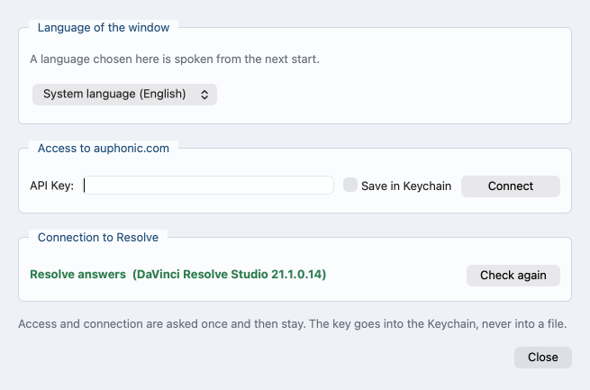

# The interface

*Auf Deutsch: [interface.de.md](interface.de.md). Back to the
[contents](README.md).*

## The four tabs

Four tabs, in the order they are needed.

- **Files & production**: the file list on top, below it a narrow strip
  with production name, spoken language and output folder. Drag files or
  whole folders in, add them, or open an earlier project. While the list
  is empty a drop area stands in its place and explains the workflow.

  The program calls the look at the material before a run the preflight.
  Every file gets a mark from it as it joins the list: ✓ nothing to
  fault, ! a note, ✕ this will not work. Below the list the result stands
  in one sentence; [Preflight](preflight.md) says what each mark means.

  **Open project ...** stands on the drop area and under **File**. An
  open project takes new files at any time, and its name stands in the
  title bar, so a window with a project open and one without are not
  the same picture.

  Where a project file lies with the material, the program offers it as
  the files come in, and before it measures any of them: one found and
  it asks once, naming it and the day it was written; several and it
  shows them to choose between; none and nothing happens. Nothing is
  ever taken in part -- the project comes back whole, with the names,
  every separation it holds, who sits at which camera, the types and
  the time window, or it is not opened at all.

  **No** leaves the files that came in exactly where they are. The list
  is built from them and measured the usual way, once, and that project
  file is not offered a second time. **Yes** puts the project's own
  files into the list in place of them, and because the question came
  first, nothing was measured that the answer then throws away. Material
  from another folder offers that folder's project; more material from a
  folder already asked about does not ask again. Once a project is open
  nothing more is offered.

  The output folder is not guessed. Until one is chosen, or a project
  says where it goes, the strip reads **next to each video file**, and
  that is where the result lands. Once a folder stands there, **reset**
  appears beside it and puts the result back next to each video file.
  The production name is suggested from the folder the material lies
  in, and can be typed over.

  Every video file carries **Camera audio** in the list. It reads
  **do not use the audio** until somebody sets it to **use the audio**.
  Set, that sound goes the same way as a recording that was read in:
  channels measured, one track or two decided, empty channels left out,
  cut into tracks. Synchronising takes that sound either way; the field
  does not decide it.

  Where there is nothing to decide the field sets itself, greys out and
  carries the reason beside it:

  - the file has no audio track,
  - the file stays out entirely,
  - the file is an intro or an outro,
  - one video file carries sound and no audio recording stands beside
    it. That sound is the only one there is, and the field stands on
    **use the audio**. Adding a recording gives the choice back.

  The same field stands at the camera on **Assignment & time window**,
  on the same value: change one and the other follows at once.

  Every video file also carries **Kind** in the list: **Content**,
  **Wide shot**, **Intro**, **Outro** or **ignore this video**. Resting
  on the field says what the entries mean. The field itself is never
  greyed as a whole -- grey over the whole box would read as "nothing to
  be done here", and there always is.

  What can be barred is an entry of the list, greyed and not pickable,
  and the reason stands on that entry: rest on it and it says why. Two
  entries can be barred at once, each with its own sentence.

  - A camera nobody is assigned to shows **Wide shot** although nobody
    marked it. **Content** is the barred entry while that lasts, because
    no speaker is assigned to it. Give that camera a speaker, or set the
    **Kind** yourself, and the entry frees itself.
  - A file the measurement could place nowhere is neither content nor
    the wide shot, and both entries are barred for it. Content is cut
    into the episode, and there is nowhere to cut this file in. The
    wide shot is the camera that runs through and steps in wherever no
    other one fits, so it has to lie on the time axis. Each entry says
    its own reason, and the program puts such a file on **Intro** of
    its own accord -- on **ignore this video** where another file
    already holds the intro, because an episode has one.

    Two things have to hold together for those two bars, and neither of
    them alone. The sound of the file has to fit the rest badly **and**
    no timecode may place it among the others, which takes a timecode on
    the file and one on something else in the material; a clock read
    once says nothing. A jingle is both at once: no timecode, and
    nothing in its sound that the room also has, and it stands red in
    the list. A camera whose microphone heard nothing of the room is
    only the first, and its own timecode still sets it to the frame, so
    it keeps the choice -- and the list writes that beside it instead of
    colouring it red.

  Leaving the file out is never barred, and intro and outro only while
  another file holds that mark -- the entry then says which one, and
  taking the mark off there frees it again. All three are answers about
  the file itself and have nothing to do with who sits in front of
  which camera. A file that fits nothing belongs in one of them.

  The two bars on a file that fits nothing are not a recommendation but
  a statement about the material, so they hold against a **Kind**
  somebody picked and against one a project file brought in: an answer
  of content or wide shot on such a file is moved to **Intro**, or to
  **ignore this video** where the intro is already given away. The bar
  on a camera nobody is assigned to is the other way round -- pick the
  **Kind** yourself and it ends.

  Every bar comes off by itself once its reason is gone. A camera that
  is given a speaker gets **Content** back, and a file a later
  measurement can place gets both entries back. What the file was moved
  to in the meantime stays until somebody sets it themselves.

  A file with more than one channel says underneath what will become of
  it: one row per channel, with a tick offering **join with Channel 2**
  on the first row and, beside it, what was measured. The program names
  channels that hold nothing and leaves them out of everything after.
  [Channels: one track or two?](channels.md) says how the program tells
  the two apart.

  A single block of a multi-part recording can be removed on its own. It
  then stays out although it lies in the folder, and putting it back
  later makes it a recording of its own. Only removing the whole
  recording and adding it again joins the blocks up as before.

  **Removing takes the answers about that file with it**: the speaker
  name, the camera, the **Kind**, what was settled about its channels.
  The project file is written out of the same store, so what has left
  the list has left the file as well, and a file added again comes back
  bare and is asked about afresh. What was removed used to stand in the
  saved project all the same, and a file put back later came up on the
  old answer without a word about it -- a recording with an empty name,
  a camera on **Intro**.

  

  *The list after a project was opened, with the marks from the
  preflight and the strip underneath.*
- **Assignment & time window**: tables on the left, player on the right.
  Appears with the files.

  The recordings are a tree. Its second column is the **Speaker
  name**. It starts empty, with the name the file name suggests
  standing in it in grey: a name typed in says the recording is that
  one person, and the entry **several speakers**, which can be picked
  instead, sets the program to work out who speaks when in that one
  recording, on this machine. Only that answer shows the voices. A
  separation nobody has answered for leaves the field empty and the
  rows hidden, and answering later brings them up at once, with the
  names and cameras they already had. The fifth column, **Speakers**,
  says how that stands -- **Separating speakers ...** and **Break off**
  while it runs, in that row and no other, then **Separated: 4
  speakers**, and a reason where the separation could not run. It is a
  report and nothing else: no separation is started there, and changing
  one's mind means going back to the field.

  Each recording keeps a separation of its own, and several stand side
  by side: every row counts the voices of its own recording, and taking
  a second one apart leaves the first one's rows, names and cameras
  where they are. Only **Break off** is ever in one row alone, because
  one recording is worked through at a time.

  A name is a person, and a person stands on the sheet once. A name that
  is already there turns its field red while it is being typed, on both
  levels and across separations. What that means is not the same on the
  two levels. Two recordings under one name are a question, not a
  refusal: they are meant to become a single track, and the line under
  the table says so; [Multitrack](multitrack.md) has that whole side. A
  **Voice** under a name somebody else carries is a refusal -- the note
  at the field asks for one of its own, **Start** stays locked, and the
  line under the buttons names the person.

  Which camera a recording belongs to follows from that name for as
  long as nobody picks one, so a name typed or corrected later takes
  the camera with it. The grey suggestion counts as that name: a
  recording nobody has typed anything into still lands on the camera
  called after it. A camera picked by hand is an answer and stays
  where it was put.

  With more than one audio recording nothing starts by itself; the
  answer in the row starts it. Under the recordings stands **Not on
  this machine**: it switches the separation off for the whole project.

  The voices are the rows under the recording they were heard in
  ([Speech recognition and speaker separation](speech.md)), indented
  and open to begin with. Each says **Voice** in the first column, so
  that the step down can be seen, and carries the name and the camera
  it belongs to. A recording with voices under it carries no camera of
  its own -- the rows below carry it, so the assignment is never on two
  levels at once -- and its own cell under **belongs to** says as much
  in grey: **the voices below carry the cameras**. Fold the voices away
  and that cell names them instead -- the cameras: **on 2 cameras**, or
  **on 1 camera, 1 without** where a voice has none yet. A click on a
  voice takes the player to where that voice
  speaks longest and plays it. Recordings that show no voices are a
  flat list, without triangles.

  A name the program gives a voice itself takes the first number nobody
  has, counted over every separation and over the recordings above, so
  a second recording does not open with a second **Speaker 1**: where
  **Speaker 1** stands, the next is **Speaker 2**. A name given by hand
  is never renumbered, and a number that falls free is used again.

  The camera table under it carries **Camera audio** again, at every
  camera, on the value from the file list, and **Kind** beside it, on
  the same value and with the same entries barred: that a clip is in
  truth an outro is noticed while watching it, and the player is here.
  A camera set to **use the audio** gets a row in the assignment table
  above, like a recording of its own.

  

  *Above which recording belongs to which camera, below what becomes
  of each camera.*
- **Resolve cut**: a line about Resolve only where Resolve does not
  answer -- **Resolve does not answer -- see Settings**, with the way to
  the settings beside it. Where it answers, nothing stands there: about
  Resolve there is nothing to set, and the way to the settings is for
  whoever has something to put right. Then the time window, the box with
  the cut values and the box **Speaker**, whose heading names where the
  speakers came from, the measured speech time in brackets and, behind
  it, that people talking at once count twice.
  Last the box **Camera cut -- preview**, with the cut band
  and a picture that plays. The picture says under itself, on a plate
  in the colour of the running shot, who is speaking and which camera
  is up; where a shot has no picture the colour fills the whole box and
  those two lines stand on it. [The camera cut](camera-cut.md) reads
  them out.

  The band shares its row with three zoom buttons and, at the end of the
  row, the stretch of time on show, in typewriter digits:
  `0:00:00 -- 0:42:13`. **−** shows twice as much, **+** half as much
  around the current position, and the third one the whole length again.
  The reading stands there from the first moment, before anybody has
  zoomed: unzoomed it is the whole material, and while the band holds
  nothing it reads `0:00:00 -- 0:00:00`. Its width is fixed, so the
  three buttons stay under the pointer as the numbers change.
  [The camera cut](camera-cut.md) says how the band itself is read, and
  how the heading of the box **Speaker** is to be read.

  In the box **Camera cut -- preview**, under what the preview says,
  stands one line naming what this cut rests on, and its colour grades
  the answer. It stays there as long as there are numbers.

  - **measured from the recordings -- 3 speakers, 1:09:23**, in the
    colour of a warning. Nothing has run yet; the speakers were read
    off the recordings as they lie, and the cut in front of you is a
    provisional one.
  - **from the finished run -- 3 speakers, 1:09:23**, in the good
    colour. A run is done and the preview stands on its result: all
    tracks on one axis, the speakers as the run found them.
  - **from the processed Auphonic tracks -- 3 speakers, 1:09:23**, also
    in the good colour. The same, and the tracks came back from
    auphonic.com with the neighbours taken out of them as well.

  This is the answer to the one question worth asking of a preview:
  whether it can be trusted. Once a run is done, preview and run stand
  on the same ground -- the same speakers, the same axis. Turn the knobs
  after that and the preview follows them at once; press **Create
  Resolve project** and the cut for Resolve is worked out afresh, from
  the values standing there now and that same result. No second run, and
  no falling back on a provisional reading. As long as the line stands
  in the colour of a warning, every number beside it can still move.

  The preview reckons the speed of each recorder in, as the run does. No
  two recorders run at exactly the same rate; over an hour that comes to
  about a tenth of a second. The preview used to measure it and drop it
  again, and its edit points then ran some 143 milliseconds -- three to
  four frames -- away from the run's over an hour. They now stay inside
  a single frame. Which camera is cut to was never affected: the gap was
  far too small for that.

  Preview and run also keep the same cameras. Both ask a file the one
  question that decides it -- has it a place at all -- so a camera whose
  sound was not recognised but whose clock sets it among the others
  stands in the band as well as in the finished project. The band used
  to drop a camera the run kept, and the legend under it then counted
  one camera fewer than what came out of Resolve.

  Nothing has to be pressed for the speakers. They are worked out of
  the tracks by themselves, as soon as this tab is opened -- once, and
  not a second time: not while one reading is running, not after one
  has failed, and not where a finished run already knows them. Until
  anything is known the preview says as much, and names the way for a
  room where everybody sits on one recording: **several speakers** in
  the field **Speaker name**.

  That line under the preview stays and carries both answers. Where a
  track is neither covered by a separation nor measured, it names who is
  still missing in place of what the cut rests on -- beside a separation
  that already stands as well. Those people are in the cut; it is this
  preview that cannot show them until they have been measured. A reading
  that fails says why in the same spot. After a run only what the cut
  rests on is left there: the run measured every track it had, and its
  result is finer than anything heard out of the raw recordings.

  The box with the cut values is called **Camera cut** when the speakers
  sit on two cameras or more. On one camera for everybody it is called
  **First cut by speaker**. Nothing is switched there: the cut falls at
  every change of speaker, and Resolve gets one clip per person. With
  one person and a second camera nobody is on it is called **Cut with
  the wide shot**: that person's camera stands, and the wide shot breaks
  it up. With **Multitrack** ticked the name stays **Camera cut**.

  The box appears as soon as **Multitrack** is ticked, or as soon as two
  people carry a name and a camera. Where those two came from makes no
  difference, and the two sources count together: a voice under a
  separated recording and a recording with a name of its own are two
  people, just as two voices are, or two recordings. One person is enough
  where there are two cameras or more. One person on a single camera
  gets no box, and rightly: there is nowhere to cut to. Until then a
  line stands in place of box and preview and says what is missing. A
  Resolve project is written anyway, with every camera at its measured
  place.

  Both rear tabs are there with or without separate tracks, and so is
  the assignment: **belongs to** is asked with the tick and without it,
  because which camera a recording belongs to is the same question
  either way and the run makes the same answer of it. Clicking the tick
  therefore costs nothing -- the cameras picked by hand stay picked.
- **Output**: appears as soon as something runs, in the same colours as
  the terminal, with the buttons **Open result folder** and
  **Create Resolve project**. It also comes up on opening a project
  whose output folder already holds finished files -- the buttons belong
  to those files, so the sheet says where things stand instead of
  looking like a run that failed. **This tab is the program's
  console**, and not only a run's: what pip writes while it fetches a
  newer version lands here, and so does every line of an ffmpeg being
  installed -- the package manager's own output, or the download,
  minute by minute. Nobody starts the program from a terminal any more,
  so this is the terminal.

**Multitrack (one track per speaker)** has a line of its own under the
assignment table, above the Auphonic box. It works with auphonic.com and
without; the program asks for the API key only on the way over
auphonic.com. The camera cut does not need the tick.

Multitrack needs two input tracks. An input track is a recording of its
own, a channel of a multichannel recorder, or the audio of a video file
set to **use the audio**. Several blocks of one recording count as one
track, and a track set aside counts as none.

The tick stays clickable whatever the material. With one track only a
grey line beside it says so, and it names the way to a second:
**Camera audio** at a camera, set to **use the audio**. If every camera
already gives its audio away, that line says there is none left to
take.

Under the Auphonic box a second bar appears while the material is being
measured, one line per file with how far each has got. A line goes as
its file is done, and the bar itself a moment after the last one. It
shows the prework -- reading the audio and computing the envelopes --
which is the same work the bar beside **Start** carries, here file by
file.

**Language** beside the production name is the language spoken in the
recording, preset from the system language. It does two things: it
becomes the tag of the written audio track, and the recognition on this
machine is told to expect that language. "not set" leaves the track
untagged and lets the recognition work the language out for itself. The
list holds only languages the recognition here also knows.
[The transcript is made here](auphonic.md#the-transcript-is-made-here)
says what the recognition writes, and [Speech recognition and speaker
separation](speech.md) which way it takes on which machine.

**Loudness** in the **Production** box on the first page sets how loud
the finished episode is made; the same gain goes on every track, so the
balance between the speakers is kept. Five entries:

- **-16 LUFS (Podcast directories, stereo)**
- **-19 LUFS (Podcast directories, mono)**
- **-14 LUFS (YouTube -- turns down only, never up)**
- **-23 LUFS (EBU R128, broadcast)**
- **Take from source files**

A new project starts on -16 LUFS. The window remembers the entry last
chosen, and a loaded project file beats that memory.
**Take from source files** adjusts nothing at all: auphonic.com goes on
doing what its preset says, and without auphonic.com the sound stays as
it is in the source files -- the file comes out byte for byte the same.

[Which loudness target holds](preflight.md#which-loudness-target-holds)
says what else hangs on the target: normalising the tracks, the meter in
the Resolve project, and what the log records.

**Dry run** is the run that measures and reports and makes no edit.
One thing it does write: where the microphones hear each other too well
to be told apart, it measures how far apart they stand and keeps the
joined recording the separation needs, so the run that follows does not
build it a second time. It
and **Start** stay locked while something is outstanding, and **what it
is stands under the buttons**, with the tab it is on:

- no files,
- no sound in use: no audio recording, and no video file set to
  **use the audio**,
- no production name,
- fewer than two tracks in the assignment table for multitrack,
- with multitrack, a recording with no name at all: none typed, and
  none the file name suggests -- the grey suggestion counts as the name
  wherever nothing is typed over it,
- with multitrack, all recordings under the same name,
- a **Voice** under a name that is on somebody else: the cut puts a
  person on one camera, and one name on two voices would be that person
  in two places,
- two cameras with the same output file.

The field or the row it means turns red. A tick behind a tab means
nothing on it is outstanding. No window opens for any of this.

What a dry run shows of the speakers depends on what is already on this
machine. A separation worked out before is read back, and the voices
are counted up with their speaking time -- the real cut, without
computing anything for it. Only where a separation would have to be
measured does the run leave it undone and say so. [Speech recognition
and speaker separation](speech.md) shows the block and what stands in
it.

Then a summary: how many cameras and audio tracks, how long, which
preset, how many files this makes, how much room they need and how much
is free. If the run would overwrite files that are already there, a
window first shows which.

The player has play and pause, seconds and frames forward and back,
volume and speed; timecode on the left, position on the right, counted
from the In point. The timecode on the left is the measured place
wherever there is one -- the same reckoning the whole axis uses -- and
the file's own clock only where nothing was measured.

- A click on a row of the assignment or camera table brings that file in
  at the same point in what is happening, so two cameras can be
  compared. That point comes from the measurement; where nothing was
  measured of one of the two, the clocks answer. A picture that was
  running goes on running in the file that comes in, so the camera can
  be changed without stopping to watch. A click on a voice under a
  recording opens that recording where the voice speaks longest and
  plays at once. The tick **hear assigned audio** plays the recording
  assigned to that camera; without it the camera's own sound is heard.
  The recording is laid against the picture by the measurement as well,
  so the two run together even where the two devices disagree about the
  time of day. A recording written in several blocks plays through: the
  block holding this moment is the one that sounds, the change at the
  boundary happens by itself, and where that recording is not due under
  the picture on screen it stays silent rather than sounding its
  beginning in the wrong place. Both ends of that sum come out of one
  reckoning: mixing them left the sound running against the picture by
  the difference between the two clocks.
- In point and Out point take the spot from the picture, a blue stripe
  shows the window, and dragging the rail moves only the numbers. Until
  the time axis stands they are locked.
- Formats the machine cannot play (MXF, R3D, some ProRes variants) get a
  button for `ffplay`.

The output also goes to `videopodcast-magic.log`, and where that file
lies depends on how the program came onto the machine. A copy running
out of a folder of its own writes the log beside the program. An
installed copy writes it where the system keeps its logs --
`~/Library/Logs/videopodcast-magic/` on a Mac, under `%LOCALAPPDATA%`
on Windows, in the folder the desktop standard names for such things
elsewhere -- because the folder pip installed into belongs to pip and is
written over at the next install. **Nothing is printed to say where it
went**: nothing at all is said before the window is up, so the way to
it is **Help > Show the log of this run**, which opens it in whatever
this machine opens text files with. The entry is greyed until there is
something to open, and says so. Its
first line names version, time, operating system and Python, and the line
under it the path the program was started from -- several copies of the
program share one log, and without that line nobody can tell later which
of them wrote what. Every start of the program begins the file again and
keeps the one before as `videopodcast-magic_1.log`, so one file holds a
whole session and every run in it. What Qt and ffmpeg write past Python
is in there too. The two players write into it as well, on lines marked
**[GUI]**: what was loaded, played and paused, which sound was laid
against which picture -- naming, for a recording written in several
blocks, the block that is playing, and saying where that recording was
not due under this picture and stayed silent on purpose -- and, at every
start and every stop of the cut player, which camera it was showing.
That is the part to send along with a complaint about the preview.

Lines marked **[EXT]** hold every call to a program outside this one --
ffmpeg and ffprobe -- with the tool, the file it was about and how long
it took; speech recognition and speaker separation stand among them,
because that is where a run spends its minutes. Where no measurement was
needed because one was already there, that stands in place of the call:
from outside, a file read once looks exactly like one read four times.
The same call several times in a row stands as one line, with the count
and the total -- the fine measurement asks for nine stretches out of two
files. A line marked **[ENV]** says, for each loudness curve the program
draws out of a file for the time axis, whether it came out of the store
or had to be read off the file again; on a large file that is the
difference between minutes and nothing. And what the window shows in red
is in there with the time of day, under **[BAD]**: a warning window, a
red line under a box, a red mark on a row of the file list -- a red mark
is gone as soon as the row is drawn again, and the complaint about it
arrives hours later.

None of that goes into what the run itself prints, only into the file:
in the window it would tear the progress bars apart. The new lines are
English, like the [GUI] ones; only the wording of a red message stands
as it stood in the window, and so in the language of the program.

Beside **Start** runs **one bar for everything outstanding**, with a line
saying what is being worked on; it only ever moves forward. It covers
both halves: the measuring that follows every change to the file list,
and the run itself. That measuring takes in envelopes, camera audio,
channels and the check, and an envelope is the loudness over the length
of a track.

A step that reports a real percentage takes the bar with it. A step that
reports nothing lets the bar creep on slowly and stop short of the end.

For the run itself the line names the stage, by the same names on both
paths, with Multitrack and without:

- **Reading the plan**
- **Audio out of the cameras**: only with Multitrack. Without it the run
  aligns against the cameras and leaves them alone.
- **Common time axis**
- **Processing at auphonic.com**, or **Loudness and levels** without a key
- **Who speaks when**
- **Writing the camera files**
- **Handover and result**

A stage that will not happen is not in the list at all, so the bar holds
no share back for it. If a run stops, the line says which stage it
stopped in.

### What Settings ... holds

The button **Settings ...** sits in the footer, next to **Start**. Behind
it stands what is set up once and then left alone: the key for
auphonic.com with the tick that stores it, and whether Resolve answers.
The preset belongs to the production being made and stands where the
tracks are decided, under the assignment table.

The window behind the button holds two boxes.

- **Access to auphonic.com**: the field for the API key and the tick that
  keeps it (**Save in Keychain** on a Mac, **Save in Registry** on
  Windows). **Connect** checks the key and fetches the presets. On a Mac
  with the keychain locked the tick is grey, a line under it says so, and
  **Open Keychain Access** beside that line opens the program that
  unlocks it; the tick comes back on its own once it is open. Where the
  store refuses the key, **Connect** takes the tick off again and writes
  **The key was not saved** with the reason -- the tick never stands
  green over a key that will be gone at the next start.
- **Connection to Resolve**: whether Resolve answers, with its version if
  it does and the reasons if it does not. **Check again** asks once more,
  and so does opening the window.
  [DaVinci Resolve](resolve.md) says what a no means.

*Behind Settings ...: the key for auphonic.com, and whether Resolve
answers.*

## Reaching everything by menu or key

The menu bar carries four menus: **File**, **View**, **Player** and
**Help**.

**File** goes in the order the work goes. The project first -- **Open
project ...**, **Save project**, **Close project** -- then the material,
then the run. **Close project** empties the window down to what a fresh
start looks like and leaves the file it came from untouched; it is the
way to a second production without quitting the program. **Save
project** writes the project file where the output folder points,
without running anything, and says afterwards where it went.

Where no output folder is chosen yet, the sentence comes before the
window: the project file goes into the output folder, and none is
chosen yet, please choose one. Only then does the chooser open. Cancel
it and nothing further happens. A folder dialog that opens by itself
does not say why it is there.

**Close project** also calls off the work that was running on the old
material. The envelopes and the camera audio stop being taken out, the
channel measurement and the check stop, the common time axis stops being
measured, the speaker separation stops, and the bar beside **Start**
goes away in the same moment. A piece of work already under way in the
background may still run to its end, but its answer is thrown away: it
does not put itself back on the bar and it does not drop files into the
emptied list. An empty window is an idle one.

**View** names the tabs rather than numbering them. **Help** holds the
way into this manual, **What changed in this version**, **Show the log
of this run**, **Look for a newer version now** and **About Video
Podcast Magic**. **Show the log of this run** is how the log is found
at all -- nothing is printed before the window to name it.

On a Mac the menu bar sits at the top of the screen, everywhere else at
the top of the window. **Settings ...** moves into the application menu
there and stands under **File** everywhere else.

Everything the menus hold carries a key, and the menus hold the whole
run: the project, the material, the start, the player. Buttons that
stand on a sheet of their own have no menu entry and no key of their own
-- **Connect** and **Check again** behind **Settings ...**, and the two
under **Output**. The keys that need no modifier belong to the player,
or to the cut band, and each only works while that one has the focus.

The three buttons that zoom the cut band do carry keys, and the band
answers them itself: `+` shows half as much around the current position,
`-` twice as much, `0` and `Home` the whole length again. The wheel over
the band does the same as `+` and `-`.

| Key | The entry it presses |
|---|---|
| `Ctrl+P` | **Open project ...** |
| `Ctrl+S` | **Save project** |
| `Ctrl+W` | **Close project** |
| `Ctrl+O` | **Add files ...** |
| `Ctrl+Backspace` | **Remove** -- what is selected in the list |
| `Ctrl+Shift+O` | **Output folder ...** |
| `Ctrl+R` | **Start** |
| `Ctrl+Shift+R` | **Dry run** |
| `Ctrl+1` to `Ctrl+4` | To that tab, in the order they stand in |
| `Ctrl+,` | **Settings ...** |

In the player:

| Key | The entry it presses |
|---|---|
| `Space` | **Play and pause** |
| `L` | **Play forward, faster on every press** |
| `K` | **Pause** |
| `Left` `Right` | **One frame back**, **One frame forward** |
| `Shift+Left` `Shift+Right` | **One second back**, **One second forward** |
| `Alt+Left` `Alt+Right` | **Ten seconds back**, **Ten seconds forward** |
| `I` `O` | **Mark In**, **Mark Out** |
| `Shift+I` `Shift+O` | **to In point**, **to Out point** |

`L` doubles up to 8×, and the speed stands on the fast forward button.
The player has no `J`: Qt plays nothing backwards here, measured.

On a Mac, `Cmd` stands in place of `Ctrl`. This is the layout the editing
programs share.

## Keeping itself up to date

A moment after the window is up, the program asks github.com whether a
newer version is out. It looks only then, not while a run is going on.
That is one question for a version number.

If one is out, a window names it and the version running here. It shows
what changed in the new version, in its own words, and the address
underneath. Two buttons:

- **Later** leaves the version that is running in place.
- **Update** hands the job to pip. Before it asks, the window names
  the folder the new version is going into, so the answer is given
  knowing where it lands.

**The program does not write over itself, and that is deliberate.** It
was installed with pip3, and pip keeps the record of which version is
in place; writing over the file would leave that record standing and
wrong. So **Update** runs the same command anybody would type --
`pip3 install -U` on the address the program came from -- in the
Python the program is running in, so the installation that gets the
new version is the one that would start.

**Every line pip writes goes into the fourth tab, Output, as it
arrives.** That tab is where to watch: the window stays usable, the
last line says the new version is in place, and it runs from the next
start. Where pip stops with an error, the tab says so and keeps every
line above it -- the reason is in there, and the version that works
has not been touched.

The tick **Skip this version** puts one version aside. The next one
asks again, and **Help > Look for a newer version now** asks whenever
it is chosen.

## How the time axis is measured

As soon as two files are in the list, the interface measures in the
background where each of them sits, with the method of the run itself --
whether they carry a timecode or not. The player then jumps between files
to the same point in what is happening, and In point and Out point hold
for all alike.

**Where something was measured, the measurement decides, and the file's
own clock only answers where nothing was.** A clock is set by hand and
gets set wrong, and nothing in the file admits it: on real material a
sound recorder ran 2.35 seconds ahead of the cameras beside it, far
enough to hear the sound running against the picture. The measurement
holds every file against every other and hangs the axis on the middle one
of the clocks, so one wrong clock is outvoted instead of dragging
everything after it.

The measurement therefore runs even where every file carries a timecode.
That costs one pass the first time -- material that used to skip it now
waits for it once -- and it buys a preview that stands on the same
reckoning the run does. The run measures in any case; it was the preview
that used to leave it out.

One timecode anywhere is enough to hang the axis on; without any it counts
from the start of the material and shows as a virtual timecode.

**The column Timecode** in the assignment table shows the measured place,
at every file alike, with **computed** behind it -- or **virtual** where
the axis has no clock to hang on. Only a file the measurement could not
place at all stands there with its own timecode and nothing behind it,
and where it has none of its own either the column says **no timecode**,
in grey. That last is what a file fitting nowhere shows, and it is the
first place to look when one has put itself on **Intro**.

It used to be the other way round: a file with a clock of its own showed
that clock and the rest showed the measurement, so one column carried two
different reckonings and the numbers in it could not be compared. They are
different numbers now.

The axis goes into the project file, with size and modification time of
every file, and the next start takes it up again. Along with the place
of each file goes how fast its recorder ran, so that the second start
does not have to measure the same minutes over again. Files that no
longer fit it show red. A project file written before that speed was
kept still opens: every recorder in it then counts as running even,
which is what the program assumed all along. More about the project file
stands in [camera-cut.md](camera-cut.md).

**Files dropped in while the measurement is running are measured too.**
The measurement under way was started over the list as it stood and
knows nothing of the new file, so the request waits for it: as soon as
the answer is in, the whole list is measured again, the new file with
it. Nothing has to be pressed and nothing repeated by hand. The bar
beside **Start** says the axis is being measured, and it says it again
over the second pass.

The measurement tells three verdicts apart, and the row says which one
it is. **Two ways lead to a place, the sound and the clock, and one of
them is enough** -- that is what the two lines turn on. The verdict
stands on lines of its own, under what the row otherwise says rather
than behind it: written on one line it was pushed out of the column by
the folder in front of it, and the reader lost the half that mattered.

A file whose sound was not recognised but whose timecode puts it among
the others says **sound not recognised; placed by its timecode**. It
lies on the axis to the frame; what is missing is only the second
opinion, and the measurement bars nothing for it.

A file with no place at all says **does not fit the other files: sound
not recognised, no timecode. Its sound cannot be used.** and stands red.
Its sound has nothing in common with the rest of the material and no
timecode puts it among the others, so it cannot be cut into the episode:
in the column **Kind**, **Content** and **Wide shot** are barred for it,
it is set to **Intro** -- or to **ignore this video** where another file
already holds the intro -- and the log says which of the two and why.
That is not a proposal but a statement about the material, and it holds
however the **Kind** got there.

Where nothing whatever could be measured of such a file, **ignore this
video** is proposed for it instead. That is a proposal, like the ones
for the voices: it only ever fills a **Kind** that still carries the
program's own answer, never one somebody picked, and a file that a later
measurement can place again gets its old entry back.
[Preflight](preflight.md) says how a jingle and a camera that heard
nothing are told apart.

## When something goes wrong

- **The window stays empty and nothing can be added**: `ffmpeg` and
  `ffprobe` are missing, or the ffmpeg on this machine is older than
  9.0.1. Nothing that needs the two is possible then -- adding files,
  opening a project, measuring the time axis, a run. A box names the
  version found and the one needed, and beside **Quit** stands a button
  that gets one: on a Mac it builds it, on Windows and Linux it fetches
  or installs it, and every line of that appears under **Output** while
  the window stays usable. It takes minutes, and the box says so before
  it is pressed. [What it
  needs](requirements.md#where-ffmpeg-comes-from) says what happens on
  which system.
- **A box says this ffmpeg has no soxr**: nothing is wrong. The run
  works either way, only the clock drift between the cameras comes out
  a hundred times more coarsely. **Carry on** keeps what is there, and
  the question is not asked again in this version.
- **Start** stays locked: the line under the buttons names what is
  missing, and the field or the row it means turns red. Fill that in
  and the button frees itself.
- **The player shows no picture**: a button takes its place and hands the
  file to `ffplay`, which opens a window of its own.
- **In point and Out point are locked**: the program is still measuring
  the time axis. The bar beside **Start** says what is running. Files
  added meanwhile are measured after it, in a second pass of their own.
- **A file suddenly stands on "Intro" or on "ignore this video"**: the
  measurement found no place for it. Give it a timecode that fits the
  other recordings -- that has to be set with another program -- and
  the entries come back. Until then **Intro**, **Outro** and **ignore
  this video** are the answers on offer -- the first two only where no
  other file holds that mark; **Content** and **Wide shot** are barred,
  and no hand overrules that.
- **The update did not go through**: the file that works stays where it
  is, and the window says what was wrong. **Help > Look for a newer
  version now** tries again.
- **Asking for help**: send the version from `--version`, the operating
  system, `videopodcast-magic.log` and what you were trying to do, before
  the details of the fault. Both players write down in that log what they
  did, every line marked **[GUI]** and carrying the time of day: which
  file was loaded and at what point, every play and every pause, which
  recording was laid against the picture, out of which of the two
  reckonings that came and what the sum was. A recording written in
  several blocks is named with the block that is playing, and where it
  is not due under the picture on screen the line says it is silent --
  so a preview that went quiet can be read off afterwards instead of
  guessed at. The player on **Resolve cut** names the camera it is
  showing at each start and each stop, not on every frame between them.
  Sound running against the wrong picture can be read off those lines
  afterwards; without them it can only be described. Beside them stand
  the calls to ffmpeg and ffprobe with their times, marked **[EXT]**,
  and every red message the window showed, marked **[BAD]** and with the
  time of day -- a red mark that has since been drawn over is found
  again there instead of being remembered.

That is the whole window. The next chapter, [Preflight](preflight.md),
covers the checks before a run and the meaning of each mark in the file
list.

### Further options on the command line

The window does not offer these.

`--update` does what the button does, without the window: it runs pip
on the address the program came from, and pip writes into the terminal
instead of into the Output tab. A run with anything else on the
command line only ever says that a newer version is out -- started
from a script it must not stop at a question, and it fetches nothing
unasked.

`VPM_NO_UPDATE_CHECK` in the environment switches the whole thing off,
the menu entry with it. The entry then says so instead of looking. That
one is for whoever runs the machine.
