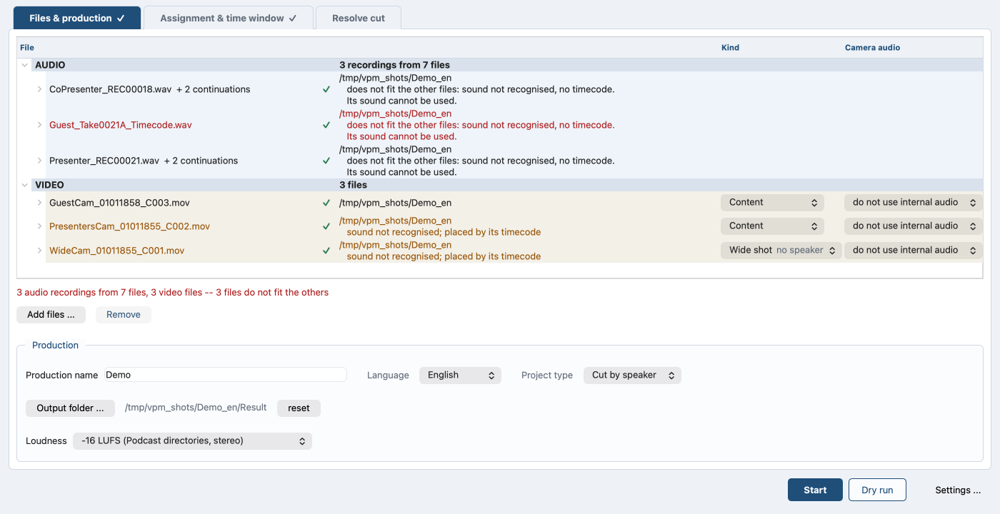

# Overview

*Auf Deutsch: [overview.de.md](overview.de.md). Back to the
[contents](README.md).*

Raw material from a video podcast becomes an edited episode: the good
audio inside the video files, the cameras on one time axis, and a first
camera cut in DaVinci Resolve. One window, or one command.

*Three tabs: Files & production, Assignment & time window, Resolve cut.
The first one is open, with the recordings, the video files and the
notes from the preflight. This chapter explains none of them; the
chapters after it do.*

## What it takes off your hands

An interview is in the can. Two cameras ran, and because a camera
microphone never sounds good, a recorder stood next to them. On the disk
there are now two kinds of file: big picture with poor sound, good sound
with no picture. Laying one on the other should be enough.

It is not. The recorder split the take at two gigabytes, so one interview
became three files. Sound and picture do not start together. And after an
hour of cutting the lips are off by a tenth of a second or so. Camera and
recorder each have their own quartz, and one ticks a few millionths
faster. Timecode would settle it, if anybody had set both devices to the
same clock.

So the program listens instead. It compares when the good audio gets loud
and when the camera microphone does, slides them together, and takes the
drift out over the length. If the measurement is too shaky for that, the
program leaves it alone and says so.

That comparison lives on pauses in the speech, and music has none. If it
comes back with nothing, the program looks again at the phase, which
survives a room and a second microphone. The log says that it switched
and how sharp the find was. The phase answers where the audio sits. How
fast the clocks run stays unknown, so the program takes no drift out on
this path.

## What comes out

One new video file per camera. The program copies the picture instead of
re-encoding it. Where a time window is set, the file holds that window
and a second at either end rather than the whole shoot -- five minutes
out of a real interview came to 6.09 GB where the whole day came to
83.57 GB. Inside it the good audio sits as the first audio track,
the camera microphone as the second, both named. In the edit you say
"audio from track one" and you are done. Afterwards the program measures
the two tracks against each other and writes down how far apart they are.
With one recorder and one camera that is the simplest case: [the simple
path](simple-path.md).

Before the first long step the program looks the material over; it calls
that check the preflight ([preflight](preflight.md)). At the end every
measurement lands in a CSV the next run does not overwrite. Over a few
months that is where a recorder going slow, or a camera drifting away
from the others in colour, shows up.

## Putting several speakers on one time axis

Three people at a table means three microphones, and all three voices are
on each of them. That bleed is what makes podcast audio sound cheap.
auphonic.com can take it out, given every track exactly the same length
to the millisecond ([processing](auphonic.md)). So the program puts every
camera and every track on one common time axis first.

Then you say who belongs to which camera, in a table with a player beside
it. Each camera file then carries the mix of exactly the speakers in its
frame as the first audio track, and the single voices behind it. Play it
alone and you hear the right thing; cut with it and you have everything
separately ([multitrack](multitrack.md)).

The service is optional. Without it three steps are missing: de-bleed,
leveler and noise removal. The program works out who speaks when for
itself, and it measures the distance between the microphones instead of
assuming it.

## Cutting by speaker

Whoever speaks alone gets their camera, with a little lead so the cut
sits before the first word. When several speak at once, a camera showing
exactly those people beats the wide shot, the one camera with everybody
in frame. The wide shot itself does not come by the clock, but at a long
pause shortly before someone else starts.

Nine number fields and five selectors set how fine the cut turns out, and
the window shows their effect at once, without writing anything. Out come
a table, an EDL and the speaking times: who talked how long, in per cent
([camera cut](camera-cut.md)).

## Building the Resolve project

On request the program creates the project and builds two timelines
([DaVinci Resolve](resolve.md)). One is the finished cut: the camera
pieces on top without their sound, a continuous overall mix below, so the
sound does not jump at the cuts. The other has every camera on its own
video track, uncut, ready to become a multicam clip if you would rather
have Resolve cut it itself.

Turning it into one is a right click, and the only thing the program does
not do for you. Resolve's scripting interface has no multicam, so it says
exactly what to click. The program sets up colour tagging, a colour group
per camera and the render job; in Resolve one click on **Render All** is
left.

## What it does not decide

The camera cut is a proposal that takes the first blunt hour off your
hands. What the episode is to become stays yours: which passage survives,
where it drags, how the picture is graded, where the intro dissolves. The
program makes sure everything is where it belongs when the actual work
starts. It tells you when something does not fit, before you have put an
hour into the wrong cut.

[What it needs](requirements.md) names what to install first. [The
interface](interface.md) shows the window itself.
