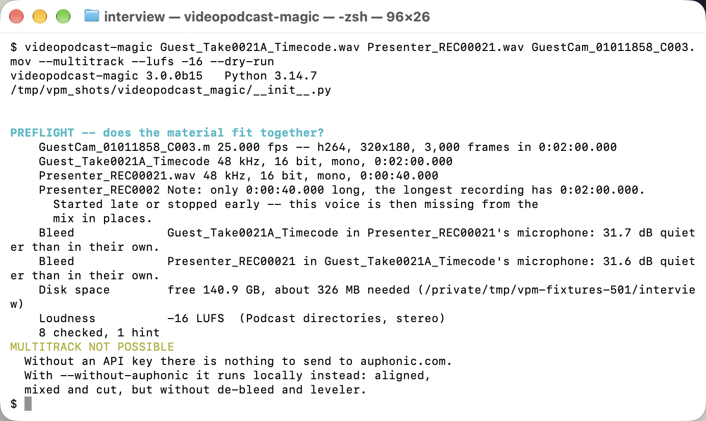

# What it needs

*Auf Deutsch: [requirements.de.md](requirements.de.md). Back to the
[contents](README.md).*

## Getting the program

One command installs it, and there is no second way in:

```
pip3 install git+https://github.com/Bascht74/videopodcast-magic
```

It leaves the command `videopodcast-magic` behind, callable out of any
folder. Everything the program needs in Python comes with it in that
one go: the window, the measuring, the authorities an https connection
is checked against, the speech recognition for a system that brings
none -- and the speaker separation, telling the voices on one recording
apart, which is the largest of them by far. Nothing gets fetched behind
anybody's back afterwards, and nothing is missing when the window opens
for the first time.

**That first command takes minutes, and the wait is those packages.**
Measured on a Mac: about a hundred seconds and about 2565 MB on the
disk afterwards. Two pieces are most of it -- the window, which is a
443 MB download in two parts and 1.2 GB unpacked, and the machinery
the speaker separation runs on, 536 MB in one piece. On a fast line it
is over sooner; on a slow one it is not stuck, it is fetching one of
those.

**The speaker separation is part of the installation, and that is
deliberate.** It used to set itself up an environment of its own the
first time somebody asked for it, and an environment beside the
installation is out of pip's reach: take a package out of it by hand
and it stays out, and the update command does not notice. Now one
command puts everything back, the separation with it.

**The newer version comes on the same address, and that one is
seconds:**

```
pip3 install -U git+https://github.com/Bascht74/videopodcast-magic
```

No package registry stands in between: the address is the repository
itself, and pip reads it afresh each time, compares the version there
with the one installed, and leaves everything alone where the two are
the same. Measured: twelve seconds for a `-U` that found nothing
newer, and not one package touched.

Where `pip3 install` refuses and says the environment is externally
managed, this Python belongs to a package manager -- Homebrew's, or a
Linux distribution's -- which keeps pip out of what it maintains, and
the refusal names the way round it: `pipx install` on the same address
puts the program in an environment of its own and the command on the
path.

Two things have to be on the machine before that command, because pip
can bring neither:

* **Python 3.10 or newer, and its pip.** A pip that reads the project
  file stops below 3.10 and names the version it wanted. **The pip
  macOS brings with its own Python 3.9 reads nothing and says nothing
  is wrong**: measured on 4 September 2026, `/usr/bin/pip3` --
  pip 21.2.4 -- answered `Successfully installed UNKNOWN-0.0.0` and
  left behind an empty folder of that name. No module, no command, no
  error. **Reading `UNKNOWN` means the pip is the wrong one**, and the
  answer is to install Python 3.10 or newer and use its `pip3`.
* **`ffmpeg` 9.0.1 or newer, and `ffprobe` beside it.** They are not
  Python and no list pip reads can name them. The program offers to
  get them, on all three systems.
  [Where ffmpeg comes from](#where-ffmpeg-comes-from) says why that
  version, what the program does below it, and why the build it offers
  brings soxr along even though it does not insist on it.

One thing the program fetches later, and only when somebody wants what
it is for: the model for the speaker separation, about 33 MB, the first
time a separation is asked for. It does not ask about that one -- what
the separation runs on came with the installation, so the model is the
last small piece of something already paid for.

And one it only asks after: the number of the newest version, from
github.com, a moment after the window is up. The program sends nothing
while it asks, and it fetches that version only when somebody says so.
[The interface](interface.md#keeping-itself-up-to-date) says what
happens then.

**The model.** Telling the voices on a recording apart is the speaker
separation, and it needs a trained model. The program fetches it from
its own repository into the folder `models/` inside the program's own
folder. It
holds every file against its SHA-256 checksum and writes only what
matches.

The separation then reads the model from that folder, without an
account, a token or a network. The program fetches it only the first
time.

## Which Python the program needs

3.10 or newer, and pip refuses the install below that. The floor is
what the interface needs: PySide6 does not build below 3.10. The
test suite runs on 3.14.7, the version this is used on daily. It
covers 3.14.7 only; anything between it and 3.10 is not measured.

`--version`, the header of the log and the first line of every run say
which Python is running. They name the recommended one when it is
another: `Python 3.11.15  (recommended version 3.14.7)`. `--help` and
`--version` answer without `numpy`, `PySide6` and `ffmpeg`.



*The first line names version and Python, below it stands the path of
the running file. This Python is the recommended one, so no bracket
follows.*

## Where ffmpeg comes from

**`ffmpeg` and `ffprobe` are the one thing pip cannot bring**, because
they are not Python and no list pip reads has a place for them. Every
other piece came with the install; these two have to be on the machine.

**Where they are looked for.** On the search path first, and then where
the package managers of this system usually leave a program: Homebrew
and MacPorts on macOS, snap and the folder a single user installs into
on Linux, Chocolatey, Scoop and winget on Windows. That second look is
what makes a double-click behave like a command line, because a program
opened from the Dock or the Finder inherits almost nothing of the search
path a terminal has -- without it the same ffmpeg is there when typed
and gone when clicked. An ffmpeg the program fetched for itself stays
ahead of all of them, and one already on the search path keeps its place
ahead of anything a manager left.

**9.0.1 is the floor, and below it nothing runs.** The picture out of a
camera file is copied through untouched, and what stands beside it is
meant to arrive untouched with it: the colour box, the recording curve,
the Dolby Vision entries, the timecode, the camera's own keys. What an
older build lets fall depends on how it was built, so the result would
look right and be wrong, in the one place nobody thinks to check.

A floor says what the program answers for; it does not claim that
everything below it is broken. 9.0.1 is the version this is measured
against, and it is the one the program can put on the machine itself,
on all three systems -- so a floor nobody can reach is not one of the
things that can go wrong here. The floor stood at 8.1.2 before, and
that build carries the picture through perfectly well.

**soxr is not a second condition, it is a difference in precision.**
The cameras are put on one time axis, and their clocks run apart -- a
few parts per million, which over an hour is frames. Taking that out
means stretching audio by a factor very close to one, and the plain
resampler can only round to whole sample rates: at 48 kHz that is steps
of 21 ppm. With soxr the step is 0.21 ppm, a hundred times finer. A
build without soxr therefore runs, corrects the clocks more coarsely,
and says so once among the messages of the run. That is why what the
program fetches or builds has soxr, although it accepts one that has
not.

Where this ffmpeg is new enough but has no soxr, the window says so
once and offers the finer build beside the sentence. It is not a gate:
**Carry on** keeps the one that is there and everything works. The
question is asked once per version and then let go -- a box that comes
back at every start over something that is not broken is a box people
learn to click away. It is not asked at all where this machine has no
way of getting a better build.

**Missing or too old: the window opens and stays empty.** Everything
that needs the two tools is barred, not the run alone -- adding files,
opening a project, measuring the time axis. The message names what was
found and what is needed, and beside it stands a button that gets it.

**It is said where somebody can read it**: in a box on the window where
there is one, and in the terminal where the program was started with
switches. Where nobody is there to answer, nothing is asked and nothing
is fetched -- the reason stands in the log and the run ends. The
program never says a line before the window is up.

**Getting it takes minutes, and every line of it can be read.** The
box says so before the button is pressed. What the package manager or
the download says then goes into the fourth tab, **Output**, line by
line, and into the log with it -- so a failure can be read afterwards
instead of guessed at. The window stays usable throughout, and when it
worked, the last lines say so and ask for a restart to pick the new
build up.

The program looks in three places: the folder it puts a build of its
own into, which goes in front of everything else, then the search path,
then next to itself. When they are still missing it takes the way this
machine has:

* **macOS: it builds one.** There is no ready-made build to fetch for
  this kind of Mac, so Homebrew compiles it from the tap that has soxr:
  `brew install --yes homebrew-ffmpeg/ffmpeg/ffmpeg --with-libsoxr`.
  That takes two to three minutes. It is deliberately **not** `brew
  install ffmpeg`: Homebrew's own ffmpeg is built without soxr in every
  version it offers, so that command would install one that corrects
  the clocks a hundred times more coarsely. Without Homebrew on the
  machine there is nothing to press, and the sentence says to install
  it from brew.sh and come back.
* **Windows: it fetches one.** Windows brings no package manager, so
  the program downloads a build that has soxr and puts `ffmpeg.exe` and
  `ffprobe.exe` in a folder of its own, under the user's own local
  data. Nothing has to go into PATH by hand. Where the download fails
  it offers to open ffmpeg.org instead.
* **Linux: the package manager first, then a download.** `apt-get`,
  `dnf`, `zypper` or `pacman`, with `sudo` in front where the run is
  not root already -- because a package manager writes outside the
  program, into what the machine owner keeps, it is asked before it is
  run. Afterwards the tools are asked again rather than taken on
  trust: a distribution can report success having laid down a version
  years under the floor. Where it has, the program fetches a build of
  its own, exactly as on Windows.
* **Where a fetched build lands, it is used.** It goes into the
  program's own folder for such things -- not the cache, which is the
  one folder everybody is told they may delete -- and in front of the
  search path, so it answers rather than the older one the system had.
* **When one is there and too old**, it has to be built again, not
  installed a second time: told to install what is already there a
  package manager answers "already installed" and does nothing. The
  program knows the difference and gives the other command -- on macOS
  `brew reinstall --yes homebrew-ffmpeg/ffmpeg/ffmpeg --with-libsoxr`.
* **When nothing gets installed**, the window stays empty and says what
  to do on this machine. Answering the question with no leaves it the
  same way.

`requirements.txt` holds the Python packages under the same names pip
reads from `pyproject.toml`, for anyone who would rather have them in
a virtual environment before the install.

## What differs per platform

Day to day the program runs on macOS and Windows. On Linux it runs as
well, with two limits:

* The key cannot be stored (no Keychain, no Registry), so it has to
  come from `AUPHONIC_TOKEN` each time.
* The cache goes to `XDG_CACHE_HOME`.

## When something goes wrong

* **pip refuses and names a Python version.** This Python is older
  than 3.10. Install a newer one and give the same command to that
  one.
* **pip answers `Successfully installed UNKNOWN-0.0.0`.** Nothing was
  installed. This pip is too old to read the project file; on a Mac
  that is `/usr/bin/pip3`, which belongs to Python 3.9. Install
  Python 3.10 or newer and give the command to its `pip3`.
* **pip says the environment is externally managed.** This Python
  belongs to a package manager. `pipx install` on the same address is
  the way round it.
* **The install breaks off part way.** The last lines of pip say why.
  It is almost always one of the two big downloads, the window or the
  machinery under the speaker separation: give the same command again.
  Nothing is lost -- what already arrived stays in pip's cache.
* **`videopodcast-magic` is not a known command afterwards.** pip put
  the command into a folder that is not on the search path, and its
  own warning names that folder. Put it on the path and open a new
  terminal. There is no second way in: **`python3 -m
  videopodcast_magic` used to start the program and does not any
  more.**
* **`ffmpeg` is still not found after installing it.** The folders the
  usual package managers install into are looked in without anything
  having to be set up, so this now points at an ffmpeg unpacked by hand
  somewhere of your own. Put that folder on the search path and start
  again.
* **The window opens and stays empty, and the message names an ffmpeg
  version.** This ffmpeg is older than 9.0.1. The button in that box
  gets a new one; what it does appears under **Output**. By hand it is
  `brew reinstall --yes homebrew-ffmpeg/ffmpeg/ffmpeg --with-libsoxr`
  on macOS, otherwise a build from ffmpeg.org with its folder on the
  path. `ffmpeg -version` in a terminal says which one is on the
  search path.
* **The window offers a finer ffmpeg and nothing is wrong.** This one
  has no soxr. Nothing is barred; the clock correction then works in
  steps of 21 ppm instead of 0.21. **Carry on** keeps what is there,
  and the question does not come back in this version. `ffmpeg
  -version` lists `--enable-libsoxr` among the build options where it
  is there.

That is everything the program needs. What the window then shows, tab
by tab, is in [The interface](interface.md).
