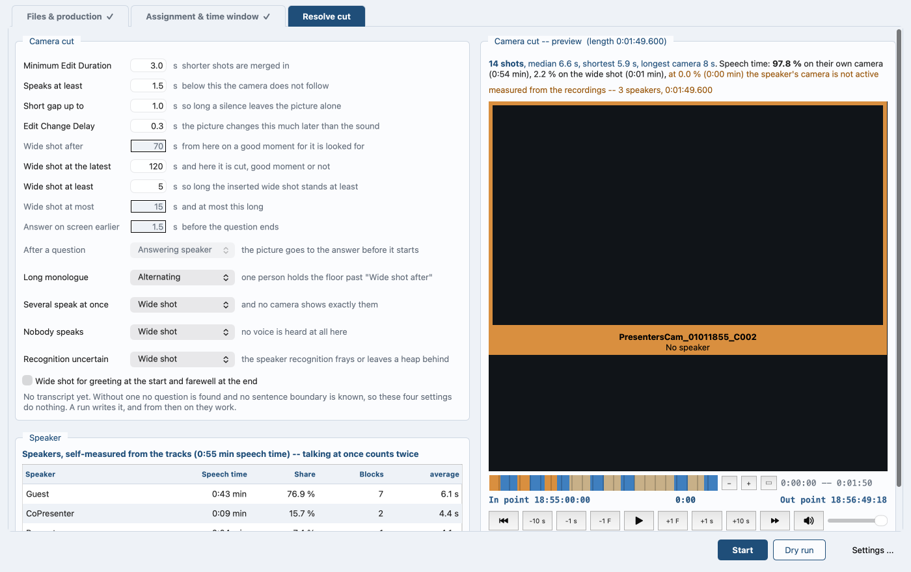

# DaVinci Resolve

*Auf Deutsch: [resolve.de.md](resolve.de.md). Back to the
[contents](README.md).*

## The button and the two timelines

On the **Output** tab, the button **Create Resolve project** builds the
project: files first, project afterwards. It creates the project, sets
frame rate, resolution and start timecode, imports the finished files
and builds the timelines. It writes the run along to
`<Production>_resolve_log.txt`.

The button works on the handover file and sends the camera-cut values
from the fields along. So it recomputes the cut list with what stands
there now. If In point or Out point have changed since, it stops. The
audio in the videos belongs to the old window.

The program asks whether Resolve answers by itself, in the background,
at the first look at the **Resolve cut** tab. That tab says the answer
in one line, and beside it stands the way to the **Settings ...**
window, where the check itself lives.

Its box **Connection to Resolve** names the product and the version if
the connection works. If it does not, it names the two paths it looked
for and what can be in the way:

- Resolve is not running.
- External scripting stands at "None" instead of "Local", under
  Preferences > System > General.
- This is the free edition. External scripting there is reported to be
  Studio-only since version 19.1. No official statement says so.

**Check again** and the rest of that window are in [The
interface](interface.md).



*Tab Resolve cut: the answer in green, and below it the values the
button takes into the cut list.*

| Case | Cut timeline | Multicam timeline |
|---|---|---|
| several cameras, speakers separated | picture from the camera cut, audio in one piece | all cameras side by side |
| several cameras, one speaker with a camera | their camera, broken up by the wide shot | all cameras side by side |
| several cameras, nobody with a name and a camera | none | all cameras side by side |
| one camera, speakers separated | one shot per change of speaker, the mix below | none |
| one camera, one voice or no separation | the camera in one piece, the mix below | none |

The speaker separation decides the cut timeline, not the path. Two
people with a name and a camera give a camera cut, on the simple path as
well, and so does one person as soon as a second camera is there that
nobody is on: their camera stands and the wide shot breaks it up.
Without that the multicam timeline stands alone: all cameras at their
measured places, and Resolve makes the multicam clip from it.

The program rounds the frame rate to one Resolve knows: ffprobe
measures 29.994 or 30.001 for some files. The log says which rate it
took. It computes timecodes with the whole-number rate and durations
with the true one, and it takes drop frame into account.

**… Cut**: the finished cut. V1 (`Camera cut`) carries the
picture pieces **without their audio**. Below on A1 (`Audio-Full-Mix`)
the Full-Mix runs through in one piece, so the sound does not jump at
the cuts. The mix comes from the separate file, otherwise from the wide
shot, where it is the first audio track.

The measured offset decides which part of each camera file the timeline
uses, not the timecode. If a camera was not running, another steps in,
the wide shot first. The log says how often. With several cameras the
timeline carries no markers.

**… Multicam**: all cameras side by side, one per video track, full
length, **uncut**, each at its measured place. Track names = speakers, a
camera without a speaker is called `Wide`, and the speaker names stand
as markers. Video track 1 takes the camera whose first audio track is
the Full-Mix, usually the wide shot; on conversion it becomes angle 1.

**Exactly one audio track per camera, linked to its picture.** The
script deletes the surplus audio after the insert and names the audio
tracks like the video tracks. It inserts a camera that did not land
separately, and reports it when even that fails.

### A file that fits nowhere

Only cameras the run could place on the common time axis go into the
handover file. Where the sound of a video has nothing in common with the
rest of the material and no timecode places it either, the run leaves it
out, and while writing it names what it left out and why: nothing places
it, so it is no camera of this episode.

A second reason leaves a camera out, and the run names it apart from
the first: the file it should have carried never came back. Placed it
was, and measured -- only nothing was written for it. Handed over it
would stand with an empty path, and Resolve then falls back to the
untouched source and imports that in place of the processed camera.

Leaving it out is the point. Nothing was rendered for such a file, and
it would carry the mark of the wide shot: the wide shot is whoever
has no speaker assigned, and nobody is assigned to a file that fits
nowhere. Handed over, a short jingle would stand as the wide shot of a
whole episode.

A file the run could only not measure is another case. That one is
handed over, with the warning that has always gone with it. Its place
then comes from its own timecode; without one it lands at the start of
the axis, and it is worth looking where it sits.

### One camera

One camera gives no multicam timeline and no multicam clip. Resolve gets
the **… Cut** timeline alone, and the speaker passages stand on it as
markers, a colour per person.

A single video file with its own sound is that case. The separation
tells the speakers apart on the one track, and the cut falls at every
change of speaker. The picture stays the same across the shots. A 360
degree camera gets its framing by hand, shot by shot, and the markers
say whose turn it is.

### When the project already exists

The program asks:

- **bring up to date**: the script deletes the two timelines it builds
  (`… Cut` and `… Multicam`), builds them again and brings the project
  settings up to date. **Media pool, your own timelines and everything
  from earlier runs stay as they are.**
- **leave it and put the new timelines alongside**: the existing ones
  stay.
- **create a new project alongside**: name with a suffix.
- **cancel.**

The interface asks in a dialog, the terminal with a number (on the command
line in advance, `--resolve-project update|keep|new|abort`).

The script checks the deletion, because Resolve reports success even when
nothing happened. If a timeline stays, the log says so and the new one gets
an addition to its name.

The script leaves the multicam timeline alone if it already fits: same
cameras, same order. Delete it in Resolve to get a new one. It keeps no
backup copy, because one more run rebuilds it.

### Choosing the multicam audio

On conversion Resolve asks under *Multicam Audio Options* where the sound
should come from (manual, chapter "Multicam Audio Options"):

| Setting | Effect |
|---|---|
| **Source Audio Channels** (default) | access to the single tracks and channels of every angle |
| **Reference Audio / Angle 1** | the *first pure audio angle* becomes the audio track for all angles; without one it is the first angle |
| **Adaptive Tracks** | all tracks and channels of an angle land in **one** adaptive track |
| **All Angles** | every audio track of every angle comes along: four plus five makes nine |

*Source Audio Channels* is the right choice: only one audio track per
camera is left. Each angle then brings exactly the speaker in front of
it. The closing note in the log says so too.

### What colour each shot gets

Every shot gets the colour of its angle, on both timelines. The script
sorts the colours by distinguishability, and the wide shot gets `Tan`.
More angles than colours means the row repeats, and the log says so.

Each camera also gets a **colour group**, described further down under
*Grading a whole camera at once*.

### What the render job sets

Once the timelines stand, the script sets the render profile and queues the
job. In Resolve only **Render All** is left.

The material and the project decide HDR or SDR, not taste. The script reads
the `colr` box of the camera files first. Three things count as HDR:

- **PQ or HLG** (transfer function 16 or 18), the two HDR display curves,
- **Log** (Apple Log is 21 in the file): a recording curve, not a
  display curve. **Log is HDR.**
- **BT.2020** as colour space or as matrix.

If a camera writes nothing usable into `colr`, the script reads its
QuickTime keys as well; most cameras note the curve there. The search runs
on word markers (`apple log`, `s-log`, `v-log`, `logc`, …), not on "log".
If the project settings say otherwise, the project wins.

| Setting | SDR | HDR |
|---|---|---|
| Codec | H.264, eight bit | H.265, ten bit (profile Main10) |
| 2160p | 45,000 kbit/s | 56,000 kbit/s |
| 1440p | 16,000 | 20,000 |
| 1080p | 8,000 | 10,000 |
| 720p | 5,000 | 6,500 |

At high frame rates of 48, 50 and 60 the higher values apply: 68,000 and
85,000 kbit/s at 2160p, correspondingly below. They are YouTube's upload
recommendation, each the upper end of the range given there. These values
are fixed, and no switch of the program sets them. Picture height, frame
rate and SDR or HDR pick the value. Set another rate in Resolve at the
render job itself.

A warning goes into the log if this Resolve offers no H.265. Another goes
in if it will not take the profile Main10, and the script then sets the
job without it.

The script also has to tag HDR, or the file carries none however cleanly
it was graded. The section *HDR: what has to be in the file* names what
the render job sets for that.

These stay fixed: one file instead of one per clip, target the output
folder, file name the production name, `.mp4`. The audio is AAC at 48 kHz,
16 bit, two channels. Resolve's scripting interface has no key for the
audio bitrate, so the program cannot set it. Set it in Resolve at the
render job. The log notes that 384 kbit/s would be the recommendation for
stereo. For HDR the log names the check too (*HDR: what has to be in the
file*).

One file instead of one per clip is asked for, and Resolve is free to
refuse it. Where it does, the log says so under **Render job**: *One file
per delivery was refused; Resolve will write one file per clip.* If the
question could not even be put, the log says that instead, with the
reason. Either way the job goes into the queue as usual -- but **Render
All** then writes one file per shot into the output folder, and somebody
looking for one episode finds a folder full of them. Set the delivery
back to a single file in Resolve at the render job, the same place the
audio bitrate and another frame rate are set, before pressing **Render
All**. No such line in the log means nothing was refused.

### Setting intro and outro

Every video file carries a **Kind**: *Content*, *Wide shot*, *Intro*,
*Outro* or *ignore this video*. Set it at the file, in the file list on
the **Files & production** tab. Other places in the program show the same
value.

Intro and outro are optional. The program does not align, process or copy
a file set to intro or outro. It is a finished clip and only goes into the
timeline (on the command line `--intro FILE` and `--outro FILE`). Both
land on the **second** video and audio track, over the content
(`Intro / Outro` and `Audio Intro / Outro`).

The program takes one intro and one outro. Setting a second file to the same
kind puts the first one back to content. A run that still sees two of a kind
stops and names them.

**Both clips keep their full length, and so does the content.** Only their
place shifts, and that follows the **sound**, not the file length:

- **Intro**: the *end of its audible sound* meets the first word. That means
  the jingle, not the file. The threshold is 40 dB below the loudest point of
  the file itself. It is fixed, and no switch sets it. A jingle that fades
  out quietly reaches the threshold before its sound stops. The rest of the
  fade then lies over the first words.
- **Outro**: the *start of its sound* meets the end of the last word.
- The speaker sections in the handover file say where the words lie.
- A clip without sound uses its end for the intro, its start for the outro.

Pull the dissolve yourself: one drag on the upper corner is enough.
Resolve's scripting interface knows no transitions.

### Keeping the colour of the source

The script keeps the colour of the source unchanged. It reads the `colr`
box out of the source itself, passes the numbers on explicitly, forces the
write and checks afterwards: log line **Colour**.

iPhone recordings from the Blackmagic Camera App carry "unspecified" as
their curve in `colr`. Resolve goes by the QuickTime keys of the
container (`com.apple.quicktime.model`, `com.apple.quicktime.software`,
`com.blackmagic-design.camera.*`). The script carries them along and
counts afterwards whether every key arrived (log line **Camera data**).

### How Apple Log survives the rewrite

The picture description holds a small atom `logs` naming the recording
curve, for instance `com.apple.apple-wide-gamut.apple-log`. **That** is
what Resolve recognises Apple Log by; the `colr` box says nothing about
it. ffmpeg cannot keep the atom, so the script adds it itself after
writing, byte for byte from the source. Afterwards it reads back whether
the file is still sound.

The log then says under **Camera atoms** whether the atom was added and
which curve it names. In the file list the curve stands in the **Colour**
row. It carries a plain name if one is known (Apple Log, Apple Log 2),
otherwise the identifier as it stands.

### Grading a whole camera at once

The script creates one **colour group** per camera and puts all clips of
that camera into it. One grade then covers a whole camera instead of a
single cut. The node editor on the Color page has four modes for this:

| Mode | acts on |
|---|---|
| **Group Pre-Clip** | "affect every clip in the group simultaneously": the whole camera |
| **Clip** | "only affect the specific clip that's selected": this one cut |
| **Group Post-Clip** | the whole group again, but computed after the clip |
| **Timeline** | every clip of the timeline |

Resolve computes them in that order. So: the basic correction of a camera in
**Group Pre-Clip**, and if a single cut falls out of line, pull it back in
**Clip**. Further clips join the group by right-click > Group > name > Assign
to Group.

### Grading one cut on its own

The script sets **local versions**, explicitly on every run. Remote
grades ("Use local version for new clips" off) would tie all clips of the
same source file to one correction. Nobody could then correct a single cut
on its own. No switch turns them back on.

The setting only affects clips that come into a timeline **afterwards**:
`--resolve-project update` rebuilds both timelines and settles it. With
`keep` the clips already there hang on to their remote grade. The log
names the way out: Color page, right-click a thumbnail > **Copy Remote
Grades to Local** (takes the correction along) or **Use Local Grades**.
The script picks the setting's name inside Resolve out of the list of all
project settings and reads it back.

### HDR: what has to be in the file

An HDR picture is not enough. The file has to say so as well. Three numbers
from ITU-T H.273 decide whether a player or YouTube treats the file as HDR.
Without them everything shows as SDR, and the effort with Apple Log is
lost.

| Feature | HDR10 (PQ) | HLG | Required |
|---|---|---|---|
| Primaries | **9** (BT.2020) | **9** | yes |
| Curve | **16** (SMPTE ST 2084) | **18** (HLG) | yes |
| Matrix | **9** (BT.2020, non-constant) | **9** | yes |
| Bit depth | 10 (or 12) | 10 | yes |
| Codec | HEVC **Main 10** | same | with HEVC |
| `colr` atom in the container | present | present | yes |
| Mastering display (ST 2086) | values of the reference monitor | none | no |
| MaxCLL / MaxFALL | e.g. 1000 / 400 | none | no |

Two traps sit in that table. **The 14 is not an HDR curve**: it is called
"BT.2020 10 bit" and is SDR in the wide gamut. And **tagging changes no
pixels**: a PQ tag on a Rec.709 grade turns it into wrongly labelled SDR.
The static metadata is only a recommendation; without it YouTube applies
default values (a Sony BVM-X300), and with HLG it falls away entirely.

**What the script does.** Building the render job, it reads the output
colour space from the project settings. If that names PQ or HLG, it sets
`ColorSpaceTag`, `GammaTag` and `EncodingProfile` = `Main10`: PQ gets
Rec.2020 / ST.2084, HLG gets Rec.2020 / HLG.

No document says which spelling this Resolve version takes, so the script
tries several and writes the accepted one into the log. If the project
names no HDR curve, the render stays on "Same as Project". The log then
names the place to look: Project Settings > Color Management > Output
Color Space.

**Looking at the finished file:**

```
videopodcast-magic.py --hdr-check Production.mp4
```

That checks every point of the table and says for each what would have to
be done. It reads the file and leaves it as it is. Return value 0 means the
file passes as HDR.

"Embed HDR10 Metadata" and the HDR10+ analysis the script cannot switch
on remotely: Resolve's scripting interface has no key for it. By hand:

1. Color Management > HDR10+
2. Color page > Analyze All Shots
3. Deliver > Embed HDR10 Metadata

### Setting position and zoom for a whole camera

Position and zoom go through the same group as the colour, but only in one
place. The **Sizing** palette (Color page, bottom middle, between "Key" and
"Stereo") has five modes:

| Mode | acts |
|---|---|
| Edit Sizing | like the inspector on the Edit page, per clip |
| Input Sizing | before the node tree, per clip |
| **Node Sizing** | **in the node tree, on the selected node** |
| Output Sizing | for the whole timeline |
| Reference Sizing | only for the still comparison |

A group shares the node tree, not the clip settings; it carries Node
Sizing along, Edit and Input Sizing not. So, for a whole camera:

1. Click a clip of that camera.
2. Switch the node editor from "Clip" to **Group Pre-Clip**.
3. Set the Sizing palette to **Node Sizing**.
4. Set position and zoom.

It holds retroactively for every clip of that camera in both timelines.
A change on the media pool clip, by contrast, takes hold only for clips
that come into a timeline *afterwards*.

Inferred from the manual (chapters 142 and 152), not copied from it. The
manual does not state that Node Sizing in the Group-Pre-Clip tree acts on
the whole group.

### When Resolve is to cut for itself

That needs a multicam clip, and the script cannot create one: the
scripting interface has no multicam. So by hand:

1. Media pool, right-click on "... Multicam"
2. **Convert Timeline to Multicam Clip** > **Use Source Audio Channels**

On the audio, see the four choices above. The track name becomes the name of
the angle (manual, chapter 49), and that is why the video tracks carry the
speakers' names. Converting is a one-way operation, and Resolve keeps no
backup copy.

### When something goes wrong

- **The button stops before it starts.** In point or Out point no longer
  match the run the files came out of. Press **Start** again, with the
  old values back in the two fields or with the new window.
- **The tab says Resolve does not answer.** The three causes stand
  above, in the box **Connection to Resolve**. Clear one and press
  **Check again**.
- **A timeline of an earlier run is still there, and the new one carries
  an addition in its name.** Resolve did not delete it. Delete it by
  hand and press the button again.
- **A camera is missing in Resolve.** The run could not place it and
  left it out of the handover file; it names it as it writes.
  Give the file a timecode that fits the other recordings and run
  again, or bring it into Resolve by hand.
- **The output folder holds one file per shot instead of one episode.**
  Resolve refused one file per delivery, and the log says so under
  **Render job**. Set the delivery back to a single file at the render
  job in Resolve and render again.
- **The finished file plays as SDR.** Run
  `videopodcast-magic.py --hdr-check <file>` and do what it names.
- **An angle brings the wrong sound.** The conversion ran with a setting
  other than **Use Source Audio Channels**. Convert again.

That is the whole Resolve part: both timelines, a colour group per
camera, and the render job in the queue. The next chapter,
[All switches](command-line.md), lists every switch of the program in
one place.

### Further options on the command line

The window has no equivalent for these.

- `--resolve` builds the project as part of a whole run, straight after the
  files.
- `--resolve-json FILE` catches up the Resolve part alone; everything
  needed is in `Production_resolve.json`. That is what the button
  **Create Resolve project** runs.
- `--resolve-audio-tracks` only looks: for the open project it prints the
  channel mapping of every clip and the tracks of every timeline.
- `--hdr-check FILE` only looks: it measures the finished file against
  the table under *HDR: what has to be in the file*.
