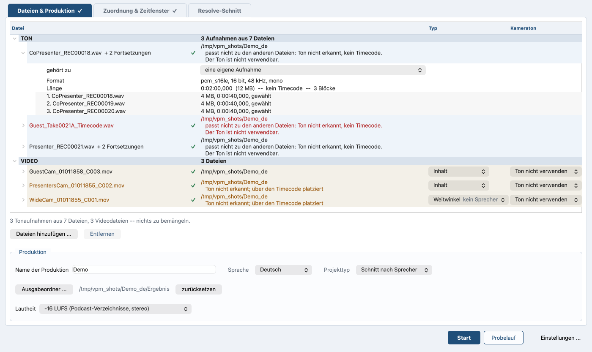

# Der einfache Weg

*In English: [simple-path.md](simple-path.md). Zurück zum
[Inhalt](README.de.md).*

## Der Lauf ohne Multitrack

Der einfache Weg ist der Lauf ohne das Häkchen **Multitrack (je Sprecher
eine Spur)**. Das Häkchen steht auf dem Reiter **Zuordnung &
Zeitfenster** über dem Kasten **Aufbereitung bei auphonic.com
(optional)**.

Beide Wege schreiben dieselbe Art Datei: MOV, Bild umkopiert, Ton
unkomprimiert, die `colr`-Angabe und die QuickTime-Schlüssel der Kamera
mitgenommen.

Was der einfache Weg genauso kann wie Multitrack:

- **Zeitfenster.** Die Knöpfe **In markieren** und **Out markieren**
  wirken auch hier (auf der Kommandozeile `--in-point` und
  `--out-point`). Sie nehmen die Schreibweisen aus
  [Multitrack](multitrack.de.md), Abschnitt „Zeitfenster“. Beschnitten
  wird der Ton; das Bild bleibt ganz und behält seinen Timecode.
- **Vorschau Player.** Auf dem Reiter **Zuordnung & Zeitfenster**, mit
  denselben Knöpfen.
- **Lautheit gemessen.** Die Summe wird gemessen, und die Zahl steht im
  Protokoll, unter `NORMALISIEREN` als **Summe der Spuren**, mit LUFS,
  Spitze und Umfang. Angepasst wird hier nichts: ohne Schlüssel für
  auphonic.com geht der Ton genau so hinaus, wie er hereinkam, und
  `--lufs` sagt das ausdrücklich ([Vorflug](preflight.de.md), Abschnitt
  „Welches Lautheitsziel gilt“).
- **Resolve-Projekt.** Mehrere Kameras geben eine Timeline mit allen
  nebeneinander, fertig für Multicam. Eine Kamera gibt eine gerade
  Timeline, oder eine geschnittene, sobald die Sprecher getrennt sind.

Je Sprecher eine Spur gibt es hier nicht. Der Mix kommt als eine Spur bei
auphonic.com an, und ohne getrennte Spuren hat das De-Bleed nichts
auseinanderzunehmen.

Was herauskommt, hängt am Material:

- **Nur Ton.** Fortsetzungsdateien werden zusammengesetzt und geschrieben.
- **Ton und Bild.** Der Ton wird ausgerichtet und in die Videodatei gelegt.
- **Nur ein Video.** Dessen eigener Ton, links und rechts getrennt.

### Die Sprecher auf einer Spur auseinanderhalten

Eine gemeinsame Aufnahme, auf der alle zu hören sind, genügt für den
Schnitt. Die Videodatei mit diesem Ton muss auf Beisteuern gestellt
werden: in der Dateiliste auf dem Reiter **Dateien & Produktion**, in
der Zeile dieser Datei, **Kameraton** auf **Ton verwenden**. Sie bekommt
dann eine Zeile in der Zuordnungstabelle. Deren **Sprechername** mit
**mehrere Sprecher** beantworten, dem einen Eintrag, den das Feld zur
Wahl stellt, und die Stimmen auf genau dieser Aufnahme werden
auseinandergehalten ([Spracherkennung und
Sprechertrennung](speech.de.md)). Die Spalte **Sprecher** sagt, wie weit
das gekommen ist; die Stimmen selbst kommen als eingerückte Zeilen unter
der Aufnahme.

Das Feld beantwortet sich nicht selbst aus einer schon gespeicherten
Trennung. Eine Aufnahme, die einmal getrennt wurde, für die aber
niemand geantwortet hat, zeigt ein leeres Feld und keine Stimmzeilen.
Wählt man später **mehrere Sprecher**, stehen die Stimmen sofort da,
mit ihren Namen und Kameras, ohne neue Rechnung.

Wo eine Zeile einen Namen trägt und nicht auf **mehrere Sprecher**
steht, bietet die Spalte **Sprecher** *Nur ein Sprecher -- Spur
auftrennen?* als flachen Textknopf an. Ein Klick setzt das Feld auf
**mehrere Sprecher**, und die Stimmen erscheinen.

Bei genau einer Videodatei mit Ton und keiner Tonaufnahme daneben muss
niemand etwas setzen: dieser Ton ist der einzige, den es gibt, also
setzt sich das Feld selbst und sagt ausgegraut, warum. Kommt eine
Tonaufnahme dazu, ist es wieder eine Frage ([Multitrack](multitrack.de.md),
Abschnitt „Kameraton zur Spur machen“).

Bei einer Kamera wird nichts umgeschnitten: es gibt nichts zu wechseln.
Es entsteht ein Schnitt an jedem Sprecherwechsel, damit Resolve je Person
einen Abschnitt bekommt statt einer langen Einstellung. Jeder Abschnitt
lässt sich dort gruppieren, einfärben und mit einem eigenen Bildausschnitt
versehen; bei einer 360-Grad-Kamera ist genau das der Punkt. Die Passagen
liegen als Marker auf dieser Timeline, je Person eine Farbe, damit
sichtbar ist, wer wo redet.

Im Protokoll steht `ERSTER SCHNITT NACH SPRECHERN` statt
`KAMERASCHNITT`, sobald alle Sprecher auf derselben Kamera sitzen; nach
mehr richtet sich die Überschrift nicht. Der Kasten im Fenster wird nach
einer eigenen Regel benannt und stimmt nicht immer damit überein.
Sprechzeiten, Schnittprognose, die Einstellwerte des Schnitts und die
vier Schnittlisten kommen mit
([Sprecherstatistik, Kameraschnitt, EDL](camera-cut.de.md)).

Eine einzige gefundene Stimme ist kein Fehler. Was daraus wird, hängt
an der Zahl der Kameras:

- **Eine Kamera.** Niemand übergibt, und es gibt nichts zu wechseln,
  also gibt es keinen Schnitt. Resolve bekommt die Kamera in einem
  Stück und den Mix darunter, und die Passagen sind auch dort
  markiert. Der Kasten im Fenster heißt **Erster Schnitt nach
  Sprechern**.
- **Zwei Kameras oder mehr.** Das Programm nimmt die erste Kamera, der
  niemand zugeordnet ist, nennt sie Weitwinkel und schneidet sie ein.
  Der Kasten heißt **Schnitt mit dem Weitwinkel**. Im Protokoll steht
  weiter `ERSTER SCHNITT NACH SPRECHERN`, weil alle Sprecher auf
  derselben Kamera sitzen.

Bei zwei Sprechern auf eigenen Kameras bleibt es ein Kameraschnitt, im
Protokoll wie im Fenster.

### Was neben dem Mix ins Video kommt

Ohne Multitrack geht aller Ton in eine Spur. Wenn mehrere Aufnahmen
gleichzeitig liefen, geht jede davon zusätzlich als eigene Spur ins
Video, hinter dem Mix. Sie liegt auf derselben Achse und hat dieselbe
Länge.

Der Lauf liest am Timecode ab, ob sie gleichzeitig liefen. Aufnahmen, die
sich überlappen, waren mehrere Mikrofone gleichzeitig. Das Programm nennt
jede Datei einer zerlegten Aufnahme einen Block. Blöcke, die aufeinander
folgen, sind eine Aufnahme und bekommen keine zusätzlichen Spuren.

Die Einzelspuren sind unbearbeitet: nur der Mix geht zu auphonic.com,
also kein De-Bleed und kein Leveler auf ihnen. Sie kosten rund 520 MB je
Spur und Stunde. Wenn der Mix von auphonic.com in anderer Länge
zurückkommt, als die Aufnahmen haben, fallen die Einzelspuren von selbst
weg. Im Gratis-Tarif macht das ein vorangestellter Jingle. Der Lauf sagt
es.

Fortsetzungsdateien findet das Script selbst; der erste nummerierte Block
genügt. Als Fortsetzung gilt nur, was lückenlos anschließt, geprüft am
Timecode, sonst an der Blockgröße. Ein späterer Take mit derselben
Namensform wird nicht angehängt.

Der Versatz wird immer gemessen, auch wenn beide Seiten Timecode tragen.
Wenn der Timecode beidseitig vorliegt, sagt der Lauf am Ende, wie weit er
vom gemessenen Wert abweicht.

Ein Video, das der Lauf gar nicht einordnen kann, bleibt draußen. Wo
weder die Form des Tons noch seine Phase die Kamera in der Aufnahme
findet und die Datei auch keinen Timecode trägt, der zum übrigen Material
passt, nennt der Lauf die Datei und geht ohne sie weiter, statt sie
dorthin zu legen, wohin die beste von mehreren schlechten Zahlen zeigt.
Die Zeile sagt, was helfen würde: ein Timecode, der zu den übrigen
Aufnahmen passt, mit einem anderen Programm gesetzt. Eine Datei, deren
Timecode passt, wird nach dieser Uhr eingeordnet und nach ihrem Ton gar
nicht gefragt; ein einzelner Timecode unter Dateien ohne Timecode ist
keine Einordnung.

### Wie der Lauf eine Uhrzeit statt eines Zählers liest

Namen mit Datum und Uhrzeit gelten ebenso als Blöcke:
`r_260808_185628.wav` und `r_260808_190128.wav`. Ein Recorder nummeriert
seine Dateien; ein Mischer schreibt oft stattdessen die Uhrzeit.

Der nächste Block gehört dazu, wenn er dort beginnt, wo der vorige endet,
auf zwei Sekunden genau. Wenn jeder Block dieselbe Uhrzeit trägt, gilt
weiter die Zähler-Regel. Diese Uhrzeit ist der Beginn der Session, und
die echte Nummer steht in einem Zähler dahinter.

### Blöcke von Hand zusammenlegen

Wenn die Dateinamen der Suche nichts hergeben, legt man die Blöcke von
Hand zusammen:

1. In der Dateiliste auf dem Reiter **Dateien & Produktion** die Zeile
   der Aufnahme aufklappen.
2. Im Auswahlfeld **gehört zu** die Aufnahme wählen, zu der sie gehört.

*Die aufgeklappte Zeile: das Auswahlfeld gehört zu, auf eine eigene
Aufnahme gestellt, und darunter die drei Blöcke mit Größe und Laufzeit.*

Die Aufnahme geht mit allen Blöcken, die sie hat, in die andere. Das
Auswahlfeld wird nur angeboten, wenn es eine andere Aufnahme zum Anlegen
gibt. Nicht angeboten wird es auf einer Aufnahme, die selbst in eine
andere gelegt wird: eine Kette von Zusammenlegungen gibt es nicht.
Zurück geht es mit dem Eintrag **eine eigene Aufnahme**.

Auf der Kommandozeile nennt `--together A B C` sie in dieser Reihenfolge
und ist für mehrere wiederholbar; jeder Name bringt die Blöcke mit, die
schon zu ihm gehören.

Die Gegenrichtung: die Zeile des Blocks in der Dateiliste auswählen und
**Entfernen** drücken. Er bleibt dann aus der gefundenen Aufnahme draußen
(auf der Kommandozeile `--apart`). Beides schlägt die Messung. Eine für
sich gestellte Datei bleibt auch aus einer Gruppe draußen, in die sie
gelegt wurde. Beides steht im Projekt.

### Was je Videodatei zurückkommt

Jede Videodatei kommt zurück mit unverändertem Bild (`-c:v copy`), dem
neuen Ton als erster Spur und der Kameraspur dahinter. Das Programm
benennt beide Spuren und behält den Timecode.

Die neue Spur heißt `Full-Mix`, die eigene der Kamera `Camera Original`;
bringt eine Kamera mehrere eigene mit, werden sie als
`Camera Original 1`, `Camera Original 2` und so fort durchnummeriert.
`--name` und `--name-camera` setzen die beiden Namen. Der erste ist nicht
bloß eine Beschriftung: Mit ihm wird die Übergabe an Resolve geschrieben,
und Resolve benennt seine Tonspur danach.

### Warum das Ziel immer MOV ist

Ziel ist immer MOV, auch bei MP4-Quellen; das Programm kopiert Bild und
Ton, statt sie neu zu berechnen. MOV trägt die Spurnamen und den
unkomprimierten Ton, MP4 beides nicht, deshalb gibt es `--container`
nicht.

### Wenn etwas klemmt

- **Die Zeile der Kamera fehlt in der Zuordnungstabelle.** Ihr Ton ist
  noch nicht in Verwendung: in der Dateiliste **Kameraton** auf **Ton
  verwenden** stellen.
- **Die Fortsetzungsdateien fehlen in der Aufnahme.** Die Namen geben
  der Suche nichts her: mit **gehört zu** von Hand zusammenlegen.
- **Eine Datei wurde in eine Aufnahme genommen, in die sie nicht
  gehört.** Ihre Zeile auswählen und **Entfernen** drücken; sie bleibt
  von da an draußen.
- **Die Einzelspuren fehlen im Video.** Der Mix kam von auphonic.com in
  anderer Länge zurück als die Aufnahmen; der Lauf sagt es. Der Mix
  selbst steht im Video.
- **Eine Videodatei fehlt im Ergebnis.** Der Lauf konnte sie nicht
  einordnen: Ihr Ton hat mit dem übrigen Material nichts gemeinsam, und
  sie trägt keinen Timecode. Ihr mit einem anderen Programm einen geben,
  der zu den übrigen Aufnahmen passt, oder sie in der Spalte **Typ** der
  Dateiliste auf **Video ignorieren** setzen, damit sie nicht mitläuft.
  Im Fenster schlägt das Programm das von selbst vor ([Die
  Oberfläche](interface.de.md)).

Im Video steht jetzt der fertige Mix und daneben die Aufnahmen, die
gleichzeitig liefen. Was auphonic.com mit dem Mix macht, steht in
[Aufbereitung über auphonic.com](auphonic.de.md).

### Weitere Optionen über die Kommandozeile

Diese Optionen gibt es im Fenster nicht.

- `--no-single-tracks` lässt die Einzelspuren aus dem Video weg.
- `--no-camera-audio` lässt die eigene Spur der Kamera aus der neuen
  Datei weg.
- `--help` setzt `[simple path only]` oder `[multitrack only]` an einen
  Schalter, der nur auf einem Weg wirkt. Beide Kennzeichnungen bleiben
  englisch, auch bei `--lang de`.
