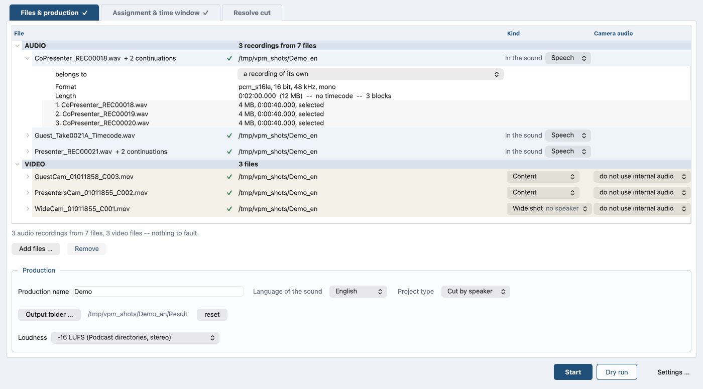

# The simple path

*Auf Deutsch: [simple-path.de.md](simple-path.de.md). Back to the
[contents](README.md).*

## The run without Multitrack

The simple path is the run with the tick **Multitrack (one track per
speaker)** left off. The tick sits on the **Assignment & time window**
tab, above the box **Processing at auphonic.com (optional)**.

Both paths write the same kind of file: MOV, picture copied over, audio
uncompressed, the `colr` box and the camera's QuickTime keys carried
along.

What the simple path does just like multitrack:

- **Time window.** The buttons **Mark In** and **Mark Out** work here
  too (on the command line `--in-point` and `--out-point`). They take
  the notations listed in [Multitrack](multitrack.md), section "Time
  window". The program trims the audio; the picture stays whole and
  keeps its timecode.
- **Preview player.** On the **Assignment & time window** tab, with the
  same buttons.
- **Resolve project.** Several cameras give one timeline with all of them
  side by side, ready for multicam. One camera gives a straight timeline,
  or a cut one as soon as the speakers are told apart.

One track per speaker is not part of it. The mix reaches auphonic.com as
a single track, and without separate tracks the de-bleed has nothing to
take apart.

What comes out depends on the material:

- **Audio only.** The program joins the continuation files and writes
  them.
- **Audio and video.** The program aligns the audio and lays it into the
  video file.
- **One video only.** The program takes its own audio, left and right
  kept apart.

### Telling the speakers apart on one track

One recording everybody is audible on is enough for the cut. The video
file carrying that sound has to be set to contribute it: in the file
list on the **Files & production** tab, in that file's row, put **Camera
audio** on **use the audio**. It then has a row in the assignment table,
with **Separate speakers** in the column **Speakers** ([Speech
recognition and speaker separation](speech.md)). The button takes that
one recording. Once it has run, the number of speakers found stands in
its place.

With exactly one video file with sound and no audio recording beside it
nobody has to set anything: that sound is the only sound there is, so
the field sets itself and says why, greyed out. Add an audio recording
and it is a question again ([Multitrack](multitrack.md), section "Making
camera sound a track").

With one camera nothing is switched over: there is nothing to switch to.
What comes of it is a cut at every change of speaker, so Resolve gets one
section per person instead of one long take. Each section can be grouped,
coloured and given a framing of its own there, which on a 360 degree
camera is the whole point. The passages sit on that timeline as markers,
a colour per person, so it is visible who speaks where.

The log says `FIRST CUT BY SPEAKER` instead of `CAMERA CUT`, and the box
in the window carries the same name. Speaking times, cut forecast, the
settings of the cut and the four cut lists come with it
([Speaker statistics, camera cut, EDL](camera-cut.md)).

One voice found is not a fault. Nobody hands over, so there is no cut.
Resolve gets the camera in one piece with the mix under it, and the
passages are marked there too.

### What goes into the video beside the mix

Without Multitrack all the audio goes into one track. If several
recordings ran at the same time, each of them also goes into the video
as a track of its own, after the mix. Each such track lies on the same
axis and has the same length.

The run reads from the timecode whether they ran at the same time.
Recordings that overlap were several microphones at once. The program
calls each file of a split recording a block. Blocks that follow one
another are one recording and get no extra tracks.

The single tracks are as recorded: only the mix goes to auphonic.com, so
no de-bleed and no leveler on them. They cost about 520 MB per track and
hour. If the mix comes back from auphonic.com with a different length
than the recordings have, the single tracks drop out by themselves. On
the free tier a prepended jingle does that. The run says so.

The script finds continuation files itself; the first numbered block is
enough. Only what joins seamlessly counts, checked on the timecode,
otherwise on the block size. The program does not append a later take
with the same naming pattern.

The program always measures the offset, even when both sides carry
timecode. If timecode is on both sides, the run ends by saying how far it
lies from the measured value.

### How the run reads a clock instead of a counter

Names with date and time of day count as blocks too:
`r_260808_185628.wav` and `r_260808_190128.wav`. A recorder numbers its
files; a mixer often writes the clock instead.

The next block belongs to the recording when it starts where the previous
one ends, within two seconds. If every block carries the same clock, the
counter rule applies as before. That clock is the start of the session,
and the real index sits in a counter behind it.

### Putting blocks together by hand

If the file names give the search nothing to go on, put the blocks
together by hand:

1. In the file list on the **Files & production** tab, expand the
   recording's row.
2. In the selector **belongs to**, choose the recording it belongs to.

*The expanded row: the selector belongs to, set to a recording of its
own, and under it the three blocks with size and runtime.*

The recording goes into that one with every block it has. The program
offers the selector only when another recording is available to join. It
leaves the selector out on a recording that is itself joining into
another: a chain of joins is not on offer. To undo it, choose **a
recording of its own**.

On the command line `--together A B C` names them in that order and is
repeatable for several; each name brings the blocks that already belong
to it.

The other direction: pick the block's row in the file list and press
**Remove**. It then stays out of the recording it was found in (on the
command line `--apart`). Both beat the measurement. A file set apart
stays out even of a group it was put into. The project stores both.

### What comes back for each video file

Each video file comes back with the picture untouched (`-c:v copy`), the
new audio as the first track and the camera's own track behind it. The
program names both tracks and keeps the timecode.

### Why the target is always MOV

The target is always MOV, for MP4 sources too; the program copies picture
and audio instead of computing them again. MOV carries the track names
and the uncompressed audio, MP4 does neither, so `--container` does not
exist.

### When something goes wrong

- **The camera's row is missing from the assignment table.** Its sound
  is not in use yet: put **Camera audio** on **use the audio** in the
  file list.
- **The continuation files are missing from the recording.** The names
  give the search nothing to go on: put them together by hand with
  **belongs to**.
- **A file was taken into a recording it does not belong to.** Pick its
  row and press **Remove**; it stays out from then on.
- **The single tracks are not in the video.** The mix came back from
  auphonic.com at a different length than the recordings; the run says
  so. The mix itself is in the video.

The video now holds the finished mix and, beside it, the recordings that
ran at the same time. What auphonic.com does to the mix is in
[Processing at auphonic.com](auphonic.md).

### Further options on the command line

These options are not in the window.

- `--no-single-tracks` leaves the single tracks out of the video.
- `--no-camera-audio` leaves the camera's own track out of the new file.
- `--help` puts `[simple path only]` or `[multitrack only]` on a switch
  that works on one path only. Both markers stay English, even with
  `--lang de`.
