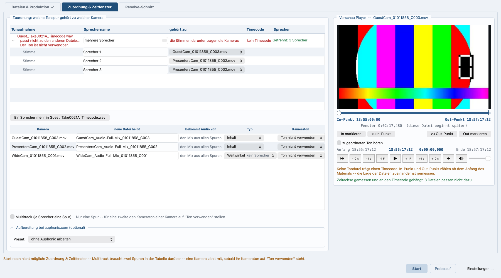

# Spracherkennung und Sprechertrennung

*In English: [Speech recognition and speaker separation](speech.md). Zurück zum [Inhalt](README.de.md).*

## Spracherkennung und Sprechertrennung

Das Programm schreibt mit, was gesprochen wird, und es trennt die
Stimmen einer Aufnahme. Beides läuft auf diesem Rechner, ohne Konto und
ohne Hochladen, und bevor irgendetwas zu auphonic.com geht.

### Die Sprecher trennen

Auf dem Reiter **Zuordnung & Zeitfenster** sagt im Kasten **Vorschau
Player** eine Zeile unter der gemessenen Zeitachse, ob sich die Stimmen
einer Aufnahme hier trennen lassen, und wie weit das gediehen ist:
bereit, läuft, fertig oder für dieses Projekt abgeschaltet. Ist nichts zu
trennen, bleibt die Zeile leer.

Der Knopf **Sprecher trennen** startet die Trennung, **Abbrechen**
hält einen laufenden Durchgang an. Auf einem Rechner, der kein Mac ist,
steht beim ersten Mal **Auf diesem Rechner nicht** daneben; die Antwort
wird im Projekt gemerkt. Auf einem Mac läuft die Trennung von selbst,
sobald die Dateien da sind.

Die Trennung ist der Weg für **eine gemeinsame Aufnahme**, auf der alle
zu hören sind. Hat jede Person ein eigenes Mikrofon, sind die Spuren die
Wahrheit und die Zeile bleibt weg.

Die Einrichtung lädt beim ersten Mal rund 218 MB. Das Modell selbst
liegt beim Programm.

### Die Stimmen benennen

Auf demselben Reiter steht unter den Zuordnungstabellen eine Tabelle:
**Stimme**, **Sprechername**, **gehört zu**, **Anhören**. Sie hat je
erkannter Stimme eine Zeile, vorbelegt mit
Sprecher 1, Sprecher 2 und so fort nach Sprechzeit, die längste zuerst.
Jeder Name lässt sich überschreiben.

**Anhören** spielt die längste Strecke ab, die diese Stimme spricht.
Unter der Tabelle hört der Knopf **Ein Sprecher mehr in `<Datei>`**
dieselbe Aufnahme noch einmal ab, mit einem Sprecher mehr als gefunden
wurde.

*Reiter Zuordnung & Zeitfenster: die Stimmentabelle unter der
Zuordnung, und der Stand der Trennung neben dem Player.*

### Wann neu gerechnet wird

Neu gerechnet wird nur, wo die Quelldatei wechselt, wo sie sich ändert
oder wo eine Sprecherzahl von Hand gesetzt wird. Ein verschobenes
Zeitfenster, ein neuer In-Punkt, ein geänderter Versatz oder ein
umbenannter Sprecher kosten nichts. Was das Fenster getrennt hat, reist
mit dem Lauf mit und wird nur noch auf dessen Zeitachse umgerechnet.

### Woher die Sprecher kamen

Das Protokoll sagt es. Zwei Marken zum Suchen:
`SPRECHER -- NACH STIMMEN GETRENNT` und `SPRECHER -- HIER GEMESSEN`. Ist
mehr als eine Quelle da, zählt zuerst die örtliche Trennung, dann die
Messung aus den Spuren. Passt die Trennung nicht zum Lauf, sagt das
Protokoll warum, es wird aus den Spuren gemessen, und der Lauf geht
weiter.

### Was gesprochen wird

Die Erkennung nimmt einen von zwei Wegen, und der Unterschied zeigt sich
allein an der Uhr.

* **macOS 26 bringt sie mit.** Nichts nachzuinstallieren, kein Konto,
  kein Netz; eine Stunde Ton in gut 20 Sekunden. Nötig sind die Command
  Line Developer Tools.
* **Überall sonst faster-whisper.** 144 MB Pakete und ein Modell von
  1,5 GB werden beim ersten Mal geholt. Auf einem gewöhnlichen
  Windows-Rechner ist die Erkennung der teuerste Schritt der ganzen
  Kette.

Das Programm sieht nach, welcher Weg da ist, und sagt im Protokoll,
welchen es genommen hat. Die Erkennung nimmt die Spracheinstellung des
Laufs; bleibt sie leer, arbeitet macOS mit der Systemsprache und Whisper
errät sie aus dem Ton. Der Lauf schreibt den Text neben dem
Kameraschnitt mit, nicht davor.

### Wofür der Text gebraucht wird

Der Text liefert die Satz- und Teilsatzgrenzen für den Kameraschnitt,
beschrieben in [Sprecherstatistik, Kameraschnitt, EDL](camera-cut.de.md).
Ohne Erkennung schneidet das Programm weiter, nur ohne Satzgrenzen: die
Totale sucht dann die längste Sprechpause in der Nähe.

### Zwei Grenzen

* Läuft die Trennung auf der ganzen Datei, hört sie auch den Vorlauf vor
  der Sendung. Beim Umrechnen wird auf das Zeitfenster geschnitten, aber
  die Sprecherzahl in der Tabelle ist die des ungeschnittenen Laufs. Wer
  im Vorlauf noch mit jemandem gesprochen hat, sieht eine Stimme mehr,
  als in der Folge vorkommt.
* Die Erkennung läuft auf dem fertigen Mix, nicht auf den Einzelspuren.
  Ein leiser Mitschnitt kann für die Sprechertrennung reichen und für
  den Text trotzdem nicht taugen.

## Weitere Optionen über die Kommandozeile

Diese Optionen gibt es im Fenster nicht.

* `--speakers-local <FILE>` nimmt diese Aufnahme auf diesem Rechner nach
  Stimmen auseinander und schneidet nach dem Ergebnis.
* `--speakers-from <FILE>` holt eine fertige Trennung aus einer
  Projekt- oder Zuordnungsdatei, statt eine zu rechnen.
* `--speakers-count <NUMBER>` gibt an, wie viele Personen zu finden sind.
* `--no-speakers-local` nimmt in diesem Lauf keine Aufnahme nach Stimmen
  auseinander, gleich was sonst danach verlangt.
* `--no-speech-recognition` lässt den Text weg.
* `VPM_NO_SPEAKER_SPLIT=1` vor dem Aufruf: die Trennung startet nie von
  selbst. Der Knopf startet sie weiterhin.
