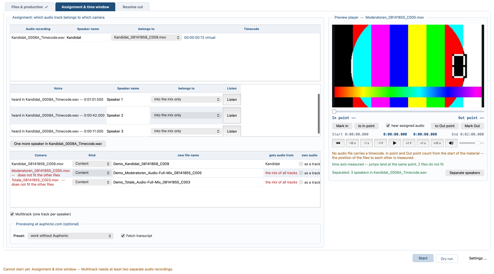

# Speech recognition and speaker separation

*Auf Deutsch: [speech.de.md](speech.de.md). Back to the [contents](README.md).*

## Speech recognition and speaker separation

The program writes down what is spoken, and it tells the voices on a
recording apart. Both run on this machine, without an account and
without an upload, and before anything goes to auphonic.com.

### Separating the speakers

On tab **Assignment & time window**, in the box **Preview player**, a
line under the measured time axis says whether the voices in a recording
can be told apart here, and how far that has got: ready, running,
finished, or switched off for this project. Where there is nothing to
separate the line stays empty.

The button **Separate speakers** starts it, **Break off** stops a run
that is going. On a machine that is not a Mac, **Not on this machine**
stands beside them the first time; the answer is kept in the project. On
a Mac the separation starts by itself as soon as the files are there.

Separation is the way for **one common recording** that everybody is
audible on. Where each person has their own microphone the tracks are
the truth and the line stays away.

The setup fetches about 218 MB the first time. The model itself comes
with the program.

### Naming the voices

On the same tab a table stands under the assignment tables: **Voice**,
**Speaker name**, **belongs to**, **Listen**. It has one row per voice
found, filled in as Speaker 1,
Speaker 2 and so on by speaking time, the longest first. Every name can
be overwritten.

**Listen** plays the longest stretch that voice speaks. Under the table
the button **One more speaker in `<file>`** goes through the same
recording again, with one speaker more than was found.

*Tab Assignment & time window: the voice table under the assignment,
and the state of the separation beside the player.*

### When it is worked out again

The separation is worked out again only where the source file is
exchanged, where it changes, or where a speaker count is set by hand. A
moved time window, a new In point, a changed offset or a renamed speaker
cost nothing. What the window separated travels with the run and is only
converted onto its time axis.

### Where the speakers came from

The log says it. Two marks to search for: `SPEAKERS -- SEPARATED BY
VOICE` and `SPEAKERS -- MEASURED HERE`. Where more than one source is
there, the local separation counts first, then the measurement from the
tracks. Where the separation does not fit the run, the log says why, the
tracks are measured, and the run carries on.

### What is spoken

Recognition takes one of two ways, and the difference shows on the clock
alone.

* **macOS 26 brings it along.** Nothing to install, no account, no
  network; an hour of audio in a good 20 seconds. It needs the Command
  Line Developer Tools.
* **Everywhere else faster-whisper.** 144 MB of packages and a model of
  1.5 GB are fetched the first time. On an ordinary Windows machine
  recognition is the most expensive step of the whole chain.

The program looks for which way is there and says in the log which one
it took. Recognition takes the language setting of the run; where that is
empty, macOS works with the system language and Whisper guesses it from
the audio. The run writes the text down alongside the camera cut, not
ahead of it.

### What the text is for

The text gives the sentence and clause boundaries for the camera cut,
described in [Speaker statistics, camera cut, EDL](camera-cut.md).
Without recognition the program still cuts, only without sentence
boundaries: the wide shot then looks for the longest pause in speech
nearby.

### Two limits

* Where the separation runs over the whole file, it hears the run-up
  before the show as well. The conversion cuts to the time window, but
  the number of speakers in the table is the one of the uncut run.
  Whoever talked to somebody in the run-up sees one voice more than the
  episode holds.
* Recognition runs on the finished mix, not on the single tracks. A
  quiet recording can be enough for the speaker separation and still not
  carry the text.

## Further options on the command line

These options are not in the window.

* `--speakers-local <FILE>` takes that recording apart by voice on this
  machine and cuts by the result.
* `--speakers-from <FILE>` takes a finished separation out of a project
  or assignment file instead of working one out.
* `--speakers-count <NUMBER>` says how many people are to be found.
* `--no-speakers-local` takes no recording apart by voice in this run,
  whatever else asks for it.
* `--no-speech-recognition` leaves the text out.
* `VPM_NO_SPEAKER_SPLIT=1` in front of the call: the separation never
  starts by itself. The button still starts it.
